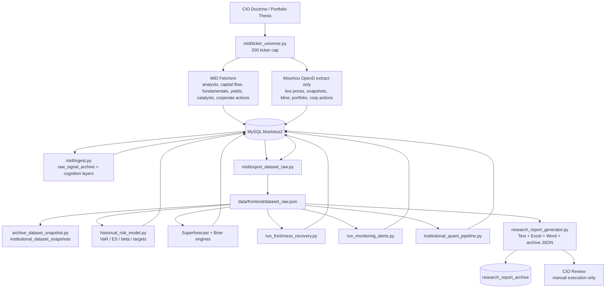
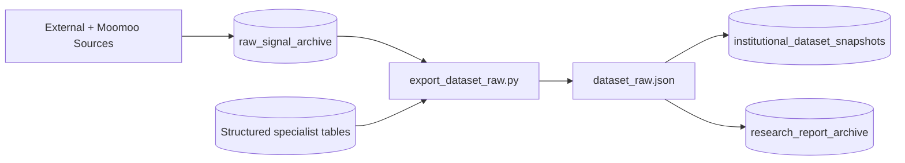
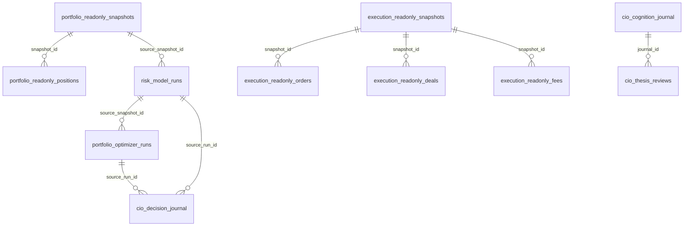
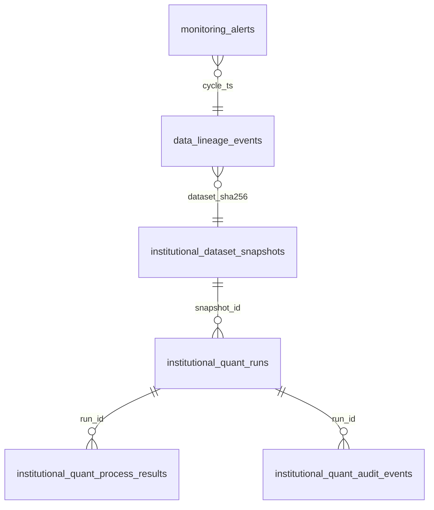
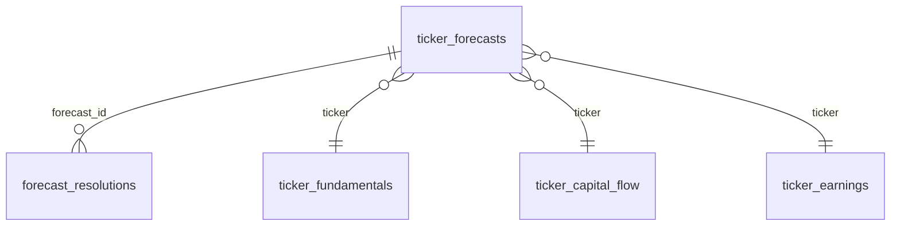
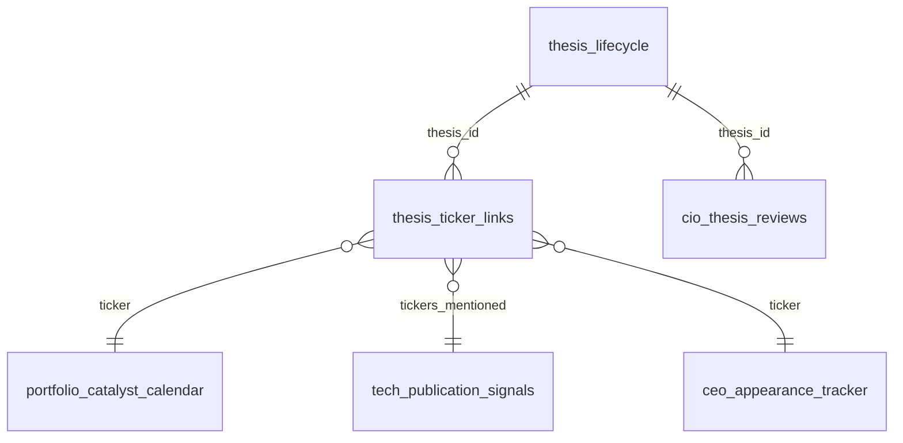

# BlueLotus V2 Architecture Documentation

Generated: 2026-06-07 06:10:17 SGT

Updated: 2026-06-07 22:42 SGT for CIO cognition journal, Strategic Thinking / Planning / Execution recording, and thesis review capture.

Updated: 2026-06-08 SGT — Publisher migration (V1 retired): `mid/bluelotus_publisher.py` now owns GitHub Pages + Telegram publishing, called directly by the V2 pipeline bat. PortfolioAgent folder archived.

Updated: 2026-06-08 SGT — `dataset_raw.json` size fix: removed `raw_payload` field from `_signal_row()` in `mid/export_dataset_raw.py`. The `raw_payload` column in `raw_signal_archive` was storing full monitoring-alert objects (~1.35 MB each) and being repeated across 158 signal rows, bloating `signals_latest` to 27 MB and the total file to 37 MB. Stripping `raw_payload` from the export (full data remains in MySQL) reduced the file from 37 MB → ~3 MB permanently.

Updated: 2026-06-08 SGT — Ingest + regime detection fixes: (1) `mid/ingest.py` was failing silently since June 7 with `ModuleNotFoundError: No module named 'ticker_universe'` when called as `python -m mid.ingest` from the project root. Fixed by adding explicit `sys.path` setup at module level (`_HERE` and `_ROOT` inserted). Pipeline bat updated to call `python ingest.py` from `mid/` directly, consistent with all other mid scripts. (2) Regime detection `_compute_risk_regime()` was using stale Friday close `chg_pct` values over weekends, causing RISK OFF -6 to persist through the weekend. Fixed: when all price sessions are `CLOSED`, Factors 1 (VIX direction), 3 (Gold vs Tech), and 6 (Sector rotation) are zeroed — sentiment-based factors (F/G, Inst, Macro) remain active. `market_closed` flag added to regime output.

Canonical workspace: `C:/bluelotus3`

CIO reference: [BlueLotus CIO Letter Edition 021](https://sohweekian.github.io/bluelotus/cio-letter.html). The V2 architecture is documented here as the machine that operationalizes the CIO doctrine: observe the world as it actually is, preserve memory, separate research from execution, and make every thesis accountable to evidence.

## Executive Summary

BlueLotus V2 is a database-centered market intelligence and CIO operating system. It ingests raw external and broker data, stores it in MySQL, exports a canonical `dataset_raw.json`, runs institutional quant readiness checks, produces risk and forecast accountability layers, and generates text/Excel/Word reports for CIO review.

Current live state from `dataset_raw.json`:

- Dataset generated: `2026-06-07T22:41:36`
- Export / ingest version: `v2.0u` / `v2.6`
- Institutional readiness: `INSTITUTIONAL_READY` | `97.256/100` | `COMPLETED`
- Process status counts: `{'FAIL': 0, 'PASS': 8, 'WARNING': 0}`
- Portfolio assets: `56143.82` | cash `14081.5`
- Risk model run: `RISK-20260607223427-72dd37639db4` | VaR95 daily `2978.86`
- CIO decision ledger: pending `66`, orders generated `0`
- CIO cognition journal: `CIOCOG-2026-06-07T22-34-50-93b85f59ec8d` | thesis reviews `6`
- Monitoring alerts current cycle: `22` | `{'WARNING': 17, 'INFO': 5}`

## Non-Negotiable Operating Doctrine

- **Database is memory.** Raw observations, snapshots, forecasts, risks, alerts, and reports are archived into MySQL.
- **Python extracts and computes.** Fetchers and engines transform external data into structured DB records and JSON artifacts.
- **`dataset_raw.json` is the canonical intelligence feed.** Research and presentation layers consume this dataset, not scattered files.
- **Reports distill intelligence.** Text is canonical for archive; Excel and Word are CIO presentation layers.
- **Moomoo is extract-only.** Broker APIs are used only for quote, historical, corporate-action, and read-only portfolio data.
- **CIO executes manually.** The system may create CIO review records, but it must not place, modify, cancel, route, or unlock trades.
- **CIO cognition is recorded.** Strategic Thinking, Planning, Execution intent, thesis review, repeatability, and mistake-risk notes are captured as governance records before any capital action.
- **Forecasts are accountable.** BlueLotus Conservative forecasts compete against analysts and actual outcomes via Brier/accuracy tracking.

## V2 System Boundaries

| Layer | Folder / Files | Responsibility |
|---|---|---|
| Database Core | `core/db.py`, `core/db_writers.py` | MySQL connections, cycle writes, raw signal archive writer. |
| MID Fetchers | `mid/fetch_*.py`, `mid/ingest.py` | External/Moomoo extraction and raw/structured DB writes. |
| Dataset Export | `mid/export_dataset_raw.py` | Converts DB state into canonical `data/frontend/dataset_raw.json`. |
| Risk / Portfolio | `mid/historical_risk_model.py`, `mid/fetch_portfolio_readonly.py` | Read-only portfolio, VaR, ES, beta, constraints, research-only target weights. |
| Forecasting | `research/bluelotus_superforecast_engine.py`, `forecast_*` | BlueLotus vs analyst forecasts, resolution, Brier comparison. |
| Governance | `mid/institutional_quant_pipeline.py`, `run_monitoring_alerts.py`, `archive_dataset_snapshot.py`, `record_cio_cognition.py` | Readiness scoring, monitoring, lineage, point-in-time archive, CIO cognition journal. |
| Reporting | `research/research_report_generator.py`, `research_report_generator_r6.py` | Text report, DB report archive, Excel, Word, delivery JSON. |
| Batch Orchestration | `run_bluelotus_v2_pipeline_simple_hourly_no_research_agent.bat` | Hourly production flow. |

## Full Pipeline Flow

## Production Batch Sequence

The production entrypoint is `run_bluelotus_v2_pipeline_simple_hourly_no_research_agent.bat`. It loops hourly and runs a conservative sequence:

1. Fetch analyst targets, capital flow, fundamentals, treasury yields, cross-market confirmation, read-only portfolio, corporate actions.
2. Run `mid.ingest` to refresh raw signals, live prices, Fear & Greed, ticker sentiment, Moomoo intelligence, regime, and cognition blocks.
3. Fetch specialist intelligence: tech publications, conferences, CEO appearances, earnings, catalysts.
4. Refresh portfolio/factor historical prices and advance the staged backfill queue.
5. Export `dataset_raw.json`, archive it, and run freshness recovery.
6. Run formal historical risk model and seed CIO decision journal.
7. Seed thesis lifecycle, record CIO cognition journal, run monitoring, run institutional quant readiness.
8. Run superforecast/Brier modules.
9. Final export, dataset archive, and report generation.

## Dataset Architecture

`data/frontend/dataset_raw.json` is the operational intelligence contract. It contains daily-use P1/P2/P3 intelligence and references to deeper P4/P5 data in the DB.

Important top-level blocks include:

- `meta`: object, 13 keys
- `source_health`: array, 52 rows
- `regime`: object, 15 keys
- `portfolio`: object, 19 keys
- `live_prices`: object, 200 keys
- `analyst_targets`: object, 186 keys
- `fundamentals`: object, 192 keys
- `capital_flow`: object, 192 keys
- `treasury_yields`: object, 14 keys
- `cross_market_confirmation`: object, 22 keys
- `security_master`: object, 194 keys
- `data_quality_sla`: object, 5 keys
- `portfolio_readonly`: object, 19 keys
- `historical_price_coverage`: object, 11 keys
- `risk_model`: object, 25 keys
- `portfolio_targets`: object, 12 keys
- `thesis_lifecycle`: object, 9 keys
- `signal_validation`: object, 10 keys
- `backtest_results`: object, 6 keys
- `monitoring`: object, 7 keys
- `audit`: object, 10 keys
- `data_lineage`: object, 10 keys
- `dataset_snapshot_archive`: object, 7 keys
- `freshness_recovery`: object, 11 keys
- `historical_backfill`: object, 8 keys
- `cio_decisions`: object, 13 keys
- `cio_cognition`: object, Strategic Thinking / Planning / Execution journal and thesis review records
- `corporate_actions`: object, 12 keys
- `delistings`: object, 8 keys
- `institutional_quant`: object, 13 keys
- `research_forecasting`: object, 19 keys
- `signals`: object, 52 keys
- `signals_latest`: array, 200 rows — fields: `id`, `received_at`, `source`, `signal_type`, `quality_score`, `raw_text`, `source_url`, `source_feed`. **Note:** `raw_payload` is intentionally excluded from this export (full payload remains in MySQL `raw_signal_archive`); omitting it keeps the dataset under ~3 MB.

## Database Block Diagrams

### Raw Signal And Export Hub

### Portfolio / Risk / CIO Governance

### Institutional Quant / Monitoring

### Forecast Accountability

### Thesis And Catalyst Intelligence

## Sample End Outputs

| Output | Path | Purpose |
|---|---|---|
| Canonical dataset | `data/frontend/dataset_raw.json` | JSON intelligence contract for reports/frontends. |
| Text report | `research/research_report.txt` | Canonical CIO report and DB archive source. |
| Excel report | `research/BlueLotus_V2_R6_CIO_Operating_Report.xlsx` | CIO operating workbook with summary, risk, forecasts, operations. |
| Word report | `research/BlueLotus_V2_R6_CIO_Word_Report.docx` | CIO presentation brief. |
| Delivery JSON | `research/research_report_delivery_latest.json` | Verifies generated report artifacts. |
| Snapshot archive JSON | `data/audit/dataset_snapshot_archive_latest.json` | Confirms point-in-time DB snapshot storage. |
| Execution read-only JSON | `data/execution/execution_readonly_latest.json` | Moomoo open order, order history, deal/fill history, and fee extraction. No order routing. |
| CIO cognition JSON | `data/cio/cio_cognition_latest.json` | Latest Strategic Thinking / Planning / Execution ledger and thesis review capture. |
| Risk latest JSON | `data/risk/risk_model_latest.json` | Formal VaR/factor risk output. |
| Forecast latest JSON | `data/forecasts/research_forecasts_latest.json` | BlueLotus forecast snapshot. |

## Active Production Modules

| File | Purpose |
|---|---|
| `core/db.py` | MySQL connection, cycle connection, raw signal writer, and database utility layer. |
| `core/db_writers.py` | Supplementary database writer helpers. |
| `mid/__init__.py` | Python module in the BlueLotus V2 codebase. |
| `mid/archive_dataset_snapshot.py` | Point-in-time dataset_raw.json archiver into institutional_dataset_snapshots. |
| `mid/bluelotus_forecast_tables.py` | DDL/table-creation module for a BlueLotus database subsystem. |
| `mid/capital_flow.json` | JSON data/config/output artifact. |
| `mid/create_gap_tables.py` | DDL/table-creation module for a BlueLotus database subsystem. |
| `mid/cross_market_confirmation.json` | JSON data/config/output artifact. |
| `mid/export_dataset_raw.py` | Canonical dataset_raw.json exporter; consolidates DB tables and latest raw signals into the frontend/research dataset. |
| `mid/fetch_analyst_targets.py` | Read-only data fetcher for analyst targets; writes DB tables, JSON artifacts, or raw signals as appropriate. |
| `mid/fetch_capital_flow.py` | Read-only data fetcher for capital flow; writes DB tables, JSON artifacts, or raw signals as appropriate. |
| `mid/fetch_catalyst_calendar.py` | Read-only data fetcher for catalyst calendar; writes DB tables, JSON artifacts, or raw signals as appropriate. |
| `mid/fetch_ceo_appearances.py` | Read-only data fetcher for ceo appearances; writes DB tables, JSON artifacts, or raw signals as appropriate. |
| `mid/fetch_conference_calendar.py` | Read-only data fetcher for conference calendar; writes DB tables, JSON artifacts, or raw signals as appropriate. |
| `mid/fetch_corporate_actions.py` | Read-only data fetcher for corporate actions; writes DB tables, JSON artifacts, or raw signals as appropriate. |
| `mid/fetch_cross_market_confirmation.py` | Read-only data fetcher for cross market confirmation; writes DB tables, JSON artifacts, or raw signals as appropriate. |
| `mid/fetch_execution_records_readonly.py` | Read-only Moomoo open order, order history, deal/fill history, and fee extractor; no unlock, no order routing. |
| `mid/fetch_fundamentals.py` | Read-only data fetcher for fundamentals; writes DB tables, JSON artifacts, or raw signals as appropriate. |
| `mid/fetch_historical_prices.py` | Read-only data fetcher for historical prices; writes DB tables, JSON artifacts, or raw signals as appropriate. |
| `mid/fetch_portfolio_readonly.py` | Read-only data fetcher for portfolio readonly; writes DB tables, JSON artifacts, or raw signals as appropriate. |
| `mid/fetch_tech_publications.py` | Read-only data fetcher for tech publications; writes DB tables, JSON artifacts, or raw signals as appropriate. |
| `mid/fetch_ticker_earnings.py` | Read-only data fetcher for ticker earnings; writes DB tables, JSON artifacts, or raw signals as appropriate. |
| `mid/fetch_treasury_yields.py` | Read-only data fetcher for treasury yields; writes DB tables, JSON artifacts, or raw signals as appropriate. |
| `mid/fundamentals.json` | JSON data/config/output artifact. |
| `mid/historical_backfill_scheduler.py` | Staged Moomoo historical-price backfill queue/scheduler for the capped universe. |
| `mid/historical_risk_model.py` | Formal history-based risk model: VaR, expected shortfall, beta, concentration, target weights. |
| `mid/ingest.py` | Main MID ingest engine: fetches raw sources, Moomoo live prices, sentiment, intelligence, and writes raw_signal_archive. |
| `mid/institutional_quant_pipeline.py` | Institutional readiness process runner; scores data quality, PIT, bias, risk, portfolio, execution, monitoring. |
| `mid/institutional_quant_tables.py` | DDL/table-creation module for a BlueLotus database subsystem. |
| `mid/institutional_upgrade_tables.py` | DDL/table-creation module for a BlueLotus database subsystem. |
| `mid/probe_short_squeeze_institutional_v2_1_ALL_TICKERS.py` | Diagnostic/probe script used to validate API shape, ticker mapping, or data availability. |
| `mid/probe_ticker_mapping.py` | Diagnostic/probe script used to validate API shape, ticker mapping, or data availability. |
| `mid/run_freshness_recovery.py` | Freshness/SLA recovery operator with weekend and source-cadence awareness. |
| `mid/run_monitoring_alerts.py` | Monitoring/governance alert generator and lineage writer. |
| `mid/record_cio_cognition.py` | CIO Strategic Thinking / Planning / Execution recorder; writes cognition journal and thesis review records. |
| `mid/seed_cio_decision_journal.py` | Seeder/updater for cio decision journal reference or lifecycle records. |
| `mid/seed_ece_events.py` | Seeder/updater for ece events reference or lifecycle records. |
| `mid/seed_thesis_lifecycle.py` | Seeder/updater for thesis lifecycle reference or lifecycle records. |
| `mid/ticker_universe.py` | Central capped 200-ticker universe, ETF sets, ticker aliases, and ambiguity controls. |
| `mid/treasury_yields.json` | JSON data/config/output artifact. |
| `mid/WO-RD-20260604-002_v1_2_SIGNED.txt` | Text report, work order, source note, or archival reference document. |
| `moomoo_intelligence.py` | Python module in the BlueLotus V2 codebase. |
| `moomoo_trader.py` | Python module in the BlueLotus V2 codebase. |
| `research/bluelotus_superforecast_engine.py` | Forecasting/Brier accountability module. |
| `research/forecast_method_comparison.py` | Forecasting/Brier accountability module. |
| `research/forecast_resolution_results.json` | JSON data/config/output artifact. |
| `research/forecast_resolution_tracker.py` | Forecasting/Brier accountability module. |
| `research/generate_improvements_report.py` | Improvement/gap analysis report generator. |
| `research/institutional_quant_level_requirements.md` | Markdown documentation, requirement, work-order, or report artifact. |
| `research/research_forecast_accuracy_report.txt` | Text report, work order, source note, or archival reference document. |
| `research/research_forecasts.json` | JSON data/config/output artifact. |
| `research/research_report.txt` | Text report, work order, source note, or archival reference document. |
| `research/research_report_archive_latest.json` | JSON data/config/output artifact. |
| `research/research_report_delivery_latest.json` | JSON data/config/output artifact. |
| `research/research_report_generator.py` | R6-U production report generator; emits text, DB archive, Excel, Word, and delivery JSON. |
| `research/research_report_generator_r6.py` | Canonical deterministic R6 text report generator and archive writer. |
| `run_bluelotus_v2_pipeline_simple_hourly_no_research_agent.bat` | Windows batch entrypoint for the hourly BlueLotus V2 production pipeline. |

## Current Gaps / Operating Notes

- Execution readiness is `PASS` when read-only Moomoo order/deal history extraction, CIO decision governance, lifecycle mapping, and TCA audit contracts are present. Broker order routing remains disabled by doctrine.
- Brier accuracy needs live forecast horizons to mature before forecast skill can be claimed.
- Historical backfill is staged to respect Moomoo quota; the queue documents remaining coverage.
- SLA policy distinguishes intraday feeds from scheduled official releases; remaining breaches should be treated as actionable only after policy review.

## Companion Documents

- `BlueLotus_V2_Database_Schema_Reference.md`: full MySQL schema and DB diagrams.
- `BlueLotus_V2_File_Inventory.md`: full file inventory and purpose map.

