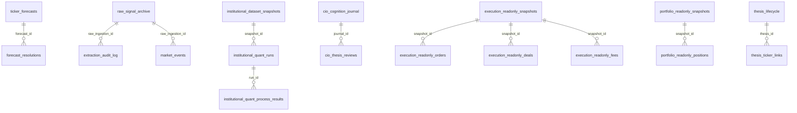
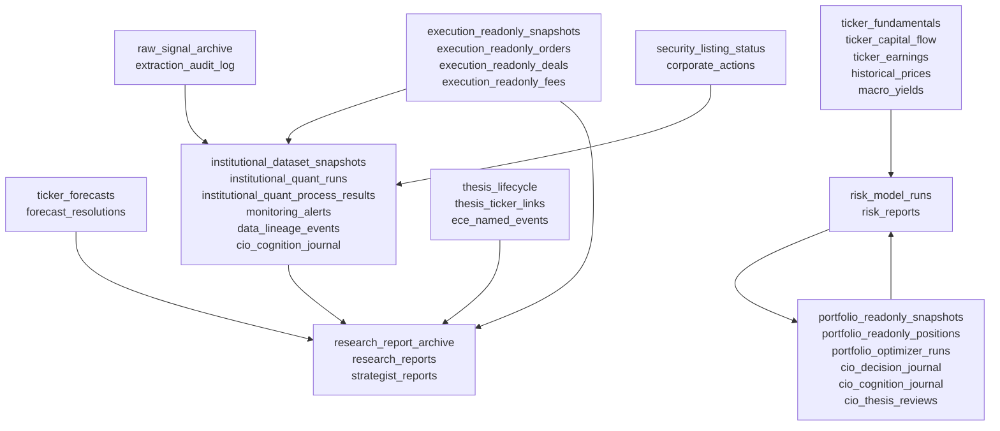

# BlueLotus V2 Database Schema Reference

Generated: 2026-06-07 06:10:17 SGT

Updated: 2026-06-07 12:35 SGT for read-only Moomoo execution-history extraction

Updated: 2026-06-07 22:42 SGT for CIO cognition journal and thesis review capture

Database: `bluelotus2`

Total tables discovered: `50`

## Schema Principles

- `raw_signal_archive` is the broad append-only evidence tape.
- Specialist tables store structured, queryable intelligence for high-value layers.
- JSON columns preserve provider payloads and audit context without forcing premature normalization.
- Institutional quant and dataset snapshot tables provide point-in-time reproducibility.
- Broker order routing is deliberately absent from the system; CIO decision records are research/governance records only.
- Read-only Moomoo open order, order history, deal/fill history, and fee extraction are stored for audit/TCA readiness without enabling order creation, modification, cancellation, or trade unlock.
- CIO Strategic Thinking / Planning / Execution intent is stored in `cio_cognition_journal`; thesis-level repeatability and mistake-risk reviews are stored in `cio_thesis_reviews`. Both are cognition/governance records only and generate no broker orders.

## Table Summary

| Table | Rows* | Columns | Approx Data | Approx Index | Role |
|---|---:|---:|---:|---:|---|
| `ceo_appearance_tracker` | 7 | 23 | 16.0 KB | 80.0 KB | Catalyst / event intelligence |
| `cio_cognition_journal` | 1 | 26 | 16.0 KB | 80.0 KB | CIO cognition / governance |
| `cio_decision_journal` | 18 | 20 | 16.0 KB | 80.0 KB | Governance / operations |
| `cio_decisions` | 0 | 25 | 16.0 KB | 16.0 KB | Support / legacy / auxiliary |
| `cio_thesis_reviews` | 6 | 23 | 16.0 KB | 64.0 KB | CIO cognition / thesis review |
| `conference_calendar` | 11 | 28 | 16.0 KB | 16.0 KB | Catalyst / event intelligence |
| `corporate_actions` | 1027 | 17 | 400.0 KB | 192.0 KB | Bias-control / reference data |
| `daily_regime_snapshots` | 0 | 17 | 16.0 KB | 16.0 KB | Support / legacy / auxiliary |
| `dashboard_snapshots` | 0 | 13 | 16.0 KB | 16.0 KB | Support / legacy / auxiliary |
| `data_lineage_events` | 10 | 9 | 16.0 KB | 64.0 KB | Governance / operations |
| `decision_audit_log` | 2 | 14 | 16.0 KB | 64.0 KB | Support / legacy / auxiliary |
| `ece_named_events` | 8 | 32 | 16.0 KB | 64.0 KB | Catalyst / event intelligence |
| `extraction_audit_log` | 24843 | 23 | 4.52 MB | 6.84 MB | Support / legacy / auxiliary |
| `execution_readonly_deals` | 1612 | 11 | 1.52 MB | 416.0 KB | Read-only execution history / TCA audit |
| `execution_readonly_fees` | 34 | 4 | 16.0 KB | 16.0 KB | Read-only execution history / TCA audit |
| `execution_readonly_orders` | 1379 | 15 | 1.52 MB | 320.0 KB | Read-only execution history / TCA audit |
| `execution_readonly_snapshots` | 1 | 16 | 16.0 KB | 48.0 KB | Read-only execution history / TCA audit |
| `forecast_resolutions` | 0 | 22 | 16.0 KB | 64.0 KB | Forecast resolution / scoring |
| `freshness_recovery_runs` | 3 | 13 | 16.0 KB | 48.0 KB | Governance / operations |
| `historical_backfill_queue` | 243 | 17 | 48.0 KB | 48.0 KB | Governance / operations |
| `historical_backfill_runs` | 3 | 11 | 16.0 KB | 48.0 KB | Governance / operations |
| `historical_prices` | 26134 | 18 | 12.52 MB | 5.28 MB | Support / legacy / auxiliary |
| `institutional_dataset_snapshots` | 48 | 10 | 136.52 MB | 48.0 KB | Point-in-time dataset archive |
| `institutional_doctrine` | 5 | 12 | 16.0 KB | 48.0 KB | Support / legacy / auxiliary |
| `institutional_quant_audit_events` | 24 | 7 | 64.0 KB | 48.0 KB | Institutional readiness process audit |
| `institutional_quant_process_results` | 192 | 11 | 176.0 KB | 48.0 KB | Institutional readiness process audit |
| `institutional_quant_runs` | 24 | 20 | 64.0 KB | 64.0 KB | Institutional readiness process audit |
| `macro_yields` | 7 | 17 | 16.0 KB | 32.0 KB | Support / legacy / auxiliary |
| `market_events` | 3 | 17 | 16.0 KB | 64.0 KB | Support / legacy / auxiliary |
| `monitoring_alerts` | 342 | 12 | 176.0 KB | 80.0 KB | Governance / operations |
| `portfolio_catalyst_calendar` | 180 | 27 | 48.0 KB | 96.0 KB | Portfolio, catalyst, or target-weight subsystem |
| `portfolio_optimizer_runs` | 4 | 12 | 16.0 KB | 48.0 KB | Portfolio, catalyst, or target-weight subsystem |
| `portfolio_readonly_positions` | 20 | 16 | 48.0 KB | 32.0 KB | Portfolio, catalyst, or target-weight subsystem |
| `portfolio_readonly_snapshots` | 4 | 19 | 16.0 KB | 48.0 KB | Portfolio, catalyst, or target-weight subsystem |
| `raw_signal_archive` | 24461 | 27 | 23.55 MB | 9.52 MB | Raw evidence tape / latest signal hub |
| `research_report_archive` | 41 | 31 | 3.52 MB | 96.0 KB | Research/report archive |
| `research_reports` | 3 | 20 | 16.0 KB | 80.0 KB | Research/report archive |
| `risk_model_runs` | 4 | 21 | 80.0 KB | 48.0 KB | Risk reporting / model outputs |
| `risk_reports` | 0 | 21 | 16.0 KB | 32.0 KB | Risk reporting / model outputs |
| `security_listing_status` | 192 | 15 | 128.0 KB | 48.0 KB | Bias-control / reference data |
| `strategist_reports` | 0 | 25 | 16.0 KB | 16.0 KB | Research/report archive |
| `tech_publication_signals` | 316 | 18 | 304.0 KB | 112.0 KB | Catalyst / event intelligence |
| `telegram_delivery_archive` | 0 | 11 | 16.0 KB | 16.0 KB | Support / legacy / auxiliary |
| `thesis_lifecycle` | 6 | 17 | 16.0 KB | 32.0 KB | Thesis lifecycle |
| `thesis_ticker_links` | 36 | 7 | 16.0 KB | 32.0 KB | Thesis lifecycle |
| `ticker_capital_flow` | 799 | 22 | 176.0 KB | 80.0 KB | Ticker-level structured market/fundamental/forecast data |
| `ticker_earnings` | 576 | 17 | 80.0 KB | 80.0 KB | Ticker-level structured market/fundamental/forecast data |
| `ticker_forecasts` | 2867 | 60 | 8.52 MB | 784.0 KB | Ticker-level structured market/fundamental/forecast data |
| `ticker_fundamentals` | 799 | 31 | 144.0 KB | 96.0 KB | Ticker-level structured market/fundamental/forecast data |
| `ticker_short_interest` | 0 | 10 | 16.0 KB | 64.0 KB | Ticker-level structured market/fundamental/forecast data |

\* MySQL `information_schema.tables.table_rows` is approximate for InnoDB.

## Actual Foreign Keys

| Child Table | Column | Parent Table | Parent Column | Constraint |
|---|---|---|---|---|
| `extraction_audit_log` | `raw_ingestion_id` | `raw_signal_archive` | `ingestion_id` | `fk_extraction_raw` |
| `forecast_resolutions` | `forecast_id` | `ticker_forecasts` | `forecast_id` | `fk_fr_forecast` |
| `institutional_quant_process_results` | `run_id` | `institutional_quant_runs` | `run_id` | `fk_iq_process_run` |
| `institutional_quant_runs` | `snapshot_id` | `institutional_dataset_snapshots` | `snapshot_id` | `fk_iq_runs_snapshot` |
| `market_events` | `raw_ingestion_id` | `raw_signal_archive` | `ingestion_id` | `fk_raw_signal` |
| `cio_thesis_reviews` | `journal_id` | `cio_cognition_journal` | `journal_id` | `fk_ctr_journal` |
| `execution_readonly_deals` | `snapshot_id` | `execution_readonly_snapshots` | `snapshot_id` | `fk_erd_snapshot` |
| `execution_readonly_fees` | `snapshot_id` | `execution_readonly_snapshots` | `snapshot_id` | `fk_erf_snapshot` |
| `execution_readonly_orders` | `snapshot_id` | `execution_readonly_snapshots` | `snapshot_id` | `fk_ero_snapshot` |
| `portfolio_readonly_positions` | `snapshot_id` | `portfolio_readonly_snapshots` | `snapshot_id` | `fk_prp_snapshot` |
| `thesis_ticker_links` | `thesis_id` | `thesis_lifecycle` | `thesis_id` | `fk_ttl_thesis` |

## Database Block Diagrams

### Explicit Foreign-Key ERD



### Logical Data Blocks



## Table-By-Table Schema

### `ceo_appearance_tracker`

Role: Catalyst / event intelligence

Approx rows: `7` | data `16.0 KB` | indexes `80.0 KB`

#### Columns

| # | Column | Type | Nullable | Key | Default | Extra |
|---:|---|---|---|---|---|---|
| 1 | `id` | `int` | NO | PRI |  | auto_increment |
| 2 | `executive_name` | `varchar(100)` | NO |  |  |  |
| 3 | `executive_slug` | `varchar(50)` | NO | MUL |  |  |
| 4 | `company` | `varchar(100)` | NO |  |  |  |
| 5 | `ticker` | `varchar(20)` | YES | MUL |  |  |
| 6 | `tier` | `tinyint` | NO |  |  |  |
| 7 | `appearance_type` | `varchar(50)` | NO |  |  |  |
| 8 | `event_name` | `varchar(200)` | YES |  |  |  |
| 9 | `conference_slug` | `varchar(100)` | YES |  |  |  |
| 10 | `appearance_date` | `date` | NO | MUL |  |  |
| 11 | `appearance_time_utc` | `varchar(10)` | YES |  |  |  |
| 12 | `is_scheduled` | `tinyint(1)` | NO |  | 1 |  |
| 13 | `is_confirmed` | `tinyint(1)` | NO |  | 0 |  |
| 14 | `topics_expected` | `json` | YES |  |  |  |
| 15 | `sentiment_bias` | `varchar(20)` | YES |  |  |  |
| 16 | `affected_tickers` | `json` | YES |  |  |  |
| 17 | `alert_72h_flag` | `tinyint(1)` | NO | MUL | 0 |  |
| 18 | `alert_24h_flag` | `tinyint(1)` | NO |  | 0 |  |
| 19 | `source_url` | `varchar(500)` | YES |  |  |  |
| 20 | `source` | `varchar(100)` | NO |  |  |  |
| 21 | `fetched_at` | `datetime` | NO |  |  |  |
| 22 | `snapshot_date` | `date` | NO |  |  |  |
| 23 | `cycle_ts` | `datetime` | NO |  |  |  |

#### Indexes

| Index | Unique | Columns | Type |
|---|---|---|---|
| `idx_ceo_alert72` | No | `alert_72h_flag` | BTREE |
| `idx_ceo_date` | No | `appearance_date` | BTREE |
| `idx_ceo_slug` | No | `executive_slug` | BTREE |
| `idx_ceo_ticker` | No | `ticker` | BTREE |
| `PRIMARY` | Yes | `id` | BTREE |
| `uq_exec_event_date` | Yes | `executive_slug`, `event_name`, `appearance_date` | BTREE |

#### DDL

```sql
CREATE TABLE `ceo_appearance_tracker` (
  `id` int NOT NULL AUTO_INCREMENT,
  `executive_name` varchar(100) COLLATE utf8mb4_unicode_ci NOT NULL COMMENT 'Full name, e.g. Jensen Huang',
  `executive_slug` varchar(50) COLLATE utf8mb4_unicode_ci NOT NULL COMMENT 'Stable key, e.g. JENSEN_HUANG',
  `company` varchar(100) COLLATE utf8mb4_unicode_ci NOT NULL COMMENT 'Employer, e.g. Nvidia',
  `ticker` varchar(20) COLLATE utf8mb4_unicode_ci DEFAULT NULL COMMENT 'Primary ticker, e.g. NVDA. NULL for non-public (Sam Altman)',
  `tier` tinyint NOT NULL COMMENT '1=Market-moving any statement; 2=Sector-specific mover',
  `appearance_type` varchar(50) COLLATE utf8mb4_unicode_ci NOT NULL COMMENT 'KEYNOTE | INTERVIEW | PANEL | EARNINGS_CALL | CONGRESSIONAL | INVESTOR_DAY',
  `event_name` varchar(200) COLLATE utf8mb4_unicode_ci DEFAULT NULL COMMENT 'e.g. Marvell Technology Keynote at Computex 2026',
  `conference_slug` varchar(100) COLLATE utf8mb4_unicode_ci DEFAULT NULL COMMENT 'Soft ref to conference_calendar.conference_slug',
  `appearance_date` date NOT NULL,
  `appearance_time_utc` varchar(10) COLLATE utf8mb4_unicode_ci DEFAULT NULL COMMENT 'UTC time of appearance, e.g. 06:00',
  `is_scheduled` tinyint(1) NOT NULL DEFAULT '1' COMMENT 'TRUE = on published schedule; FALSE = surprise/unannounced',
  `is_confirmed` tinyint(1) NOT NULL DEFAULT '0' COMMENT 'TRUE = officially announced by company or organiser',
  `topics_expected` json DEFAULT NULL COMMENT 'Expected discussion topics, e.g. ["Blackwell","quantum","AI infra"]',
  `sentiment_bias` varchar(20) COLLATE utf8mb4_unicode_ci DEFAULT NULL COMMENT 'BULLISH | BEARISH | NEUTRAL | UNKNOWN',
  `affected_tickers` json DEFAULT NULL COMMENT 'Tickers expected to move on this appearance',
  `alert_72h_flag` tinyint(1) NOT NULL DEFAULT '0' COMMENT 'TRUE if appearance_date within 72h of snapshot_date',
  `alert_24h_flag` tinyint(1) NOT NULL DEFAULT '0' COMMENT 'TRUE if appearance_date within 24h of snapshot_date',
  `source_url` varchar(500) COLLATE utf8mb4_unicode_ci DEFAULT NULL,
  `source` varchar(100) COLLATE utf8mb4_unicode_ci NOT NULL COMMENT 'HPCwire | SEC_EDGAR_8K | Manual | X_Signals | Nvidia_Newsroom',
  `fetched_at` datetime NOT NULL,
  `snapshot_date` date NOT NULL,
  `cycle_ts` datetime NOT NULL,
  PRIMARY KEY (`id`),
  UNIQUE KEY `uq_exec_event_date` (`executive_slug`,`event_name`(100),`appearance_date`),
  KEY `idx_ceo_date` (`appearance_date`),
  KEY `idx_ceo_slug` (`executive_slug`),
  KEY `idx_ceo_alert72` (`alert_72h_flag`),
  KEY `idx_ceo_ticker` (`ticker`)
) ENGINE=InnoDB AUTO_INCREMENT=379 DEFAULT CHARSET=utf8mb4 COLLATE=utf8mb4_unicode_ci COMMENT='Gap 2: Executive public appearance forward tracker.\n           Tier 1 (any statement moves market) and Tier 2 (sector movers).\n           Populated by fetch_ceo_appearances.py.\n           Gap Report: gap_report_20260602_230000';
```

### `cio_cognition_journal`

Role: CIO cognition / governance.

Purpose: records CIO Strategic Thinking, Planning, Execution intent, non-execution rationale, evidence references, linked thesis records, linked decision prompts, follow-up prompts, and author metadata. This table is a governance memory layer only; `order_generated` must remain false and `execution_authority` must remain `CIO_ONLY_MANUAL`.

Key columns:

| Column | Purpose |
|---|---|
| `journal_id` | Stable unique journal key for one CIO cognition capture. |
| `journal_ts` | Timestamp of cognition capture. |
| `source_dataset_sha256` | Dataset hash anchoring the cognition record to point-in-time evidence. |
| `strategic_thinking` | CIO strategic interpretation of regime, thesis state, and edge/mistake context. |
| `planning` | CIO planning notes before action or deliberate non-action. |
| `execution_intent` | CIO-only manual execution intent; never a broker order. |
| `key_risks_json` | Structured risks visible at cognition time. |
| `linked_theses_json` | Thesis records considered by the CIO. |
| `linked_decisions_json` | CIO decision prompts considered by the CIO. |
| `follow_up_json` | Future review prompts for repeatability and mistake learning. |

### `cio_thesis_reviews`

Role: CIO cognition / thesis review.

Purpose: records thesis-level CIO assessment for repeatability, mistake risk, kill-condition review, planning notes, and execution notes. Rows link to `cio_cognition_journal.journal_id` and allow the 90-day trial to distinguish correct-repeatable, correct-lucky, wrong-explainable, and wrong-dangerous thesis behavior.

Key columns:

| Column | Purpose |
|---|---|
| `review_id` | Stable unique review key. |
| `journal_id` | Parent CIO cognition journal. |
| `thesis_id` | Thesis under review. |
| `cio_assessment` | CIO classification such as `EDGE_CANDIDATE_REVIEW`, `WATCH`, or `MISTAKE_REVIEW`. |
| `repeatability_hypothesis` | What would make the thesis repeatable edge. |
| `mistake_risk` | Why this thesis could lead to a wrong decision. |
| `evidence_json` | Evidence present at review time. |
| `contradiction_json` | Contradictions present at review time. |

### `cio_decision_journal`

Role: Governance / operations

Approx rows: `18` | data `16.0 KB` | indexes `80.0 KB`

#### Columns

| # | Column | Type | Nullable | Key | Default | Extra |
|---:|---|---|---|---|---|---|
| 1 | `id` | `bigint` | NO | PRI |  | auto_increment |
| 2 | `decision_id` | `varchar(96)` | NO | UNI |  |  |
| 3 | `decision_ts` | `datetime` | NO | MUL |  |  |
| 4 | `source_run_id` | `varchar(64)` | YES |  |  |  |
| 5 | `decision_type` | `varchar(64)` | NO |  |  |  |
| 6 | `status` | `varchar(48)` | NO | MUL | RESEARCH_PENDING_CIO_REVIEW |  |
| 7 | `priority` | `varchar(16)` | NO |  | P2 |  |
| 8 | `ticker` | `varchar(24)` | YES | MUL |  |  |
| 9 | `thesis_id` | `varchar(64)` | YES | MUL |  |  |
| 10 | `current_weight` | `decimal(12,6)` | YES |  |  |  |
| 11 | `target_weight` | `decimal(12,6)` | YES |  |  |  |
| 12 | `delta_weight` | `decimal(12,6)` | YES |  |  |  |
| 13 | `research_recommendation_json` | `json` | NO |  |  |  |
| 14 | `cio_decision` | `varchar(64)` | YES |  |  |  |
| 15 | `cio_notes` | `text` | YES |  |  |  |
| 16 | `execution_authority` | `varchar(64)` | NO |  | CIO_ONLY_MANUAL |  |
| 17 | `order_generated` | `tinyint(1)` | NO |  | 0 |  |
| 18 | `order_reference` | `varchar(128)` | YES |  |  |  |
| 19 | `created_at` | `timestamp` | YES |  | CURRENT_TIMESTAMP | DEFAULT_GENERATED |
| 20 | `updated_at` | `timestamp` | YES |  | CURRENT_TIMESTAMP | DEFAULT_GENERATED on update CURRENT_TIMESTAMP |

#### Indexes

| Index | Unique | Columns | Type |
|---|---|---|---|
| `decision_id` | Yes | `decision_id` | BTREE |
| `idx_cdj_decision_ts` | No | `decision_ts` | BTREE |
| `idx_cdj_status_priority` | No | `status`, `priority` | BTREE |
| `idx_cdj_thesis` | No | `thesis_id` | BTREE |
| `idx_cdj_ticker` | No | `ticker` | BTREE |
| `PRIMARY` | Yes | `id` | BTREE |

#### DDL

```sql
CREATE TABLE `cio_decision_journal` (
  `id` bigint NOT NULL AUTO_INCREMENT,
  `decision_id` varchar(96) COLLATE utf8mb4_unicode_ci NOT NULL,
  `decision_ts` datetime NOT NULL,
  `source_run_id` varchar(64) COLLATE utf8mb4_unicode_ci DEFAULT NULL,
  `decision_type` varchar(64) COLLATE utf8mb4_unicode_ci NOT NULL,
  `status` varchar(48) COLLATE utf8mb4_unicode_ci NOT NULL DEFAULT 'RESEARCH_PENDING_CIO_REVIEW',
  `priority` varchar(16) COLLATE utf8mb4_unicode_ci NOT NULL DEFAULT 'P2',
  `ticker` varchar(24) COLLATE utf8mb4_unicode_ci DEFAULT NULL,
  `thesis_id` varchar(64) COLLATE utf8mb4_unicode_ci DEFAULT NULL,
  `current_weight` decimal(12,6) DEFAULT NULL,
  `target_weight` decimal(12,6) DEFAULT NULL,
  `delta_weight` decimal(12,6) DEFAULT NULL,
  `research_recommendation_json` json NOT NULL,
  `cio_decision` varchar(64) COLLATE utf8mb4_unicode_ci DEFAULT NULL,
  `cio_notes` text COLLATE utf8mb4_unicode_ci,
  `execution_authority` varchar(64) COLLATE utf8mb4_unicode_ci NOT NULL DEFAULT 'CIO_ONLY_MANUAL',
  `order_generated` tinyint(1) NOT NULL DEFAULT '0',
  `order_reference` varchar(128) COLLATE utf8mb4_unicode_ci DEFAULT NULL,
  `created_at` timestamp NULL DEFAULT CURRENT_TIMESTAMP,
  `updated_at` timestamp NULL DEFAULT CURRENT_TIMESTAMP ON UPDATE CURRENT_TIMESTAMP,
  PRIMARY KEY (`id`),
  UNIQUE KEY `decision_id` (`decision_id`),
  KEY `idx_cdj_decision_ts` (`decision_ts`),
  KEY `idx_cdj_status_priority` (`status`,`priority`),
  KEY `idx_cdj_ticker` (`ticker`),
  KEY `idx_cdj_thesis` (`thesis_id`)
) ENGINE=InnoDB AUTO_INCREMENT=25 DEFAULT CHARSET=utf8mb4 COLLATE=utf8mb4_unicode_ci;
```

### `cio_decisions`

Role: Support / legacy / auxiliary

Approx rows: `0` | data `16.0 KB` | indexes `16.0 KB`

#### Columns

| # | Column | Type | Nullable | Key | Default | Extra |
|---:|---|---|---|---|---|---|
| 1 | `id` | `int` | NO | PRI |  | auto_increment |
| 2 | `decision_id` | `varchar(60)` | NO | UNI |  |  |
| 3 | `decision_date` | `date` | NO | MUL |  |  |
| 4 | `decision_time` | `time` | NO |  |  |  |
| 5 | `recorded_at` | `datetime` | NO |  | CURRENT_TIMESTAMP | DEFAULT_GENERATED |
| 6 | `action` | `varchar(20)` | NO | MUL |  |  |
| 7 | `ticker` | `varchar(10)` | YES | MUL |  |  |
| 8 | `quantity` | `int` | YES |  |  |  |
| 9 | `price_at_decision` | `decimal(12,4)` | YES |  |  |  |
| 10 | `size_usd` | `decimal(14,2)` | YES |  |  |  |
| 11 | `confidence` | `decimal(4,3)` | NO |  | 0.000 |  |
| 12 | `rationale` | `text` | NO |  |  |  |
| 13 | `thesis_reference` | `varchar(60)` | YES |  |  |  |
| 14 | `risk_reference` | `varchar(60)` | YES |  |  |  |
| 15 | `regime_at_decision` | `varchar(30)` | NO |  |  |  |
| 16 | `portfolio_pct_before` | `decimal(6,3)` | YES |  |  |  |
| 17 | `portfolio_pct_after` | `decimal(6,3)` | YES |  |  |  |
| 18 | `entry_type` | `varchar(30)` | YES |  |  |  |
| 19 | `working_order_placed` | `tinyint(1)` | NO |  | 0 |  |
| 20 | `order_price` | `decimal(12,4)` | YES |  |  |  |
| 21 | `strategic_note` | `text` | YES |  |  |  |
| 22 | `outcome_review_date` | `date` | YES |  |  |  |
| 23 | `outcome_recorded` | `tinyint(1)` | NO | MUL | 0 |  |
| 24 | `outcome_notes` | `text` | YES |  |  |  |
| 25 | `schema_version` | `varchar(10)` | NO |  | 1.0 |  |

#### Indexes

| Index | Unique | Columns | Type |
|---|---|---|---|
| `idx_cio_action` | No | `action` | BTREE |
| `idx_cio_date` | No | `decision_date` | BTREE |
| `idx_cio_outcome` | No | `outcome_recorded` | BTREE |
| `idx_cio_ticker` | No | `ticker` | BTREE |
| `PRIMARY` | Yes | `id` | BTREE |
| `uq_cio_decision_id` | Yes | `decision_id` | BTREE |

#### DDL

```sql
CREATE TABLE `cio_decisions` (
  `id` int NOT NULL AUTO_INCREMENT,
  `decision_id` varchar(60) COLLATE utf8mb4_unicode_ci NOT NULL,
  `decision_date` date NOT NULL,
  `decision_time` time NOT NULL,
  `recorded_at` datetime NOT NULL DEFAULT CURRENT_TIMESTAMP,
  `action` varchar(20) COLLATE utf8mb4_unicode_ci NOT NULL,
  `ticker` varchar(10) COLLATE utf8mb4_unicode_ci DEFAULT NULL,
  `quantity` int DEFAULT NULL,
  `price_at_decision` decimal(12,4) DEFAULT NULL,
  `size_usd` decimal(14,2) DEFAULT NULL,
  `confidence` decimal(4,3) NOT NULL DEFAULT '0.000',
  `rationale` text COLLATE utf8mb4_unicode_ci NOT NULL,
  `thesis_reference` varchar(60) COLLATE utf8mb4_unicode_ci DEFAULT NULL,
  `risk_reference` varchar(60) COLLATE utf8mb4_unicode_ci DEFAULT NULL,
  `regime_at_decision` varchar(30) COLLATE utf8mb4_unicode_ci NOT NULL,
  `portfolio_pct_before` decimal(6,3) DEFAULT NULL,
  `portfolio_pct_after` decimal(6,3) DEFAULT NULL,
  `entry_type` varchar(30) COLLATE utf8mb4_unicode_ci DEFAULT NULL,
  `working_order_placed` tinyint(1) NOT NULL DEFAULT '0',
  `order_price` decimal(12,4) DEFAULT NULL,
  `strategic_note` text COLLATE utf8mb4_unicode_ci,
  `outcome_review_date` date DEFAULT NULL,
  `outcome_recorded` tinyint(1) NOT NULL DEFAULT '0',
  `outcome_notes` text COLLATE utf8mb4_unicode_ci,
  `schema_version` varchar(10) COLLATE utf8mb4_unicode_ci NOT NULL DEFAULT '1.0',
  PRIMARY KEY (`id`),
  UNIQUE KEY `uq_cio_decision_id` (`decision_id`),
  KEY `idx_cio_date` (`decision_date` DESC),
  KEY `idx_cio_ticker` (`ticker`),
  KEY `idx_cio_action` (`action`),
  KEY `idx_cio_outcome` (`outcome_recorded`)
) ENGINE=InnoDB DEFAULT CHARSET=utf8mb4 COLLATE=utf8mb4_unicode_ci;
```

### `conference_calendar`

Role: Catalyst / event intelligence

Approx rows: `11` | data `16.0 KB` | indexes `16.0 KB`

#### Columns

| # | Column | Type | Nullable | Key | Default | Extra |
|---:|---|---|---|---|---|---|
| 1 | `id` | `int` | NO | PRI |  | auto_increment |
| 2 | `conference_name` | `varchar(200)` | NO |  |  |  |
| 3 | `conference_slug` | `varchar(100)` | NO | MUL |  |  |
| 4 | `edition_year` | `smallint` | NO |  |  |  |
| 5 | `event_date_start` | `date` | NO |  |  |  |
| 6 | `event_date_end` | `date` | NO |  |  |  |
| 7 | `keynote_date` | `date` | YES |  |  |  |
| 8 | `keynote_time_local` | `varchar(10)` | YES |  |  |  |
| 9 | `keynote_timezone` | `varchar(50)` | YES |  |  |  |
| 10 | `keynote_speakers` | `json` | YES |  |  |  |
| 11 | `hosting_company` | `varchar(100)` | YES |  |  |  |
| 12 | `location_city` | `varchar(100)` | YES |  |  |  |
| 13 | `location_country` | `varchar(10)` | YES |  |  |  |
| 14 | `impact_tier` | `tinyint` | NO |  | 2 |  |
| 15 | `affected_tickers` | `json` | YES |  |  |  |
| 16 | `affected_themes` | `json` | YES |  |  |  |
| 17 | `hist_impact_bull` | `decimal(6,2)` | YES |  |  |  |
| 18 | `hist_impact_base` | `decimal(6,2)` | YES |  |  |  |
| 19 | `hist_impact_bear` | `decimal(6,2)` | YES |  |  |  |
| 20 | `hist_years_tracked` | `tinyint` | YES |  |  |  |
| 21 | `days_until_event` | `smallint` | YES |  |  |  |
| 22 | `catalyst_flag` | `varchar(30)` | YES |  |  |  |
| 23 | `announcement_url` | `varchar(500)` | YES |  |  |  |
| 24 | `source` | `varchar(100)` | NO |  |  |  |
| 25 | `fetched_at` | `datetime` | NO |  |  |  |
| 26 | `snapshot_date` | `date` | NO |  |  |  |
| 27 | `cycle_ts` | `datetime` | NO |  |  |  |
| 28 | `notes` | `text` | YES |  |  |  |

#### Indexes

| Index | Unique | Columns | Type |
|---|---|---|---|
| `PRIMARY` | Yes | `id` | BTREE |
| `uq_conf_slug_year` | Yes | `conference_slug`, `edition_year` | BTREE |

#### DDL

```sql
CREATE TABLE `conference_calendar` (
  `id` int NOT NULL AUTO_INCREMENT,
  `conference_name` varchar(200) COLLATE utf8mb4_unicode_ci NOT NULL COMMENT 'Human-readable name, e.g. Computex Taipei 2026',
  `conference_slug` varchar(100) COLLATE utf8mb4_unicode_ci NOT NULL COMMENT 'Stable machine key, e.g. COMPUTEX_2026',
  `edition_year` smallint NOT NULL COMMENT 'Calendar year of this edition',
  `event_date_start` date NOT NULL COMMENT 'First day of conference (inclusive)',
  `event_date_end` date NOT NULL COMMENT 'Last day of conference (inclusive)',
  `keynote_date` date DEFAULT NULL COMMENT 'Specific keynote day if known; NULL = TBC',
  `keynote_time_local` varchar(10) COLLATE utf8mb4_unicode_ci DEFAULT NULL COMMENT 'Keynote start time in local tz, e.g. 14:00',
  `keynote_timezone` varchar(50) COLLATE utf8mb4_unicode_ci DEFAULT NULL COMMENT 'IANA timezone, e.g. Asia/Taipei',
  `keynote_speakers` json DEFAULT NULL COMMENT 'Array of speaker names, e.g. ["Jensen Huang"]',
  `hosting_company` varchar(100) COLLATE utf8mb4_unicode_ci DEFAULT NULL COMMENT 'Company hosting or co-presenting the keynote',
  `location_city` varchar(100) COLLATE utf8mb4_unicode_ci DEFAULT NULL,
  `location_country` varchar(10) COLLATE utf8mb4_unicode_ci DEFAULT NULL COMMENT 'ISO 3166-1 alpha-2, e.g. TW US',
  `impact_tier` tinyint NOT NULL DEFAULT '2' COMMENT '1=CRITICAL 2=HIGH 3=MEDIUM — market move potential',
  `affected_tickers` json DEFAULT NULL COMMENT 'Watchlist tickers expected to move, e.g. ["NVDA","MRVL"]',
  `affected_themes` json DEFAULT NULL COMMENT 'Theme tags, e.g. ["AI","SEMICONDUCTOR","QUANTUM"]',
  `hist_impact_bull` decimal(6,2) DEFAULT NULL COMMENT 'Bull case: best historical % move (e.g. +10.4 for NVDA 2024)',
  `hist_impact_base` decimal(6,2) DEFAULT NULL COMMENT 'Base case: typical expected % move',
  `hist_impact_bear` decimal(6,2) DEFAULT NULL COMMENT 'Bear case: fade/underperform % move (e.g. -1.2)',
  `hist_years_tracked` tinyint DEFAULT NULL COMMENT 'Number of historical years backing the impact model',
  `days_until_event` smallint DEFAULT NULL COMMENT 'Calendar days from snapshot_date to event_date_start',
  `catalyst_flag` varchar(30) COLLATE utf8mb4_unicode_ci DEFAULT NULL COMMENT 'IMMINENT (<3d) | UPCOMING (<14d) | ACTIVE | PAST',
  `announcement_url` varchar(500) COLLATE utf8mb4_unicode_ci DEFAULT NULL COMMENT 'URL of the official schedule or announcement',
  `source` varchar(100) COLLATE utf8mb4_unicode_ci NOT NULL COMMENT 'Feed that provided this record, e.g. HPCwire | Manual_Calendar',
  `fetched_at` datetime NOT NULL COMMENT 'SGT wall-clock time this row was written (naive, no tzinfo)',
  `snapshot_date` date NOT NULL COMMENT 'Trading date this record was ingested',
  `cycle_ts` datetime NOT NULL COMMENT 'SGT cycle timestamp — matches BUG-MID-004 convention',
  `notes` text COLLATE utf8mb4_unicode_ci COMMENT 'Research Team annotations, e.g. surprise appearance context',
  PRIMARY KEY (`id`),
  UNIQUE KEY `uq_conf_slug_year` (`conference_slug`,`edition_year`)
) ENGINE=InnoDB AUTO_INCREMENT=881 DEFAULT CHARSET=utf8mb4 COLLATE=utf8mb4_unicode_ci COMMENT='Gap 1: Forward-looking tech conference and keynote calendar.\n           Populated by fetch_conference_calendar.py.\n           Gap Report: gap_report_20260602_230000';
```

### `corporate_actions`

Role: Bias-control / reference data

Approx rows: `1027` | data `400.0 KB` | indexes `192.0 KB`

#### Columns

| # | Column | Type | Nullable | Key | Default | Extra |
|---:|---|---|---|---|---|---|
| 1 | `id` | `bigint` | NO | PRI |  | auto_increment |
| 2 | `action_id` | `varchar(96)` | NO | UNI |  |  |
| 3 | `ticker` | `varchar(24)` | NO | MUL |  |  |
| 4 | `code` | `varchar(32)` | NO |  |  |  |
| 5 | `action_type` | `varchar(32)` | NO | MUL |  |  |
| 6 | `event_date` | `date` | YES |  |  |  |
| 7 | `ex_date` | `date` | YES |  |  |  |
| 8 | `record_date` | `date` | YES |  |  |  |
| 9 | `pay_date` | `date` | YES |  |  |  |
| 10 | `statement` | `text` | YES |  |  |  |
| 11 | `ratio_text` | `varchar(128)` | YES |  |  |  |
| 12 | `amount` | `decimal(20,8)` | YES |  |  |  |
| 13 | `currency` | `varchar(16)` | YES |  |  |  |
| 14 | `raw_json` | `json` | NO |  |  |  |
| 15 | `fetched_at` | `datetime` | NO |  |  |  |
| 16 | `created_at` | `timestamp` | YES |  | CURRENT_TIMESTAMP | DEFAULT_GENERATED |
| 17 | `updated_at` | `timestamp` | YES |  | CURRENT_TIMESTAMP | DEFAULT_GENERATED on update CURRENT_TIMESTAMP |

#### Indexes

| Index | Unique | Columns | Type |
|---|---|---|---|
| `action_id` | Yes | `action_id` | BTREE |
| `idx_ca_ticker_date` | No | `ticker`, `event_date` | BTREE |
| `idx_ca_type` | No | `action_type` | BTREE |
| `PRIMARY` | Yes | `id` | BTREE |

#### DDL

```sql
CREATE TABLE `corporate_actions` (
  `id` bigint NOT NULL AUTO_INCREMENT,
  `action_id` varchar(96) COLLATE utf8mb4_unicode_ci NOT NULL,
  `ticker` varchar(24) COLLATE utf8mb4_unicode_ci NOT NULL,
  `code` varchar(32) COLLATE utf8mb4_unicode_ci NOT NULL,
  `action_type` varchar(32) COLLATE utf8mb4_unicode_ci NOT NULL,
  `event_date` date DEFAULT NULL,
  `ex_date` date DEFAULT NULL,
  `record_date` date DEFAULT NULL,
  `pay_date` date DEFAULT NULL,
  `statement` text COLLATE utf8mb4_unicode_ci,
  `ratio_text` varchar(128) COLLATE utf8mb4_unicode_ci DEFAULT NULL,
  `amount` decimal(20,8) DEFAULT NULL,
  `currency` varchar(16) COLLATE utf8mb4_unicode_ci DEFAULT NULL,
  `raw_json` json NOT NULL,
  `fetched_at` datetime NOT NULL,
  `created_at` timestamp NULL DEFAULT CURRENT_TIMESTAMP,
  `updated_at` timestamp NULL DEFAULT CURRENT_TIMESTAMP ON UPDATE CURRENT_TIMESTAMP,
  PRIMARY KEY (`id`),
  UNIQUE KEY `action_id` (`action_id`),
  KEY `idx_ca_ticker_date` (`ticker`,`event_date`),
  KEY `idx_ca_type` (`action_type`)
) ENGINE=InnoDB AUTO_INCREMENT=3124 DEFAULT CHARSET=utf8mb4 COLLATE=utf8mb4_unicode_ci;
```

### `daily_regime_snapshots`

Role: Support / legacy / auxiliary

Approx rows: `0` | data `16.0 KB` | indexes `16.0 KB`

#### Columns

| # | Column | Type | Nullable | Key | Default | Extra |
|---:|---|---|---|---|---|---|
| 1 | `id` | `int` | NO | PRI |  | auto_increment |
| 2 | `snapshot_date` | `date` | NO | UNI |  |  |
| 3 | `regime_label` | `varchar(50)` | YES |  |  |  |
| 4 | `regime_score` | `decimal(4,2)` | YES |  |  |  |
| 5 | `vix` | `decimal(6,2)` | YES |  |  |  |
| 6 | `fear_greed_index` | `int` | YES |  |  |  |
| 7 | `dxy` | `decimal(8,4)` | YES |  |  |  |
| 8 | `spy_close` | `decimal(10,4)` | YES |  |  |  |
| 9 | `qqq_close` | `decimal(10,4)` | YES |  |  |  |
| 10 | `tnx` | `decimal(6,4)` | YES |  |  |  |
| 11 | `oil_price` | `decimal(8,4)` | YES |  |  |  |
| 12 | `gold_price` | `decimal(10,4)` | YES |  |  |  |
| 13 | `sector_leadership` | `json` | YES |  |  |  |
| 14 | `volatility_state` | `varchar(30)` | YES |  |  |  |
| 15 | `macro_bias` | `varchar(20)` | YES |  |  |  |
| 16 | `cio_annotation` | `text` | YES |  |  |  |
| 17 | `created_at` | `datetime` | YES |  | CURRENT_TIMESTAMP | DEFAULT_GENERATED |

#### Indexes

| Index | Unique | Columns | Type |
|---|---|---|---|
| `idx_regime_date` | No | `snapshot_date` | BTREE |
| `PRIMARY` | Yes | `id` | BTREE |
| `snapshot_date` | Yes | `snapshot_date` | BTREE |

#### DDL

```sql
CREATE TABLE `daily_regime_snapshots` (
  `id` int NOT NULL AUTO_INCREMENT,
  `snapshot_date` date NOT NULL,
  `regime_label` varchar(50) COLLATE utf8mb4_unicode_ci DEFAULT NULL,
  `regime_score` decimal(4,2) DEFAULT NULL,
  `vix` decimal(6,2) DEFAULT NULL,
  `fear_greed_index` int DEFAULT NULL,
  `dxy` decimal(8,4) DEFAULT NULL,
  `spy_close` decimal(10,4) DEFAULT NULL,
  `qqq_close` decimal(10,4) DEFAULT NULL,
  `tnx` decimal(6,4) DEFAULT NULL,
  `oil_price` decimal(8,4) DEFAULT NULL,
  `gold_price` decimal(10,4) DEFAULT NULL,
  `sector_leadership` json DEFAULT NULL,
  `volatility_state` varchar(30) COLLATE utf8mb4_unicode_ci DEFAULT NULL,
  `macro_bias` varchar(20) COLLATE utf8mb4_unicode_ci DEFAULT NULL,
  `cio_annotation` text COLLATE utf8mb4_unicode_ci,
  `created_at` datetime DEFAULT CURRENT_TIMESTAMP,
  PRIMARY KEY (`id`),
  UNIQUE KEY `snapshot_date` (`snapshot_date`),
  KEY `idx_regime_date` (`snapshot_date` DESC)
) ENGINE=InnoDB DEFAULT CHARSET=utf8mb4 COLLATE=utf8mb4_unicode_ci;
```

### `dashboard_snapshots`

Role: Support / legacy / auxiliary

Approx rows: `0` | data `16.0 KB` | indexes `16.0 KB`

#### Columns

| # | Column | Type | Nullable | Key | Default | Extra |
|---:|---|---|---|---|---|---|
| 1 | `id` | `int` | NO | PRI |  | auto_increment |
| 2 | `snapshot_id` | `varchar(36)` | NO | UNI |  |  |
| 3 | `snapshot_timestamp` | `datetime` | NO |  |  |  |
| 4 | `regime_label` | `varchar(50)` | YES |  |  |  |
| 5 | `total_tickers` | `int` | YES |  |  |  |
| 6 | `high_conviction_ct` | `int` | YES |  |  |  |
| 7 | `medium_ct` | `int` | YES |  |  |  |
| 8 | `avoid_ct` | `int` | YES |  |  |  |
| 9 | `top_gainers` | `json` | YES |  |  |  |
| 10 | `top_losers` | `json` | YES |  |  |  |
| 11 | `payload_json` | `json` | YES |  |  |  |
| 12 | `html_path` | `varchar(500)` | YES |  |  |  |
| 13 | `created_at` | `datetime` | YES |  | CURRENT_TIMESTAMP | DEFAULT_GENERATED |

#### Indexes

| Index | Unique | Columns | Type |
|---|---|---|---|
| `PRIMARY` | Yes | `id` | BTREE |
| `snapshot_id` | Yes | `snapshot_id` | BTREE |

#### DDL

```sql
CREATE TABLE `dashboard_snapshots` (
  `id` int NOT NULL AUTO_INCREMENT,
  `snapshot_id` varchar(36) COLLATE utf8mb4_unicode_ci NOT NULL,
  `snapshot_timestamp` datetime NOT NULL,
  `regime_label` varchar(50) COLLATE utf8mb4_unicode_ci DEFAULT NULL,
  `total_tickers` int DEFAULT NULL,
  `high_conviction_ct` int DEFAULT NULL,
  `medium_ct` int DEFAULT NULL,
  `avoid_ct` int DEFAULT NULL,
  `top_gainers` json DEFAULT NULL,
  `top_losers` json DEFAULT NULL,
  `payload_json` json DEFAULT NULL,
  `html_path` varchar(500) COLLATE utf8mb4_unicode_ci DEFAULT NULL,
  `created_at` datetime DEFAULT CURRENT_TIMESTAMP,
  PRIMARY KEY (`id`),
  UNIQUE KEY `snapshot_id` (`snapshot_id`)
) ENGINE=InnoDB DEFAULT CHARSET=utf8mb4 COLLATE=utf8mb4_unicode_ci;
```

### `data_lineage_events`

Role: Governance / operations

Approx rows: `10` | data `16.0 KB` | indexes `64.0 KB`

#### Columns

| # | Column | Type | Nullable | Key | Default | Extra |
|---:|---|---|---|---|---|---|
| 1 | `id` | `bigint` | NO | PRI |  | auto_increment |
| 2 | `event_id` | `varchar(64)` | NO | UNI |  |  |
| 3 | `cycle_ts` | `datetime` | NO | MUL |  |  |
| 4 | `stage` | `varchar(64)` | NO | MUL |  |  |
| 5 | `input_refs_json` | `json` | YES |  |  |  |
| 6 | `output_refs_json` | `json` | YES |  |  |  |
| 7 | `dataset_sha256` | `char(64)` | YES | MUL |  |  |
| 8 | `notes` | `text` | YES |  |  |  |
| 9 | `created_at` | `timestamp` | YES |  | CURRENT_TIMESTAMP | DEFAULT_GENERATED |

#### Indexes

| Index | Unique | Columns | Type |
|---|---|---|---|
| `event_id` | Yes | `event_id` | BTREE |
| `idx_dle_cycle_ts` | No | `cycle_ts` | BTREE |
| `idx_dle_dataset_sha` | No | `dataset_sha256` | BTREE |
| `idx_dle_stage` | No | `stage` | BTREE |
| `PRIMARY` | Yes | `id` | BTREE |

#### DDL

```sql
CREATE TABLE `data_lineage_events` (
  `id` bigint NOT NULL AUTO_INCREMENT,
  `event_id` varchar(64) COLLATE utf8mb4_unicode_ci NOT NULL,
  `cycle_ts` datetime NOT NULL,
  `stage` varchar(64) COLLATE utf8mb4_unicode_ci NOT NULL,
  `input_refs_json` json DEFAULT NULL,
  `output_refs_json` json DEFAULT NULL,
  `dataset_sha256` char(64) COLLATE utf8mb4_unicode_ci DEFAULT NULL,
  `notes` text COLLATE utf8mb4_unicode_ci,
  `created_at` timestamp NULL DEFAULT CURRENT_TIMESTAMP,
  PRIMARY KEY (`id`),
  UNIQUE KEY `event_id` (`event_id`),
  KEY `idx_dle_cycle_ts` (`cycle_ts`),
  KEY `idx_dle_stage` (`stage`),
  KEY `idx_dle_dataset_sha` (`dataset_sha256`)
) ENGINE=InnoDB AUTO_INCREMENT=11 DEFAULT CHARSET=utf8mb4 COLLATE=utf8mb4_unicode_ci;
```

### `decision_audit_log`

Role: Support / legacy / auxiliary

Approx rows: `2` | data `16.0 KB` | indexes `64.0 KB`

#### Columns

| # | Column | Type | Nullable | Key | Default | Extra |
|---:|---|---|---|---|---|---|
| 1 | `id` | `int` | NO | PRI |  | auto_increment |
| 2 | `log_id` | `varchar(36)` | NO | UNI |  |  |
| 3 | `log_timestamp` | `datetime` | NO | MUL | CURRENT_TIMESTAMP | DEFAULT_GENERATED |
| 4 | `actor` | `varchar(100)` | NO | MUL |  |  |
| 5 | `action_type` | `varchar(50)` | NO | MUL |  |  |
| 6 | `entity_type` | `varchar(50)` | YES |  |  |  |
| 7 | `entity_id` | `varchar(100)` | YES |  |  |  |
| 8 | `previous_value` | `json` | YES |  |  |  |
| 9 | `new_value` | `json` | YES |  |  |  |
| 10 | `reason` | `text` | YES |  |  |  |
| 11 | `confidence_shift` | `decimal(4,2)` | YES |  |  |  |
| 12 | `model_version` | `varchar(50)` | YES |  |  |  |
| 13 | `session_id` | `varchar(100)` | YES |  |  |  |
| 14 | `created_at` | `datetime` | YES |  | CURRENT_TIMESTAMP | DEFAULT_GENERATED |

#### Indexes

| Index | Unique | Columns | Type |
|---|---|---|---|
| `idx_audit_action` | No | `action_type` | BTREE |
| `idx_audit_actor` | No | `actor` | BTREE |
| `idx_audit_timestamp` | No | `log_timestamp` | BTREE |
| `log_id` | Yes | `log_id` | BTREE |
| `PRIMARY` | Yes | `id` | BTREE |

#### DDL

```sql
CREATE TABLE `decision_audit_log` (
  `id` int NOT NULL AUTO_INCREMENT,
  `log_id` varchar(36) COLLATE utf8mb4_unicode_ci NOT NULL,
  `log_timestamp` datetime NOT NULL DEFAULT CURRENT_TIMESTAMP,
  `actor` varchar(100) COLLATE utf8mb4_unicode_ci NOT NULL,
  `action_type` varchar(50) COLLATE utf8mb4_unicode_ci NOT NULL,
  `entity_type` varchar(50) COLLATE utf8mb4_unicode_ci DEFAULT NULL,
  `entity_id` varchar(100) COLLATE utf8mb4_unicode_ci DEFAULT NULL,
  `previous_value` json DEFAULT NULL,
  `new_value` json DEFAULT NULL,
  `reason` text COLLATE utf8mb4_unicode_ci,
  `confidence_shift` decimal(4,2) DEFAULT NULL,
  `model_version` varchar(50) COLLATE utf8mb4_unicode_ci DEFAULT NULL,
  `session_id` varchar(100) COLLATE utf8mb4_unicode_ci DEFAULT NULL,
  `created_at` datetime DEFAULT CURRENT_TIMESTAMP,
  PRIMARY KEY (`id`),
  UNIQUE KEY `log_id` (`log_id`),
  KEY `idx_audit_timestamp` (`log_timestamp` DESC),
  KEY `idx_audit_actor` (`actor`),
  KEY `idx_audit_action` (`action_type`)
) ENGINE=InnoDB AUTO_INCREMENT=3 DEFAULT CHARSET=utf8mb4 COLLATE=utf8mb4_unicode_ci;
```

### `ece_named_events`

Role: Catalyst / event intelligence

Approx rows: `8` | data `16.0 KB` | indexes `64.0 KB`

#### Columns

| # | Column | Type | Nullable | Key | Default | Extra |
|---:|---|---|---|---|---|---|
| 1 | `id` | `int` | NO | PRI |  | auto_increment |
| 2 | `event_slug` | `varchar(100)` | NO | UNI |  |  |
| 3 | `event_name` | `varchar(200)` | NO |  |  |  |
| 4 | `event_category` | `varchar(50)` | NO | MUL |  |  |
| 5 | `description` | `text` | YES |  |  |  |
| 6 | `trigger_type` | `varchar(30)` | NO |  |  |  |
| 7 | `trigger_month` | `tinyint` | YES |  |  |  |
| 8 | `trigger_week_of_month` | `tinyint` | YES |  |  |  |
| 9 | `trigger_day_of_week` | `tinyint` | YES |  |  |  |
| 10 | `trigger_day_of_month` | `tinyint` | YES |  |  |  |
| 11 | `trigger_description` | `varchar(200)` | YES |  |  |  |
| 12 | `base_case_sectors` | `json` | YES |  |  |  |
| 13 | `base_case_impact_pct` | `decimal(6,2)` | YES |  |  |  |
| 14 | `base_case_duration_days` | `tinyint` | YES |  |  |  |
| 15 | `bull_trigger` | `text` | YES |  |  |  |
| 16 | `bull_case_impact_pct` | `decimal(6,2)` | YES |  |  |  |
| 17 | `bull_case_tickers` | `json` | YES |  |  |  |
| 18 | `bull_duration_days` | `tinyint` | YES |  |  |  |
| 19 | `bear_trigger` | `text` | YES |  |  |  |
| 20 | `bear_case_impact_pct` | `decimal(6,2)` | YES |  |  |  |
| 21 | `bear_duration_days` | `tinyint` | YES |  |  |  |
| 22 | `sector_impact_map` | `json` | YES |  |  |  |
| 23 | `historical_years` | `json` | YES |  |  |  |
| 24 | `years_tracked` | `tinyint` | YES |  |  |  |
| 25 | `is_active` | `tinyint(1)` | NO | MUL | 1 |  |
| 26 | `last_occurrence` | `date` | YES |  |  |  |
| 27 | `next_occurrence` | `date` | YES | MUL |  |  |
| 28 | `source` | `varchar(100)` | NO |  | Manual_ECE |  |
| 29 | `authored_by` | `varchar(100)` | YES |  |  |  |
| 30 | `created_at` | `datetime` | NO |  |  |  |
| 31 | `updated_at` | `datetime` | NO |  |  |  |
| 32 | `notes` | `text` | YES |  |  |  |

#### Indexes

| Index | Unique | Columns | Type |
|---|---|---|---|
| `idx_ece_active` | No | `is_active` | BTREE |
| `idx_ece_category` | No | `event_category` | BTREE |
| `idx_ece_next_occurrence` | No | `next_occurrence` | BTREE |
| `PRIMARY` | Yes | `id` | BTREE |
| `uq_ece_event_slug` | Yes | `event_slug` | BTREE |

#### DDL

```sql
CREATE TABLE `ece_named_events` (
  `id` int NOT NULL AUTO_INCREMENT,
  `event_slug` varchar(100) COLLATE utf8mb4_unicode_ci NOT NULL COMMENT 'Stable machine key, e.g. COMPUTEX_HUANG_KEYNOTE',
  `event_name` varchar(200) COLLATE utf8mb4_unicode_ci NOT NULL COMMENT 'Human label, e.g. Computex Jensen Huang Keynote',
  `event_category` varchar(50) COLLATE utf8mb4_unicode_ci NOT NULL COMMENT 'SEASONAL_TECH | FED_DECISION | EARNINGS_SEASON\n                                      | GEOPOLITICAL | REGULATORY | SECTOR_ROTATION',
  `description` text COLLATE utf8mb4_unicode_ci COMMENT 'Research Team narrative of why this event matters',
  `trigger_type` varchar(30) COLLATE utf8mb4_unicode_ci NOT NULL COMMENT 'ANNUAL_DATE (fixed date) | ANNUAL_WEEKDAY (Nth weekday)',
  `trigger_month` tinyint DEFAULT NULL COMMENT 'Month number 1-12',
  `trigger_week_of_month` tinyint DEFAULT NULL COMMENT 'For ANNUAL_WEEKDAY: 1=first, 2=second, etc.',
  `trigger_day_of_week` tinyint DEFAULT NULL COMMENT 'For ANNUAL_WEEKDAY: 0=Mon 1=Tue ... 6=Sun (ISO)',
  `trigger_day_of_month` tinyint DEFAULT NULL COMMENT 'For ANNUAL_DATE: day number 1-31',
  `trigger_description` varchar(200) COLLATE utf8mb4_unicode_ci DEFAULT NULL COMMENT 'Human description, e.g. First Monday of June (Taipei time)',
  `base_case_sectors` json DEFAULT NULL COMMENT 'Primary affected sectors, e.g. ["SEMICONDUCTOR","AI","QUANTUM"]',
  `base_case_impact_pct` decimal(6,2) DEFAULT NULL COMMENT 'Expected % market move, base case (S&P proxy)',
  `base_case_duration_days` tinyint DEFAULT NULL COMMENT 'Expected carry duration in trading days',
  `bull_trigger` text COLLATE utf8mb4_unicode_ci COMMENT 'Condition that produces the bull case outcome',
  `bull_case_impact_pct` decimal(6,2) DEFAULT NULL COMMENT '% move, bull case. e.g. +6.26 (NVDA Day1, 2026)',
  `bull_case_tickers` json DEFAULT NULL COMMENT 'Primary movers in bull case, e.g. ["NVDA","MRVL"]',
  `bull_duration_days` tinyint DEFAULT NULL COMMENT 'Carry days in bull case',
  `bear_trigger` text COLLATE utf8mb4_unicode_ci COMMENT 'Condition that produces the bear case outcome',
  `bear_case_impact_pct` decimal(6,2) DEFAULT NULL COMMENT '% move, bear case. e.g. -1.20 (fade)',
  `bear_duration_days` tinyint DEFAULT NULL COMMENT 'Carry days in bear case',
  `sector_impact_map` json DEFAULT NULL COMMENT 'JSON object: ticker -> role string.\n                                      Roles: DIRECT_PRIMARY | DIRECT_SECONDARY\n                                             | INDIRECT_SENTIMENT | QUANTUM_SPILLOVER\n                                      e.g. {"NVDA":"DIRECT_PRIMARY","BAC":"INDIRECT_SENTIMENT"}',
  `historical_years` json DEFAULT NULL COMMENT 'Array of past event outcomes.\n                                      Each entry: {year, outcome, nvda_pct, sp500_pct, notes}\n                                      Updated by Research Team after each event resolves.',
  `years_tracked` tinyint DEFAULT NULL COMMENT 'Count of entries in historical_years array',
  `is_active` tinyint(1) NOT NULL DEFAULT '1' COMMENT 'FALSE = deprecated or one-off event',
  `last_occurrence` date DEFAULT NULL COMMENT 'Date of most recent occurrence (updated post-event)',
  `next_occurrence` date DEFAULT NULL COMMENT 'Computed next trigger date (updated by seed_ece_events.py)',
  `source` varchar(100) COLLATE utf8mb4_unicode_ci NOT NULL DEFAULT 'Manual_ECE' COMMENT 'Manual_ECE | Research_Team | Auto_ECE',
  `authored_by` varchar(100) COLLATE utf8mb4_unicode_ci DEFAULT NULL COMMENT 'Author of this event record',
  `created_at` datetime NOT NULL,
  `updated_at` datetime NOT NULL,
  `notes` text COLLATE utf8mb4_unicode_ci COMMENT 'Research Team annotations and calibration history',
  PRIMARY KEY (`id`),
  UNIQUE KEY `uq_ece_event_slug` (`event_slug`),
  KEY `idx_ece_category` (`event_category`),
  KEY `idx_ece_next_occurrence` (`next_occurrence`),
  KEY `idx_ece_active` (`is_active`)
) ENGINE=InnoDB AUTO_INCREMENT=17 DEFAULT CHARSET=utf8mb4 COLLATE=utf8mb4_unicode_ci COMMENT='Gap 5: ECE seasonal named events registry.\n           Encodes institutional knowledge of recurring market-moving events.\n           Initial seed: COMPUTEX_HUANG_KEYNOTE (2024/2025/2026 calibrated).\n           Populated by seed_ece_events.py (Research Team maintained).\n           Gap Report: gap_report_20260602_230000';
```

### `extraction_audit_log`

Role: Support / legacy / auxiliary

Approx rows: `24843` | data `4.52 MB` | indexes `6.84 MB`

#### Columns

| # | Column | Type | Nullable | Key | Default | Extra |
|---:|---|---|---|---|---|---|
| 1 | `id` | `int` | NO | PRI |  | auto_increment |
| 2 | `audit_id` | `varchar(36)` | NO | UNI |  |  |
| 3 | `raw_ingestion_id` | `varchar(36)` | NO | MUL |  |  |
| 4 | `extracted_event_id` | `varchar(36)` | YES |  |  |  |
| 5 | `extracted_at` | `datetime` | NO |  | CURRENT_TIMESTAMP | DEFAULT_GENERATED |
| 6 | `extraction_model` | `varchar(100)` | YES | MUL |  |  |
| 7 | `extraction_version` | `varchar(50)` | YES |  |  |  |
| 8 | `extraction_duration_ms` | `int` | YES |  |  |  |
| 9 | `extracted_category` | `varchar(50)` | YES |  |  |  |
| 10 | `extracted_entities` | `json` | YES |  |  |  |
| 11 | `extracted_trust_score` | `decimal(3,2)` | YES |  |  |  |
| 12 | `extracted_impact_score` | `decimal(3,2)` | YES |  |  |  |
| 13 | `extracted_regime` | `varchar(50)` | YES |  |  |  |
| 14 | `extraction_confidence` | `decimal(3,2)` | YES |  |  |  |
| 15 | `validation_passed` | `tinyint(1)` | YES |  |  |  |
| 16 | `validation_errors` | `json` | YES |  |  |  |
| 17 | `human_corrected` | `tinyint(1)` | YES | MUL | 0 |  |
| 18 | `correction_actor` | `varchar(100)` | YES |  |  |  |
| 19 | `corrected_category` | `varchar(50)` | YES |  |  |  |
| 20 | `corrected_entities` | `json` | YES |  |  |  |
| 21 | `correction_notes` | `text` | YES |  |  |  |
| 22 | `corrected_at` | `datetime` | YES |  |  |  |
| 23 | `created_at` | `datetime` | YES |  | CURRENT_TIMESTAMP | DEFAULT_GENERATED |

#### Indexes

| Index | Unique | Columns | Type |
|---|---|---|---|
| `audit_id` | Yes | `audit_id` | BTREE |
| `idx_extract_audit_corrected` | No | `human_corrected` | BTREE |
| `idx_extract_audit_model` | No | `extraction_model` | BTREE |
| `idx_extract_audit_raw` | No | `raw_ingestion_id` | BTREE |
| `PRIMARY` | Yes | `id` | BTREE |

#### Foreign Keys

- `raw_ingestion_id` -> `raw_signal_archive.ingestion_id` (`fk_extraction_raw`)

#### DDL

```sql
CREATE TABLE `extraction_audit_log` (
  `id` int NOT NULL AUTO_INCREMENT,
  `audit_id` varchar(36) COLLATE utf8mb4_unicode_ci NOT NULL,
  `raw_ingestion_id` varchar(36) COLLATE utf8mb4_unicode_ci NOT NULL,
  `extracted_event_id` varchar(36) COLLATE utf8mb4_unicode_ci DEFAULT NULL,
  `extracted_at` datetime NOT NULL DEFAULT CURRENT_TIMESTAMP,
  `extraction_model` varchar(100) COLLATE utf8mb4_unicode_ci DEFAULT NULL,
  `extraction_version` varchar(50) COLLATE utf8mb4_unicode_ci DEFAULT NULL,
  `extraction_duration_ms` int DEFAULT NULL,
  `extracted_category` varchar(50) COLLATE utf8mb4_unicode_ci DEFAULT NULL,
  `extracted_entities` json DEFAULT NULL,
  `extracted_trust_score` decimal(3,2) DEFAULT NULL,
  `extracted_impact_score` decimal(3,2) DEFAULT NULL,
  `extracted_regime` varchar(50) COLLATE utf8mb4_unicode_ci DEFAULT NULL,
  `extraction_confidence` decimal(3,2) DEFAULT NULL,
  `validation_passed` tinyint(1) DEFAULT NULL,
  `validation_errors` json DEFAULT NULL,
  `human_corrected` tinyint(1) DEFAULT '0',
  `correction_actor` varchar(100) COLLATE utf8mb4_unicode_ci DEFAULT NULL,
  `corrected_category` varchar(50) COLLATE utf8mb4_unicode_ci DEFAULT NULL,
  `corrected_entities` json DEFAULT NULL,
  `correction_notes` text COLLATE utf8mb4_unicode_ci,
  `corrected_at` datetime DEFAULT NULL,
  `created_at` datetime DEFAULT CURRENT_TIMESTAMP,
  PRIMARY KEY (`id`),
  UNIQUE KEY `audit_id` (`audit_id`),
  KEY `idx_extract_audit_raw` (`raw_ingestion_id`),
  KEY `idx_extract_audit_model` (`extraction_model`),
  KEY `idx_extract_audit_corrected` (`human_corrected`),
  CONSTRAINT `fk_extraction_raw` FOREIGN KEY (`raw_ingestion_id`) REFERENCES `raw_signal_archive` (`ingestion_id`)
) ENGINE=InnoDB AUTO_INCREMENT=24660 DEFAULT CHARSET=utf8mb4 COLLATE=utf8mb4_unicode_ci;
```

### `forecast_resolutions`

Role: Forecast resolution / scoring

Approx rows: `0` | data `16.0 KB` | indexes `64.0 KB`

#### Columns

| # | Column | Type | Nullable | Key | Default | Extra |
|---:|---|---|---|---|---|---|
| 1 | `id` | `bigint` | NO | PRI |  | auto_increment |
| 2 | `forecast_id` | `varchar(96)` | YES | MUL |  |  |
| 3 | `snapshot_id` | `varchar(96)` | YES |  |  |  |
| 4 | `ticker` | `varchar(16)` | NO | MUL |  |  |
| 5 | `prediction_method` | `varchar(64)` | YES | MUL |  |  |
| 6 | `horizon_days` | `int` | NO |  |  |  |
| 7 | `forecast_date` | `datetime` | NO |  |  |  |
| 8 | `resolution_date` | `datetime` | NO | MUL |  |  |
| 9 | `current_price` | `decimal(18,6)` | NO |  |  |  |
| 10 | `predicted_price` | `decimal(18,6)` | YES |  |  |  |
| 11 | `actual_price` | `decimal(18,6)` | YES |  |  |  |
| 12 | `forecast_direction` | `varchar(16)` | NO |  |  |  |
| 13 | `forecast_probability` | `decimal(8,4)` | YES |  |  |  |
| 14 | `actual_outcome` | `tinyint` | YES |  |  |  |
| 15 | `brier_score` | `decimal(12,8)` | YES |  |  |  |
| 16 | `absolute_error` | `decimal(18,6)` | YES |  |  |  |
| 17 | `percentage_error` | `decimal(12,8)` | YES |  |  |  |
| 18 | `expected_return_pct` | `decimal(10,4)` | YES |  |  |  |
| 19 | `actual_return_pct` | `decimal(10,4)` | YES |  |  |  |
| 20 | `directional_correct` | `tinyint` | YES |  |  |  |
| 21 | `resolution_json` | `json` | YES |  |  |  |
| 22 | `created_at` | `timestamp` | YES |  | CURRENT_TIMESTAMP | DEFAULT_GENERATED |

#### Indexes

| Index | Unique | Columns | Type |
|---|---|---|---|
| `idx_fr_method_horizon` | No | `prediction_method`, `horizon_days` | BTREE |
| `idx_fr_resolution_date` | No | `resolution_date` | BTREE |
| `idx_fr_ticker` | No | `ticker` | BTREE |
| `PRIMARY` | Yes | `id` | BTREE |
| `uq_fr_forecast_horizon` | Yes | `forecast_id`, `horizon_days` | BTREE |

#### Foreign Keys

- `forecast_id` -> `ticker_forecasts.forecast_id` (`fk_fr_forecast`)

#### DDL

```sql
CREATE TABLE `forecast_resolutions` (
  `id` bigint NOT NULL AUTO_INCREMENT,
  `forecast_id` varchar(96) COLLATE utf8mb4_unicode_ci DEFAULT NULL,
  `snapshot_id` varchar(96) COLLATE utf8mb4_unicode_ci DEFAULT NULL,
  `ticker` varchar(16) COLLATE utf8mb4_unicode_ci NOT NULL,
  `prediction_method` varchar(64) COLLATE utf8mb4_unicode_ci DEFAULT NULL,
  `horizon_days` int NOT NULL,
  `forecast_date` datetime NOT NULL,
  `resolution_date` datetime NOT NULL,
  `current_price` decimal(18,6) NOT NULL,
  `predicted_price` decimal(18,6) DEFAULT NULL,
  `actual_price` decimal(18,6) DEFAULT NULL,
  `forecast_direction` varchar(16) COLLATE utf8mb4_unicode_ci NOT NULL,
  `forecast_probability` decimal(8,4) DEFAULT NULL,
  `actual_outcome` tinyint DEFAULT NULL,
  `brier_score` decimal(12,8) DEFAULT NULL,
  `absolute_error` decimal(18,6) DEFAULT NULL,
  `percentage_error` decimal(12,8) DEFAULT NULL,
  `expected_return_pct` decimal(10,4) DEFAULT NULL,
  `actual_return_pct` decimal(10,4) DEFAULT NULL,
  `directional_correct` tinyint DEFAULT NULL,
  `resolution_json` json DEFAULT NULL,
  `created_at` timestamp NULL DEFAULT CURRENT_TIMESTAMP,
  PRIMARY KEY (`id`),
  UNIQUE KEY `uq_fr_forecast_horizon` (`forecast_id`,`horizon_days`),
  KEY `idx_fr_ticker` (`ticker`),
  KEY `idx_fr_method_horizon` (`prediction_method`,`horizon_days`),
  KEY `idx_fr_resolution_date` (`resolution_date`),
  CONSTRAINT `fk_fr_forecast` FOREIGN KEY (`forecast_id`) REFERENCES `ticker_forecasts` (`forecast_id`) ON DELETE CASCADE ON UPDATE CASCADE
) ENGINE=InnoDB DEFAULT CHARSET=utf8mb4 COLLATE=utf8mb4_unicode_ci;
```

### `freshness_recovery_runs`

Role: Governance / operations

Approx rows: `3` | data `16.0 KB` | indexes `48.0 KB`

#### Columns

| # | Column | Type | Nullable | Key | Default | Extra |
|---:|---|---|---|---|---|---|
| 1 | `id` | `bigint` | NO | PRI |  | auto_increment |
| 2 | `run_id` | `varchar(64)` | NO | UNI |  |  |
| 3 | `cycle_ts` | `datetime` | NO | MUL |  |  |
| 4 | `dataset_generated_at` | `datetime` | YES |  |  |  |
| 5 | `market_session` | `varchar(32)` | YES |  |  |  |
| 6 | `stale_sections_json` | `json` | YES |  |  |  |
| 7 | `market_closed_deferred_json` | `json` | YES |  |  |  |
| 8 | `attempted_modules_json` | `json` | YES |  |  |  |
| 9 | `command_results_json` | `json` | YES |  |  |  |
| 10 | `unresolved_sections_json` | `json` | YES |  |  |  |
| 11 | `status` | `varchar(32)` | NO | MUL |  |  |
| 12 | `summary_json` | `json` | NO |  |  |  |
| 13 | `created_at` | `timestamp` | YES |  | CURRENT_TIMESTAMP | DEFAULT_GENERATED |

#### Indexes

| Index | Unique | Columns | Type |
|---|---|---|---|
| `idx_frr_cycle_ts` | No | `cycle_ts` | BTREE |
| `idx_frr_status` | No | `status` | BTREE |
| `PRIMARY` | Yes | `id` | BTREE |
| `run_id` | Yes | `run_id` | BTREE |

#### DDL

```sql
CREATE TABLE `freshness_recovery_runs` (
  `id` bigint NOT NULL AUTO_INCREMENT,
  `run_id` varchar(64) COLLATE utf8mb4_unicode_ci NOT NULL,
  `cycle_ts` datetime NOT NULL,
  `dataset_generated_at` datetime DEFAULT NULL,
  `market_session` varchar(32) COLLATE utf8mb4_unicode_ci DEFAULT NULL,
  `stale_sections_json` json DEFAULT NULL,
  `market_closed_deferred_json` json DEFAULT NULL,
  `attempted_modules_json` json DEFAULT NULL,
  `command_results_json` json DEFAULT NULL,
  `unresolved_sections_json` json DEFAULT NULL,
  `status` varchar(32) COLLATE utf8mb4_unicode_ci NOT NULL,
  `summary_json` json NOT NULL,
  `created_at` timestamp NULL DEFAULT CURRENT_TIMESTAMP,
  PRIMARY KEY (`id`),
  UNIQUE KEY `run_id` (`run_id`),
  KEY `idx_frr_cycle_ts` (`cycle_ts`),
  KEY `idx_frr_status` (`status`)
) ENGINE=InnoDB AUTO_INCREMENT=4 DEFAULT CHARSET=utf8mb4 COLLATE=utf8mb4_unicode_ci;
```

### `historical_backfill_queue`

Role: Governance / operations

Approx rows: `243` | data `48.0 KB` | indexes `48.0 KB`

#### Columns

| # | Column | Type | Nullable | Key | Default | Extra |
|---:|---|---|---|---|---|---|
| 1 | `id` | `bigint` | NO | PRI |  | auto_increment |
| 2 | `ticker` | `varchar(24)` | NO | UNI |  |  |
| 3 | `universe_source` | `varchar(64)` | NO |  | grand_universe_200 |  |
| 4 | `priority` | `int` | NO |  | 5 |  |
| 5 | `desired_days` | `int` | NO |  | 180 |  |
| 6 | `min_rows` | `int` | NO |  | 90 |  |
| 7 | `row_count` | `int` | NO |  | 0 |  |
| 8 | `first_bar_date` | `date` | YES |  |  |  |
| 9 | `latest_bar_date` | `date` | YES | MUL |  |  |
| 10 | `latest_fetch_at` | `datetime` | YES |  |  |  |
| 11 | `status` | `varchar(32)` | NO | MUL | PENDING |  |
| 12 | `attempt_count` | `int` | NO |  | 0 |  |
| 13 | `last_attempt_at` | `datetime` | YES |  |  |  |
| 14 | `last_success_at` | `datetime` | YES |  |  |  |
| 15 | `last_error` | `text` | YES |  |  |  |
| 16 | `created_at` | `timestamp` | YES |  | CURRENT_TIMESTAMP | DEFAULT_GENERATED |
| 17 | `updated_at` | `timestamp` | YES |  | CURRENT_TIMESTAMP | DEFAULT_GENERATED on update CURRENT_TIMESTAMP |

#### Indexes

| Index | Unique | Columns | Type |
|---|---|---|---|
| `idx_hbq_latest_bar` | No | `latest_bar_date` | BTREE |
| `idx_hbq_status_priority` | No | `status`, `priority`, `last_attempt_at` | BTREE |
| `PRIMARY` | Yes | `id` | BTREE |
| `ticker` | Yes | `ticker` | BTREE |

#### DDL

```sql
CREATE TABLE `historical_backfill_queue` (
  `id` bigint NOT NULL AUTO_INCREMENT,
  `ticker` varchar(24) COLLATE utf8mb4_unicode_ci NOT NULL,
  `universe_source` varchar(64) COLLATE utf8mb4_unicode_ci NOT NULL DEFAULT 'grand_universe_200',
  `priority` int NOT NULL DEFAULT '5',
  `desired_days` int NOT NULL DEFAULT '180',
  `min_rows` int NOT NULL DEFAULT '90',
  `row_count` int NOT NULL DEFAULT '0',
  `first_bar_date` date DEFAULT NULL,
  `latest_bar_date` date DEFAULT NULL,
  `latest_fetch_at` datetime DEFAULT NULL,
  `status` varchar(32) COLLATE utf8mb4_unicode_ci NOT NULL DEFAULT 'PENDING',
  `attempt_count` int NOT NULL DEFAULT '0',
  `last_attempt_at` datetime DEFAULT NULL,
  `last_success_at` datetime DEFAULT NULL,
  `last_error` text COLLATE utf8mb4_unicode_ci,
  `created_at` timestamp NULL DEFAULT CURRENT_TIMESTAMP,
  `updated_at` timestamp NULL DEFAULT CURRENT_TIMESTAMP ON UPDATE CURRENT_TIMESTAMP,
  PRIMARY KEY (`id`),
  UNIQUE KEY `ticker` (`ticker`),
  KEY `idx_hbq_status_priority` (`status`,`priority`,`last_attempt_at`),
  KEY `idx_hbq_latest_bar` (`latest_bar_date`)
) ENGINE=InnoDB AUTO_INCREMENT=1459 DEFAULT CHARSET=utf8mb4 COLLATE=utf8mb4_unicode_ci;
```

### `historical_backfill_runs`

Role: Governance / operations

Approx rows: `3` | data `16.0 KB` | indexes `48.0 KB`

#### Columns

| # | Column | Type | Nullable | Key | Default | Extra |
|---:|---|---|---|---|---|---|
| 1 | `id` | `bigint` | NO | PRI |  | auto_increment |
| 2 | `run_id` | `varchar(64)` | NO | UNI |  |  |
| 3 | `cycle_ts` | `datetime` | NO | MUL |  |  |
| 4 | `status` | `varchar(32)` | NO | MUL |  |  |
| 5 | `batch_size` | `int` | NO |  | 0 |  |
| 6 | `selected_tickers_json` | `json` | YES |  |  |  |
| 7 | `command_json` | `json` | YES |  |  |  |
| 8 | `command_exit_code` | `int` | YES |  |  |  |
| 9 | `coverage_json` | `json` | YES |  |  |  |
| 10 | `summary_json` | `json` | NO |  |  |  |
| 11 | `created_at` | `timestamp` | YES |  | CURRENT_TIMESTAMP | DEFAULT_GENERATED |

#### Indexes

| Index | Unique | Columns | Type |
|---|---|---|---|
| `idx_hbr_cycle_ts` | No | `cycle_ts` | BTREE |
| `idx_hbr_status` | No | `status` | BTREE |
| `PRIMARY` | Yes | `id` | BTREE |
| `run_id` | Yes | `run_id` | BTREE |

#### DDL

```sql
CREATE TABLE `historical_backfill_runs` (
  `id` bigint NOT NULL AUTO_INCREMENT,
  `run_id` varchar(64) COLLATE utf8mb4_unicode_ci NOT NULL,
  `cycle_ts` datetime NOT NULL,
  `status` varchar(32) COLLATE utf8mb4_unicode_ci NOT NULL,
  `batch_size` int NOT NULL DEFAULT '0',
  `selected_tickers_json` json DEFAULT NULL,
  `command_json` json DEFAULT NULL,
  `command_exit_code` int DEFAULT NULL,
  `coverage_json` json DEFAULT NULL,
  `summary_json` json NOT NULL,
  `created_at` timestamp NULL DEFAULT CURRENT_TIMESTAMP,
  PRIMARY KEY (`id`),
  UNIQUE KEY `run_id` (`run_id`),
  KEY `idx_hbr_cycle_ts` (`cycle_ts`),
  KEY `idx_hbr_status` (`status`)
) ENGINE=InnoDB AUTO_INCREMENT=4 DEFAULT CHARSET=utf8mb4 COLLATE=utf8mb4_unicode_ci;
```

### `historical_prices`

Role: Support / legacy / auxiliary

Approx rows: `26134` | data `12.52 MB` | indexes `5.28 MB`

#### Columns

| # | Column | Type | Nullable | Key | Default | Extra |
|---:|---|---|---|---|---|---|
| 1 | `id` | `bigint` | NO | PRI |  | auto_increment |
| 2 | `ticker` | `varchar(24)` | NO | MUL |  |  |
| 3 | `code` | `varchar(32)` | YES |  |  |  |
| 4 | `bar_date` | `date` | NO |  |  |  |
| 5 | `time_key` | `varchar(32)` | NO |  |  |  |
| 6 | `ktype` | `varchar(16)` | NO |  | K_DAY |  |
| 7 | `autype` | `varchar(16)` | NO |  | QFQ |  |
| 8 | `open_price` | `decimal(20,6)` | YES |  |  |  |
| 9 | `high_price` | `decimal(20,6)` | YES |  |  |  |
| 10 | `low_price` | `decimal(20,6)` | YES |  |  |  |
| 11 | `close_price` | `decimal(20,6)` | YES |  |  |  |
| 12 | `volume` | `bigint` | YES |  |  |  |
| 13 | `turnover` | `decimal(24,6)` | YES |  |  |  |
| 14 | `change_rate` | `decimal(12,6)` | YES |  |  |  |
| 15 | `raw_bar_json` | `json` | YES |  |  |  |
| 16 | `fetched_at` | `datetime` | NO | MUL |  |  |
| 17 | `created_at` | `timestamp` | YES |  | CURRENT_TIMESTAMP | DEFAULT_GENERATED |
| 18 | `updated_at` | `timestamp` | YES |  | CURRENT_TIMESTAMP | DEFAULT_GENERATED on update CURRENT_TIMESTAMP |

#### Indexes

| Index | Unique | Columns | Type |
|---|---|---|---|
| `idx_hp_fetched_at` | No | `fetched_at` | BTREE |
| `idx_hp_ticker_date` | No | `ticker`, `bar_date` | BTREE |
| `PRIMARY` | Yes | `id` | BTREE |
| `uq_hp_ticker_date_type` | Yes | `ticker`, `bar_date`, `ktype`, `autype` | BTREE |

#### DDL

```sql
CREATE TABLE `historical_prices` (
  `id` bigint NOT NULL AUTO_INCREMENT,
  `ticker` varchar(24) COLLATE utf8mb4_unicode_ci NOT NULL,
  `code` varchar(32) COLLATE utf8mb4_unicode_ci DEFAULT NULL,
  `bar_date` date NOT NULL,
  `time_key` varchar(32) COLLATE utf8mb4_unicode_ci NOT NULL,
  `ktype` varchar(16) COLLATE utf8mb4_unicode_ci NOT NULL DEFAULT 'K_DAY',
  `autype` varchar(16) COLLATE utf8mb4_unicode_ci NOT NULL DEFAULT 'QFQ',
  `open_price` decimal(20,6) DEFAULT NULL,
  `high_price` decimal(20,6) DEFAULT NULL,
  `low_price` decimal(20,6) DEFAULT NULL,
  `close_price` decimal(20,6) DEFAULT NULL,
  `volume` bigint DEFAULT NULL,
  `turnover` decimal(24,6) DEFAULT NULL,
  `change_rate` decimal(12,6) DEFAULT NULL,
  `raw_bar_json` json DEFAULT NULL,
  `fetched_at` datetime NOT NULL,
  `created_at` timestamp NULL DEFAULT CURRENT_TIMESTAMP,
  `updated_at` timestamp NULL DEFAULT CURRENT_TIMESTAMP ON UPDATE CURRENT_TIMESTAMP,
  PRIMARY KEY (`id`),
  UNIQUE KEY `uq_hp_ticker_date_type` (`ticker`,`bar_date`,`ktype`,`autype`),
  KEY `idx_hp_ticker_date` (`ticker`,`bar_date`),
  KEY `idx_hp_fetched_at` (`fetched_at`)
) ENGINE=InnoDB AUTO_INCREMENT=49837 DEFAULT CHARSET=utf8mb4 COLLATE=utf8mb4_unicode_ci;
```

### `institutional_dataset_snapshots`

Role: Point-in-time dataset archive

Approx rows: `48` | data `136.52 MB` | indexes `48.0 KB`

#### Columns

| # | Column | Type | Nullable | Key | Default | Extra |
|---:|---|---|---|---|---|---|
| 1 | `id` | `bigint` | NO | PRI |  | auto_increment |
| 2 | `snapshot_id` | `varchar(64)` | NO | UNI |  |  |
| 3 | `captured_at` | `datetime` | NO |  |  |  |
| 4 | `dataset_generated_at` | `datetime` | YES | MUL |  |  |
| 5 | `export_version` | `varchar(32)` | YES |  |  |  |
| 6 | `ingest_version` | `varchar(32)` | YES |  |  |  |
| 7 | `dataset_sha256` | `char(64)` | NO | MUL |  |  |
| 8 | `dataset_path` | `varchar(500)` | YES |  |  |  |
| 9 | `dataset_json` | `json` | NO |  |  |  |
| 10 | `created_at` | `timestamp` | YES |  | CURRENT_TIMESTAMP | DEFAULT_GENERATED |

#### Indexes

| Index | Unique | Columns | Type |
|---|---|---|---|
| `idx_iq_dataset_generated_at` | No | `dataset_generated_at` | BTREE |
| `idx_iq_dataset_sha256` | No | `dataset_sha256` | BTREE |
| `PRIMARY` | Yes | `id` | BTREE |
| `snapshot_id` | Yes | `snapshot_id` | BTREE |

#### DDL

```sql
CREATE TABLE `institutional_dataset_snapshots` (
  `id` bigint NOT NULL AUTO_INCREMENT,
  `snapshot_id` varchar(64) COLLATE utf8mb4_unicode_ci NOT NULL,
  `captured_at` datetime NOT NULL,
  `dataset_generated_at` datetime DEFAULT NULL,
  `export_version` varchar(32) COLLATE utf8mb4_unicode_ci DEFAULT NULL,
  `ingest_version` varchar(32) COLLATE utf8mb4_unicode_ci DEFAULT NULL,
  `dataset_sha256` char(64) COLLATE utf8mb4_unicode_ci NOT NULL,
  `dataset_path` varchar(500) COLLATE utf8mb4_unicode_ci DEFAULT NULL,
  `dataset_json` json NOT NULL,
  `created_at` timestamp NULL DEFAULT CURRENT_TIMESTAMP,
  PRIMARY KEY (`id`),
  UNIQUE KEY `snapshot_id` (`snapshot_id`),
  KEY `idx_iq_dataset_generated_at` (`dataset_generated_at`),
  KEY `idx_iq_dataset_sha256` (`dataset_sha256`)
) ENGINE=InnoDB AUTO_INCREMENT=50 DEFAULT CHARSET=utf8mb4 COLLATE=utf8mb4_unicode_ci;
```

### `institutional_doctrine`

Role: Support / legacy / auxiliary

Approx rows: `5` | data `16.0 KB` | indexes `48.0 KB`

#### Columns

| # | Column | Type | Nullable | Key | Default | Extra |
|---:|---|---|---|---|---|---|
| 1 | `id` | `int` | NO | PRI |  | auto_increment |
| 2 | `doctrine_id` | `varchar(50)` | NO | UNI |  |  |
| 3 | `version` | `varchar(20)` | NO |  |  |  |
| 4 | `title` | `varchar(255)` | NO |  |  |  |
| 5 | `description` | `text` | NO |  |  |  |
| 6 | `rationale` | `text` | YES |  |  |  |
| 7 | `effective_date` | `date` | NO | MUL |  |  |
| 8 | `created_at` | `datetime` | YES |  | CURRENT_TIMESTAMP | DEFAULT_GENERATED |
| 9 | `superseded_by` | `varchar(50)` | YES |  |  |  |
| 10 | `status` | `varchar(20)` | YES | MUL | active |  |
| 11 | `authored_by` | `varchar(100)` | YES |  |  |  |
| 12 | `model_version` | `varchar(100)` | YES |  |  |  |

#### Indexes

| Index | Unique | Columns | Type |
|---|---|---|---|
| `doctrine_id` | Yes | `doctrine_id` | BTREE |
| `idx_doctrine_effective` | No | `effective_date` | BTREE |
| `idx_doctrine_status` | No | `status` | BTREE |
| `PRIMARY` | Yes | `id` | BTREE |

#### DDL

```sql
CREATE TABLE `institutional_doctrine` (
  `id` int NOT NULL AUTO_INCREMENT,
  `doctrine_id` varchar(50) COLLATE utf8mb4_unicode_ci NOT NULL,
  `version` varchar(20) COLLATE utf8mb4_unicode_ci NOT NULL,
  `title` varchar(255) COLLATE utf8mb4_unicode_ci NOT NULL,
  `description` text COLLATE utf8mb4_unicode_ci NOT NULL,
  `rationale` text COLLATE utf8mb4_unicode_ci,
  `effective_date` date NOT NULL,
  `created_at` datetime DEFAULT CURRENT_TIMESTAMP,
  `superseded_by` varchar(50) COLLATE utf8mb4_unicode_ci DEFAULT NULL,
  `status` varchar(20) COLLATE utf8mb4_unicode_ci DEFAULT 'active',
  `authored_by` varchar(100) COLLATE utf8mb4_unicode_ci DEFAULT NULL,
  `model_version` varchar(100) COLLATE utf8mb4_unicode_ci DEFAULT NULL,
  PRIMARY KEY (`id`),
  UNIQUE KEY `doctrine_id` (`doctrine_id`),
  KEY `idx_doctrine_status` (`status`),
  KEY `idx_doctrine_effective` (`effective_date` DESC)
) ENGINE=InnoDB AUTO_INCREMENT=6 DEFAULT CHARSET=utf8mb4 COLLATE=utf8mb4_unicode_ci;
```

### `institutional_quant_audit_events`

Role: Institutional readiness process audit

Approx rows: `24` | data `64.0 KB` | indexes `48.0 KB`

#### Columns

| # | Column | Type | Nullable | Key | Default | Extra |
|---:|---|---|---|---|---|---|
| 1 | `id` | `bigint` | NO | PRI |  | auto_increment |
| 2 | `run_id` | `varchar(64)` | YES | MUL |  |  |
| 3 | `event_type` | `varchar(64)` | NO | MUL |  |  |
| 4 | `severity` | `varchar(24)` | NO | MUL |  |  |
| 5 | `message` | `text` | NO |  |  |  |
| 6 | `payload_json` | `json` | YES |  |  |  |
| 7 | `created_at` | `timestamp` | YES |  | CURRENT_TIMESTAMP | DEFAULT_GENERATED |

#### Indexes

| Index | Unique | Columns | Type |
|---|---|---|---|
| `idx_iq_audit_run` | No | `run_id` | BTREE |
| `idx_iq_audit_severity` | No | `severity` | BTREE |
| `idx_iq_audit_type` | No | `event_type` | BTREE |
| `PRIMARY` | Yes | `id` | BTREE |

#### DDL

```sql
CREATE TABLE `institutional_quant_audit_events` (
  `id` bigint NOT NULL AUTO_INCREMENT,
  `run_id` varchar(64) COLLATE utf8mb4_unicode_ci DEFAULT NULL,
  `event_type` varchar(64) COLLATE utf8mb4_unicode_ci NOT NULL,
  `severity` varchar(24) COLLATE utf8mb4_unicode_ci NOT NULL,
  `message` text COLLATE utf8mb4_unicode_ci NOT NULL,
  `payload_json` json DEFAULT NULL,
  `created_at` timestamp NULL DEFAULT CURRENT_TIMESTAMP,
  PRIMARY KEY (`id`),
  KEY `idx_iq_audit_run` (`run_id`),
  KEY `idx_iq_audit_type` (`event_type`),
  KEY `idx_iq_audit_severity` (`severity`)
) ENGINE=InnoDB AUTO_INCREMENT=25 DEFAULT CHARSET=utf8mb4 COLLATE=utf8mb4_unicode_ci;
```

### `institutional_quant_process_results`

Role: Institutional readiness process audit

Approx rows: `192` | data `176.0 KB` | indexes `48.0 KB`

#### Columns

| # | Column | Type | Nullable | Key | Default | Extra |
|---:|---|---|---|---|---|---|
| 1 | `id` | `bigint` | NO | PRI |  | auto_increment |
| 2 | `run_id` | `varchar(64)` | NO | MUL |  |  |
| 3 | `process_name` | `varchar(96)` | NO | MUL |  |  |
| 4 | `process_version` | `varchar(32)` | NO |  |  |  |
| 5 | `process_status` | `varchar(32)` | NO | MUL |  |  |
| 6 | `readiness_score` | `decimal(6,3)` | YES |  |  |  |
| 7 | `readiness_label` | `varchar(32)` | YES |  |  |  |
| 8 | `result_json` | `json` | NO |  |  |  |
| 9 | `metrics_json` | `json` | YES |  |  |  |
| 10 | `warnings_json` | `json` | YES |  |  |  |
| 11 | `created_at` | `timestamp` | YES |  | CURRENT_TIMESTAMP | DEFAULT_GENERATED |

#### Indexes

| Index | Unique | Columns | Type |
|---|---|---|---|
| `idx_iq_process_name` | No | `process_name` | BTREE |
| `idx_iq_process_status` | No | `process_status` | BTREE |
| `PRIMARY` | Yes | `id` | BTREE |
| `uq_iq_process_run_name` | Yes | `run_id`, `process_name` | BTREE |

#### Foreign Keys

- `run_id` -> `institutional_quant_runs.run_id` (`fk_iq_process_run`)

#### DDL

```sql
CREATE TABLE `institutional_quant_process_results` (
  `id` bigint NOT NULL AUTO_INCREMENT,
  `run_id` varchar(64) COLLATE utf8mb4_unicode_ci NOT NULL,
  `process_name` varchar(96) COLLATE utf8mb4_unicode_ci NOT NULL,
  `process_version` varchar(32) COLLATE utf8mb4_unicode_ci NOT NULL,
  `process_status` varchar(32) COLLATE utf8mb4_unicode_ci NOT NULL,
  `readiness_score` decimal(6,3) DEFAULT NULL,
  `readiness_label` varchar(32) COLLATE utf8mb4_unicode_ci DEFAULT NULL,
  `result_json` json NOT NULL,
  `metrics_json` json DEFAULT NULL,
  `warnings_json` json DEFAULT NULL,
  `created_at` timestamp NULL DEFAULT CURRENT_TIMESTAMP,
  PRIMARY KEY (`id`),
  UNIQUE KEY `uq_iq_process_run_name` (`run_id`,`process_name`),
  KEY `idx_iq_process_name` (`process_name`),
  KEY `idx_iq_process_status` (`process_status`),
  CONSTRAINT `fk_iq_process_run` FOREIGN KEY (`run_id`) REFERENCES `institutional_quant_runs` (`run_id`) ON DELETE CASCADE ON UPDATE CASCADE
) ENGINE=InnoDB AUTO_INCREMENT=193 DEFAULT CHARSET=utf8mb4 COLLATE=utf8mb4_unicode_ci;
```

### `institutional_quant_runs`

Role: Institutional readiness process audit

Approx rows: `24` | data `64.0 KB` | indexes `64.0 KB`

#### Columns

| # | Column | Type | Nullable | Key | Default | Extra |
|---:|---|---|---|---|---|---|
| 1 | `id` | `bigint` | NO | PRI |  | auto_increment |
| 2 | `run_id` | `varchar(64)` | NO | UNI |  |  |
| 3 | `run_version` | `varchar(32)` | NO |  |  |  |
| 4 | `run_status` | `varchar(32)` | NO | MUL |  |  |
| 5 | `started_at` | `datetime` | NO |  |  |  |
| 6 | `completed_at` | `datetime` | YES | MUL |  |  |
| 7 | `snapshot_id` | `varchar(64)` | NO | MUL |  |  |
| 8 | `dataset_generated_at` | `datetime` | YES |  |  |  |
| 9 | `dataset_export_version` | `varchar(32)` | YES |  |  |  |
| 10 | `dataset_ingest_version` | `varchar(32)` | YES |  |  |  |
| 11 | `dataset_sha256` | `char(64)` | NO |  |  |  |
| 12 | `dataset_snapshot_path` | `varchar(500)` | YES |  |  |  |
| 13 | `total_processes` | `int` | NO |  | 0 |  |
| 14 | `passed_processes` | `int` | NO |  | 0 |  |
| 15 | `warning_processes` | `int` | NO |  | 0 |  |
| 16 | `failed_processes` | `int` | NO |  | 0 |  |
| 17 | `readiness_score` | `decimal(6,3)` | YES |  |  |  |
| 18 | `readiness_label` | `varchar(32)` | YES |  |  |  |
| 19 | `summary_json` | `json` | YES |  |  |  |
| 20 | `created_at` | `timestamp` | YES |  | CURRENT_TIMESTAMP | DEFAULT_GENERATED |

#### Indexes

| Index | Unique | Columns | Type |
|---|---|---|---|
| `idx_iq_runs_completed` | No | `completed_at` | BTREE |
| `idx_iq_runs_snapshot` | No | `snapshot_id` | BTREE |
| `idx_iq_runs_status` | No | `run_status` | BTREE |
| `PRIMARY` | Yes | `id` | BTREE |
| `run_id` | Yes | `run_id` | BTREE |

#### Foreign Keys

- `snapshot_id` -> `institutional_dataset_snapshots.snapshot_id` (`fk_iq_runs_snapshot`)

#### DDL

```sql
CREATE TABLE `institutional_quant_runs` (
  `id` bigint NOT NULL AUTO_INCREMENT,
  `run_id` varchar(64) COLLATE utf8mb4_unicode_ci NOT NULL,
  `run_version` varchar(32) COLLATE utf8mb4_unicode_ci NOT NULL,
  `run_status` varchar(32) COLLATE utf8mb4_unicode_ci NOT NULL,
  `started_at` datetime NOT NULL,
  `completed_at` datetime DEFAULT NULL,
  `snapshot_id` varchar(64) COLLATE utf8mb4_unicode_ci NOT NULL,
  `dataset_generated_at` datetime DEFAULT NULL,
  `dataset_export_version` varchar(32) COLLATE utf8mb4_unicode_ci DEFAULT NULL,
  `dataset_ingest_version` varchar(32) COLLATE utf8mb4_unicode_ci DEFAULT NULL,
  `dataset_sha256` char(64) COLLATE utf8mb4_unicode_ci NOT NULL,
  `dataset_snapshot_path` varchar(500) COLLATE utf8mb4_unicode_ci DEFAULT NULL,
  `total_processes` int NOT NULL DEFAULT '0',
  `passed_processes` int NOT NULL DEFAULT '0',
  `warning_processes` int NOT NULL DEFAULT '0',
  `failed_processes` int NOT NULL DEFAULT '0',
  `readiness_score` decimal(6,3) DEFAULT NULL,
  `readiness_label` varchar(32) COLLATE utf8mb4_unicode_ci DEFAULT NULL,
  `summary_json` json DEFAULT NULL,
  `created_at` timestamp NULL DEFAULT CURRENT_TIMESTAMP,
  PRIMARY KEY (`id`),
  UNIQUE KEY `run_id` (`run_id`),
  KEY `idx_iq_runs_completed` (`completed_at`),
  KEY `idx_iq_runs_status` (`run_status`),
  KEY `idx_iq_runs_snapshot` (`snapshot_id`),
  CONSTRAINT `fk_iq_runs_snapshot` FOREIGN KEY (`snapshot_id`) REFERENCES `institutional_dataset_snapshots` (`snapshot_id`) ON DELETE RESTRICT ON UPDATE CASCADE
) ENGINE=InnoDB AUTO_INCREMENT=25 DEFAULT CHARSET=utf8mb4 COLLATE=utf8mb4_unicode_ci;
```

### `macro_yields`

Role: Support / legacy / auxiliary

Approx rows: `7` | data `16.0 KB` | indexes `32.0 KB`

#### Columns

| # | Column | Type | Nullable | Key | Default | Extra |
|---:|---|---|---|---|---|---|
| 1 | `id` | `int` | NO | PRI |  | auto_increment |
| 2 | `snapshot_date` | `date` | NO | UNI |  |  |
| 3 | `cycle_ts` | `datetime` | NO |  |  |  |
| 4 | `source` | `varchar(50)` | NO |  | Treasury_Yields |  |
| 5 | `yield_10y` | `decimal(8,4)` | YES |  |  |  |
| 6 | `yield_2y` | `decimal(8,4)` | YES |  |  |  |
| 7 | `yield_30y` | `decimal(8,4)` | YES |  |  |  |
| 8 | `yield_3m` | `decimal(8,4)` | YES |  |  |  |
| 9 | `yield_spread_10_2` | `decimal(8,4)` | YES |  |  |  |
| 10 | `yield_spread_10_3m` | `decimal(8,4)` | YES |  |  |  |
| 11 | `curve_status` | `varchar(20)` | YES |  |  |  |
| 12 | `ffr_target` | `decimal(8,4)` | YES |  |  |  |
| 13 | `ffr_upper` | `decimal(8,4)` | YES |  |  |  |
| 14 | `ffr_lower` | `decimal(8,4)` | YES |  |  |  |
| 15 | `cpi_latest` | `decimal(8,4)` | YES |  |  |  |
| 16 | `real_yield_10y` | `decimal(8,4)` | YES |  |  |  |
| 17 | `nim_proxy` | `decimal(8,4)` | YES |  |  |  |

#### Indexes

| Index | Unique | Columns | Type |
|---|---|---|---|
| `idx_yields_date` | No | `snapshot_date` | BTREE |
| `PRIMARY` | Yes | `id` | BTREE |
| `snapshot_date` | Yes | `snapshot_date` | BTREE |

#### DDL

```sql
CREATE TABLE `macro_yields` (
  `id` int NOT NULL AUTO_INCREMENT,
  `snapshot_date` date NOT NULL,
  `cycle_ts` datetime NOT NULL,
  `source` varchar(50) NOT NULL DEFAULT 'Treasury_Yields',
  `yield_10y` decimal(8,4) DEFAULT NULL COMMENT 'US 10-Year Treasury Yield %',
  `yield_2y` decimal(8,4) DEFAULT NULL COMMENT 'US 2-Year Treasury Yield %',
  `yield_30y` decimal(8,4) DEFAULT NULL COMMENT 'US 30-Year Treasury Yield %',
  `yield_3m` decimal(8,4) DEFAULT NULL COMMENT 'US 3-Month T-Bill Yield %',
  `yield_spread_10_2` decimal(8,4) DEFAULT NULL COMMENT '10Y - 2Y spread (bps x 100)',
  `yield_spread_10_3m` decimal(8,4) DEFAULT NULL COMMENT '10Y - 3M spread',
  `curve_status` varchar(20) DEFAULT NULL COMMENT 'NORMAL / FLAT / INVERTED',
  `ffr_target` decimal(8,4) DEFAULT NULL COMMENT 'Fed Funds Rate target %',
  `ffr_upper` decimal(8,4) DEFAULT NULL COMMENT 'Fed Funds Rate upper bound %',
  `ffr_lower` decimal(8,4) DEFAULT NULL COMMENT 'Fed Funds Rate lower bound %',
  `cpi_latest` decimal(8,4) DEFAULT NULL COMMENT 'Latest CPI reading % YoY',
  `real_yield_10y` decimal(8,4) DEFAULT NULL COMMENT '10Y yield - CPI = real yield',
  `nim_proxy` decimal(8,4) DEFAULT NULL COMMENT '10Y - FFR = bank NIM proxy',
  PRIMARY KEY (`id`),
  UNIQUE KEY `snapshot_date` (`snapshot_date`),
  KEY `idx_yields_date` (`snapshot_date` DESC)
) ENGINE=InnoDB AUTO_INCREMENT=101 DEFAULT CHARSET=utf8mb4 COLLATE=utf8mb4_0900_ai_ci COMMENT='Daily treasury yield curve and Fed rate data — macro overlay';
```

### `market_events`

Role: Support / legacy / auxiliary

Approx rows: `3` | data `16.0 KB` | indexes `64.0 KB`

#### Columns

| # | Column | Type | Nullable | Key | Default | Extra |
|---:|---|---|---|---|---|---|
| 1 | `id` | `int` | NO | PRI |  | auto_increment |
| 2 | `ingestion_id` | `varchar(36)` | NO | UNI |  |  |
| 3 | `raw_ingestion_id` | `varchar(36)` | NO | MUL |  |  |
| 4 | `event_hash` | `varchar(64)` | NO |  |  |  |
| 5 | `source` | `varchar(100)` | NO |  |  |  |
| 6 | `event_timestamp` | `datetime` | NO | MUL |  |  |
| 7 | `category` | `varchar(50)` | NO | MUL |  |  |
| 8 | `trust_score` | `decimal(3,2)` | YES |  |  |  |
| 9 | `impact_score` | `decimal(3,2)` | YES |  |  |  |
| 10 | `entities` | `json` | YES |  |  |  |
| 11 | `regime_context` | `varchar(50)` | YES |  |  |  |
| 12 | `headline` | `varchar(500)` | YES |  |  |  |
| 13 | `raw_text` | `text` | YES |  |  |  |
| 14 | `tags` | `json` | YES |  |  |  |
| 15 | `extraction_confidence` | `decimal(3,2)` | YES |  |  |  |
| 16 | `processed` | `tinyint(1)` | YES |  | 0 |  |
| 17 | `created_at` | `datetime` | YES |  | CURRENT_TIMESTAMP | DEFAULT_GENERATED |

#### Indexes

| Index | Unique | Columns | Type |
|---|---|---|---|
| `idx_market_events_category` | No | `category` | BTREE |
| `idx_market_events_raw_id` | No | `raw_ingestion_id` | BTREE |
| `idx_market_events_timestamp` | No | `event_timestamp` | BTREE |
| `ingestion_id` | Yes | `ingestion_id` | BTREE |
| `PRIMARY` | Yes | `id` | BTREE |

#### Foreign Keys

- `raw_ingestion_id` -> `raw_signal_archive.ingestion_id` (`fk_raw_signal`)

#### DDL

```sql
CREATE TABLE `market_events` (
  `id` int NOT NULL AUTO_INCREMENT,
  `ingestion_id` varchar(36) COLLATE utf8mb4_unicode_ci NOT NULL,
  `raw_ingestion_id` varchar(36) COLLATE utf8mb4_unicode_ci NOT NULL,
  `event_hash` varchar(64) COLLATE utf8mb4_unicode_ci NOT NULL,
  `source` varchar(100) COLLATE utf8mb4_unicode_ci NOT NULL,
  `event_timestamp` datetime NOT NULL,
  `category` varchar(50) COLLATE utf8mb4_unicode_ci NOT NULL,
  `trust_score` decimal(3,2) DEFAULT NULL,
  `impact_score` decimal(3,2) DEFAULT NULL,
  `entities` json DEFAULT NULL,
  `regime_context` varchar(50) COLLATE utf8mb4_unicode_ci DEFAULT NULL,
  `headline` varchar(500) COLLATE utf8mb4_unicode_ci DEFAULT NULL,
  `raw_text` text COLLATE utf8mb4_unicode_ci,
  `tags` json DEFAULT NULL,
  `extraction_confidence` decimal(3,2) DEFAULT NULL,
  `processed` tinyint(1) DEFAULT '0',
  `created_at` datetime DEFAULT CURRENT_TIMESTAMP,
  PRIMARY KEY (`id`),
  UNIQUE KEY `ingestion_id` (`ingestion_id`),
  KEY `idx_market_events_raw_id` (`raw_ingestion_id`),
  KEY `idx_market_events_timestamp` (`event_timestamp` DESC),
  KEY `idx_market_events_category` (`category`),
  CONSTRAINT `fk_raw_signal` FOREIGN KEY (`raw_ingestion_id`) REFERENCES `raw_signal_archive` (`ingestion_id`)
) ENGINE=InnoDB AUTO_INCREMENT=4 DEFAULT CHARSET=utf8mb4 COLLATE=utf8mb4_unicode_ci;
```

### `monitoring_alerts`

Role: Governance / operations

Approx rows: `342` | data `176.0 KB` | indexes `80.0 KB`

#### Columns

| # | Column | Type | Nullable | Key | Default | Extra |
|---:|---|---|---|---|---|---|
| 1 | `id` | `bigint` | NO | PRI |  | auto_increment |
| 2 | `alert_id` | `varchar(64)` | NO | UNI |  |  |
| 3 | `cycle_ts` | `datetime` | NO | MUL |  |  |
| 4 | `severity` | `varchar(24)` | NO | MUL |  |  |
| 5 | `layer_name` | `varchar(64)` | NO | MUL |  |  |
| 6 | `alert_type` | `varchar(64)` | NO |  |  |  |
| 7 | `title` | `varchar(255)` | NO |  |  |  |
| 8 | `message` | `text` | NO |  |  |  |
| 9 | `related_ticker` | `varchar(24)` | YES | MUL |  |  |
| 10 | `payload_json` | `json` | YES |  |  |  |
| 11 | `resolved` | `tinyint(1)` | NO |  | 0 |  |
| 12 | `created_at` | `timestamp` | YES |  | CURRENT_TIMESTAMP | DEFAULT_GENERATED |

#### Indexes

| Index | Unique | Columns | Type |
|---|---|---|---|
| `alert_id` | Yes | `alert_id` | BTREE |
| `idx_ma_cycle_ts` | No | `cycle_ts` | BTREE |
| `idx_ma_layer` | No | `layer_name` | BTREE |
| `idx_ma_related_ticker` | No | `related_ticker` | BTREE |
| `idx_ma_severity` | No | `severity` | BTREE |
| `PRIMARY` | Yes | `id` | BTREE |

#### DDL

```sql
CREATE TABLE `monitoring_alerts` (
  `id` bigint NOT NULL AUTO_INCREMENT,
  `alert_id` varchar(64) COLLATE utf8mb4_unicode_ci NOT NULL,
  `cycle_ts` datetime NOT NULL,
  `severity` varchar(24) COLLATE utf8mb4_unicode_ci NOT NULL,
  `layer_name` varchar(64) COLLATE utf8mb4_unicode_ci NOT NULL,
  `alert_type` varchar(64) COLLATE utf8mb4_unicode_ci NOT NULL,
  `title` varchar(255) COLLATE utf8mb4_unicode_ci NOT NULL,
  `message` text COLLATE utf8mb4_unicode_ci NOT NULL,
  `related_ticker` varchar(24) COLLATE utf8mb4_unicode_ci DEFAULT NULL,
  `payload_json` json DEFAULT NULL,
  `resolved` tinyint(1) NOT NULL DEFAULT '0',
  `created_at` timestamp NULL DEFAULT CURRENT_TIMESTAMP,
  PRIMARY KEY (`id`),
  UNIQUE KEY `alert_id` (`alert_id`),
  KEY `idx_ma_cycle_ts` (`cycle_ts`),
  KEY `idx_ma_severity` (`severity`),
  KEY `idx_ma_layer` (`layer_name`),
  KEY `idx_ma_related_ticker` (`related_ticker`)
) ENGINE=InnoDB AUTO_INCREMENT=343 DEFAULT CHARSET=utf8mb4 COLLATE=utf8mb4_unicode_ci;
```

### `portfolio_catalyst_calendar`

Role: Portfolio, catalyst, or target-weight subsystem

Approx rows: `180` | data `48.0 KB` | indexes `96.0 KB`

#### Columns

| # | Column | Type | Nullable | Key | Default | Extra |
|---:|---|---|---|---|---|---|
| 1 | `id` | `int` | NO | PRI |  | auto_increment |
| 2 | `ticker` | `varchar(20)` | NO | MUL |  |  |
| 3 | `company_name` | `varchar(200)` | YES |  |  |  |
| 4 | `catalyst_type` | `varchar(50)` | NO | MUL |  |  |
| 5 | `catalyst_date` | `date` | NO | MUL |  |  |
| 6 | `catalyst_time_et` | `varchar(10)` | YES |  |  |  |
| 7 | `is_confirmed` | `tinyint(1)` | NO |  | 0 |  |
| 8 | `is_estimate` | `tinyint(1)` | NO |  | 0 |  |
| 9 | `event_name` | `varchar(300)` | YES |  |  |  |
| 10 | `event_venue` | `varchar(200)` | YES |  |  |  |
| 11 | `event_url` | `varchar(500)` | YES |  |  |  |
| 12 | `eps_estimate` | `decimal(10,4)` | YES |  |  |  |
| 13 | `eps_prior` | `decimal(10,4)` | YES |  |  |  |
| 14 | `revenue_estimate` | `decimal(20,2)` | YES |  |  |  |
| 15 | `dividend_amount` | `decimal(10,4)` | YES |  |  |  |
| 16 | `dividend_frequency` | `varchar(20)` | YES |  |  |  |
| 17 | `offering_size_usd` | `decimal(20,2)` | YES |  |  |  |
| 18 | `dilution_pct` | `decimal(8,4)` | YES |  |  |  |
| 19 | `in_portfolio` | `tinyint(1)` | NO | MUL | 0 |  |
| 20 | `has_working_order` | `tinyint(1)` | NO |  | 0 |  |
| 21 | `days_until_catalyst` | `smallint` | YES |  |  |  |
| 22 | `alert_flag` | `varchar(30)` | YES | MUL |  |  |
| 23 | `source` | `varchar(100)` | NO |  |  |  |
| 24 | `source_url` | `varchar(500)` | YES |  |  |  |
| 25 | `fetched_at` | `datetime` | NO |  |  |  |
| 26 | `snapshot_date` | `date` | NO |  |  |  |
| 27 | `cycle_ts` | `datetime` | NO |  |  |  |

#### Indexes

| Index | Unique | Columns | Type |
|---|---|---|---|
| `idx_cat_alert` | No | `alert_flag` | BTREE |
| `idx_cat_date` | No | `catalyst_date` | BTREE |
| `idx_cat_portfolio` | No | `in_portfolio` | BTREE |
| `idx_cat_ticker` | No | `ticker` | BTREE |
| `idx_cat_type` | No | `catalyst_type` | BTREE |
| `PRIMARY` | Yes | `id` | BTREE |
| `uq_catalyst_ticker_type_date` | Yes | `ticker`, `catalyst_type`, `catalyst_date` | BTREE |

#### DDL

```sql
CREATE TABLE `portfolio_catalyst_calendar` (
  `id` int NOT NULL AUTO_INCREMENT,
  `ticker` varchar(20) COLLATE utf8mb4_unicode_ci NOT NULL,
  `company_name` varchar(200) COLLATE utf8mb4_unicode_ci DEFAULT NULL,
  `catalyst_type` varchar(50) COLLATE utf8mb4_unicode_ci NOT NULL COMMENT 'EARNINGS | INVESTOR_DAY | ANALYST_DAY | CONFERENCE_APPEARANCE\n                                  | DIVIDEND_EX | DIVIDEND_PAY | SECONDARY_OFFERING\n                                  | LOCKUP_EXPIRY | FDA_DECISION | PRODUCT_LAUNCH | OTHER',
  `catalyst_date` date NOT NULL,
  `catalyst_time_et` varchar(10) COLLATE utf8mb4_unicode_ci DEFAULT NULL COMMENT 'ET time, e.g. 07:00 for pre-market earnings',
  `is_confirmed` tinyint(1) NOT NULL DEFAULT '0' COMMENT 'TRUE = confirmed by company or exchange filing',
  `is_estimate` tinyint(1) NOT NULL DEFAULT '0' COMMENT 'TRUE = date inferred from pattern, not confirmed',
  `event_name` varchar(300) COLLATE utf8mb4_unicode_ci DEFAULT NULL COMMENT 'e.g. D-Wave Investor Day at NYSE',
  `event_venue` varchar(200) COLLATE utf8mb4_unicode_ci DEFAULT NULL,
  `event_url` varchar(500) COLLATE utf8mb4_unicode_ci DEFAULT NULL,
  `eps_estimate` decimal(10,4) DEFAULT NULL COMMENT 'Analyst consensus EPS estimate (USD)',
  `eps_prior` decimal(10,4) DEFAULT NULL COMMENT 'Prior quarter actual EPS for YoY comparison',
  `revenue_estimate` decimal(20,2) DEFAULT NULL COMMENT 'Analyst consensus revenue estimate (USD)',
  `dividend_amount` decimal(10,4) DEFAULT NULL COMMENT 'Declared dividend per share (USD)',
  `dividend_frequency` varchar(20) COLLATE utf8mb4_unicode_ci DEFAULT NULL COMMENT 'QUARTERLY | ANNUAL | MONTHLY | SPECIAL',
  `offering_size_usd` decimal(20,2) DEFAULT NULL COMMENT 'Offering size in USD',
  `dilution_pct` decimal(8,4) DEFAULT NULL COMMENT 'Estimated dilution as % of shares outstanding',
  `in_portfolio` tinyint(1) NOT NULL DEFAULT '0' COMMENT 'TRUE if ticker is an active position in Portfolio_Snapshot',
  `has_working_order` tinyint(1) NOT NULL DEFAULT '0' COMMENT 'TRUE if ticker has an active working order',
  `days_until_catalyst` smallint DEFAULT NULL COMMENT 'Calendar days from snapshot_date to catalyst_date',
  `alert_flag` varchar(30) COLLATE utf8mb4_unicode_ci DEFAULT NULL COMMENT 'IMMINENT (<3d) | UPCOMING (<14d) | ACTIVE | PAST',
  `source` varchar(100) COLLATE utf8mb4_unicode_ci NOT NULL COMMENT 'Moomoo_EarningsCalendar | Nasdaq_Calendar | SEC_EDGAR_8K | Manual',
  `source_url` varchar(500) COLLATE utf8mb4_unicode_ci DEFAULT NULL,
  `fetched_at` datetime NOT NULL,
  `snapshot_date` date NOT NULL,
  `cycle_ts` datetime NOT NULL,
  PRIMARY KEY (`id`),
  UNIQUE KEY `uq_catalyst_ticker_type_date` (`ticker`,`catalyst_type`,`catalyst_date`),
  KEY `idx_cat_ticker` (`ticker`),
  KEY `idx_cat_date` (`catalyst_date`),
  KEY `idx_cat_type` (`catalyst_type`),
  KEY `idx_cat_portfolio` (`in_portfolio`),
  KEY `idx_cat_alert` (`alert_flag`)
) ENGINE=InnoDB AUTO_INCREMENT=6893 DEFAULT CHARSET=utf8mb4 COLLATE=utf8mb4_unicode_ci COMMENT='Gap 3: Per-ticker forward catalyst calendar.\n           Earnings, investor days, dividends, lock-up expiries, secondary offerings.\n           Populated by fetch_catalyst_calendar.py.\n           Gap Report: gap_report_20260602_230000';
```

### `portfolio_optimizer_runs`

Role: Portfolio, catalyst, or target-weight subsystem

Approx rows: `4` | data `16.0 KB` | indexes `48.0 KB`

#### Columns

| # | Column | Type | Nullable | Key | Default | Extra |
|---:|---|---|---|---|---|---|
| 1 | `id` | `bigint` | NO | PRI |  | auto_increment |
| 2 | `run_id` | `varchar(64)` | NO | UNI |  |  |
| 3 | `generated_at` | `datetime` | NO | MUL |  |  |
| 4 | `source_snapshot_id` | `varchar(64)` | YES | MUL |  |  |
| 5 | `status` | `varchar(32)` | NO |  |  |  |
| 6 | `objective` | `varchar(255)` | NO |  |  |  |
| 7 | `current_weights_json` | `json` | NO |  |  |  |
| 8 | `target_weights_json` | `json` | NO |  |  |  |
| 9 | `constraints_json` | `json` | NO |  |  |  |
| 10 | `actions_json` | `json` | YES |  |  |  |
| 11 | `notes` | `text` | YES |  |  |  |
| 12 | `created_at` | `timestamp` | YES |  | CURRENT_TIMESTAMP | DEFAULT_GENERATED |

#### Indexes

| Index | Unique | Columns | Type |
|---|---|---|---|
| `idx_por_generated_at` | No | `generated_at` | BTREE |
| `idx_por_snapshot` | No | `source_snapshot_id` | BTREE |
| `PRIMARY` | Yes | `id` | BTREE |
| `run_id` | Yes | `run_id` | BTREE |

#### DDL

```sql
CREATE TABLE `portfolio_optimizer_runs` (
  `id` bigint NOT NULL AUTO_INCREMENT,
  `run_id` varchar(64) COLLATE utf8mb4_unicode_ci NOT NULL,
  `generated_at` datetime NOT NULL,
  `source_snapshot_id` varchar(64) COLLATE utf8mb4_unicode_ci DEFAULT NULL,
  `status` varchar(32) COLLATE utf8mb4_unicode_ci NOT NULL,
  `objective` varchar(255) COLLATE utf8mb4_unicode_ci NOT NULL,
  `current_weights_json` json NOT NULL,
  `target_weights_json` json NOT NULL,
  `constraints_json` json NOT NULL,
  `actions_json` json DEFAULT NULL,
  `notes` text COLLATE utf8mb4_unicode_ci,
  `created_at` timestamp NULL DEFAULT CURRENT_TIMESTAMP,
  PRIMARY KEY (`id`),
  UNIQUE KEY `run_id` (`run_id`),
  KEY `idx_por_generated_at` (`generated_at`),
  KEY `idx_por_snapshot` (`source_snapshot_id`)
) ENGINE=InnoDB AUTO_INCREMENT=5 DEFAULT CHARSET=utf8mb4 COLLATE=utf8mb4_unicode_ci;
```

### `portfolio_readonly_positions`

Role: Portfolio, catalyst, or target-weight subsystem

Approx rows: `20` | data `48.0 KB` | indexes `32.0 KB`

#### Columns

| # | Column | Type | Nullable | Key | Default | Extra |
|---:|---|---|---|---|---|---|
| 1 | `id` | `bigint` | NO | PRI |  | auto_increment |
| 2 | `snapshot_id` | `varchar(64)` | NO | MUL |  |  |
| 3 | `ticker` | `varchar(24)` | NO | MUL |  |  |
| 4 | `code` | `varchar(32)` | YES |  |  |  |
| 5 | `qty` | `decimal(20,6)` | NO |  | 0.000000 |  |
| 6 | `average_cost` | `decimal(20,6)` | YES |  |  |  |
| 7 | `cost_price` | `decimal(20,6)` | YES |  |  |  |
| 8 | `diluted_cost` | `decimal(20,6)` | YES |  |  |  |
| 9 | `price` | `decimal(20,6)` | YES |  |  |  |
| 10 | `market_value` | `decimal(20,4)` | YES |  |  |  |
| 11 | `cost_basis` | `decimal(20,4)` | YES |  |  |  |
| 12 | `unrealized_pnl` | `decimal(20,4)` | YES |  |  |  |
| 13 | `unrealized_pnl_pct` | `decimal(12,6)` | YES |  |  |  |
| 14 | `day_change_pct` | `decimal(12,6)` | YES |  |  |  |
| 15 | `raw_position_json` | `json` | YES |  |  |  |
| 16 | `created_at` | `timestamp` | YES |  | CURRENT_TIMESTAMP | DEFAULT_GENERATED |

#### Indexes

| Index | Unique | Columns | Type |
|---|---|---|---|
| `idx_prp_ticker` | No | `ticker` | BTREE |
| `PRIMARY` | Yes | `id` | BTREE |
| `uq_prp_snapshot_ticker` | Yes | `snapshot_id`, `ticker` | BTREE |

#### Foreign Keys

- `snapshot_id` -> `portfolio_readonly_snapshots.snapshot_id` (`fk_prp_snapshot`)

#### DDL

```sql
CREATE TABLE `portfolio_readonly_positions` (
  `id` bigint NOT NULL AUTO_INCREMENT,
  `snapshot_id` varchar(64) COLLATE utf8mb4_unicode_ci NOT NULL,
  `ticker` varchar(24) COLLATE utf8mb4_unicode_ci NOT NULL,
  `code` varchar(32) COLLATE utf8mb4_unicode_ci DEFAULT NULL,
  `qty` decimal(20,6) NOT NULL DEFAULT '0.000000',
  `average_cost` decimal(20,6) DEFAULT NULL,
  `cost_price` decimal(20,6) DEFAULT NULL,
  `diluted_cost` decimal(20,6) DEFAULT NULL,
  `price` decimal(20,6) DEFAULT NULL,
  `market_value` decimal(20,4) DEFAULT NULL,
  `cost_basis` decimal(20,4) DEFAULT NULL,
  `unrealized_pnl` decimal(20,4) DEFAULT NULL,
  `unrealized_pnl_pct` decimal(12,6) DEFAULT NULL,
  `day_change_pct` decimal(12,6) DEFAULT NULL,
  `raw_position_json` json DEFAULT NULL,
  `created_at` timestamp NULL DEFAULT CURRENT_TIMESTAMP,
  PRIMARY KEY (`id`),
  UNIQUE KEY `uq_prp_snapshot_ticker` (`snapshot_id`,`ticker`),
  KEY `idx_prp_ticker` (`ticker`),
  CONSTRAINT `fk_prp_snapshot` FOREIGN KEY (`snapshot_id`) REFERENCES `portfolio_readonly_snapshots` (`snapshot_id`) ON DELETE CASCADE ON UPDATE CASCADE
) ENGINE=InnoDB AUTO_INCREMENT=21 DEFAULT CHARSET=utf8mb4 COLLATE=utf8mb4_unicode_ci;
```

### `portfolio_readonly_snapshots`

Role: Portfolio, catalyst, or target-weight subsystem

Approx rows: `4` | data `16.0 KB` | indexes `48.0 KB`

#### Columns

| # | Column | Type | Nullable | Key | Default | Extra |
|---:|---|---|---|---|---|---|
| 1 | `id` | `bigint` | NO | PRI |  | auto_increment |
| 2 | `snapshot_id` | `varchar(64)` | NO | UNI |  |  |
| 3 | `cycle_ts` | `datetime` | NO | MUL |  |  |
| 4 | `broker` | `varchar(32)` | NO |  | moomoo |  |
| 5 | `data_source` | `varchar(64)` | NO |  | OpenSecTradeContext |  |
| 6 | `account_currency` | `varchar(16)` | NO |  | USD |  |
| 7 | `position_count` | `int` | NO |  | 0 |  |
| 8 | `total_assets` | `decimal(20,4)` | YES |  |  |  |
| 9 | `cash` | `decimal(20,4)` | YES |  |  |  |
| 10 | `buying_power` | `decimal(20,4)` | YES |  |  |  |
| 11 | `market_value` | `decimal(20,4)` | YES |  |  |  |
| 12 | `total_cost` | `decimal(20,4)` | YES |  |  |  |
| 13 | `total_pnl` | `decimal(20,4)` | YES |  |  |  |
| 14 | `total_pnl_pct` | `decimal(12,6)` | YES |  |  |  |
| 15 | `integrity_flag` | `tinyint(1)` | NO | MUL | 0 |  |
| 16 | `integrity_reason` | `text` | YES |  |  |  |
| 17 | `read_only_protocol_json` | `json` | NO |  |  |  |
| 18 | `account_raw_json` | `json` | YES |  |  |  |
| 19 | `created_at` | `timestamp` | YES |  | CURRENT_TIMESTAMP | DEFAULT_GENERATED |

#### Indexes

| Index | Unique | Columns | Type |
|---|---|---|---|
| `idx_prs_cycle_ts` | No | `cycle_ts` | BTREE |
| `idx_prs_integrity` | No | `integrity_flag` | BTREE |
| `PRIMARY` | Yes | `id` | BTREE |
| `snapshot_id` | Yes | `snapshot_id` | BTREE |

#### DDL

```sql
CREATE TABLE `portfolio_readonly_snapshots` (
  `id` bigint NOT NULL AUTO_INCREMENT,
  `snapshot_id` varchar(64) COLLATE utf8mb4_unicode_ci NOT NULL,
  `cycle_ts` datetime NOT NULL,
  `broker` varchar(32) COLLATE utf8mb4_unicode_ci NOT NULL DEFAULT 'moomoo',
  `data_source` varchar(64) COLLATE utf8mb4_unicode_ci NOT NULL DEFAULT 'OpenSecTradeContext',
  `account_currency` varchar(16) COLLATE utf8mb4_unicode_ci NOT NULL DEFAULT 'USD',
  `position_count` int NOT NULL DEFAULT '0',
  `total_assets` decimal(20,4) DEFAULT NULL,
  `cash` decimal(20,4) DEFAULT NULL,
  `buying_power` decimal(20,4) DEFAULT NULL,
  `market_value` decimal(20,4) DEFAULT NULL,
  `total_cost` decimal(20,4) DEFAULT NULL,
  `total_pnl` decimal(20,4) DEFAULT NULL,
  `total_pnl_pct` decimal(12,6) DEFAULT NULL,
  `integrity_flag` tinyint(1) NOT NULL DEFAULT '0',
  `integrity_reason` text COLLATE utf8mb4_unicode_ci,
  `read_only_protocol_json` json NOT NULL,
  `account_raw_json` json DEFAULT NULL,
  `created_at` timestamp NULL DEFAULT CURRENT_TIMESTAMP,
  PRIMARY KEY (`id`),
  UNIQUE KEY `snapshot_id` (`snapshot_id`),
  KEY `idx_prs_cycle_ts` (`cycle_ts`),
  KEY `idx_prs_integrity` (`integrity_flag`)
) ENGINE=InnoDB AUTO_INCREMENT=5 DEFAULT CHARSET=utf8mb4 COLLATE=utf8mb4_unicode_ci;
```

### `raw_signal_archive`

Role: Raw evidence tape / latest signal hub

Approx rows: `24461` | data `23.55 MB` | indexes `9.52 MB`

#### Columns

| # | Column | Type | Nullable | Key | Default | Extra |
|---:|---|---|---|---|---|---|
| 1 | `id` | `int` | NO | PRI |  | auto_increment |
| 2 | `ingestion_id` | `varchar(36)` | NO | UNI |  |  |
| 3 | `received_at` | `datetime` | NO | MUL | CURRENT_TIMESTAMP | DEFAULT_GENERATED |
| 4 | `source` | `varchar(100)` | NO | MUL |  |  |
| 5 | `source_url` | `text` | YES |  |  |  |
| 6 | `source_feed` | `varchar(100)` | YES |  |  |  |
| 7 | `ingestion_method` | `varchar(50)` | NO |  |  |  |
| 8 | `ingestion_agent` | `varchar(100)` | YES |  |  |  |
| 9 | `raw_payload` | `json` | NO |  |  |  |
| 10 | `raw_text` | `text` | YES |  |  |  |
| 11 | `raw_format` | `varchar(20)` | YES |  | json |  |
| 12 | `payload_hash` | `varchar(64)` | NO | UNI |  |  |
| 13 | `payload_size_bytes` | `int` | YES |  |  |  |
| 14 | `signal_type` | `varchar(50)` | YES | MUL |  |  |
| 15 | `suspected_category` | `varchar(50)` | YES |  |  |  |
| 16 | `suspected_entities` | `json` | YES |  |  |  |
| 17 | `suspected_impact` | `varchar(10)` | YES |  |  |  |
| 18 | `extraction_status` | `varchar(20)` | YES | MUL | pending |  |
| 19 | `extraction_errors` | `json` | YES |  |  |  |
| 20 | `quality_score` | `decimal(3,2)` | YES |  |  |  |
| 21 | `quality_flags` | `json` | YES |  |  |  |
| 22 | `manually_reviewed` | `tinyint(1)` | YES |  | 0 |  |
| 23 | `review_notes` | `text` | YES |  |  |  |
| 24 | `processed_event_id` | `varchar(36)` | YES |  |  |  |
| 25 | `superseded_by` | `varchar(36)` | YES |  |  |  |
| 26 | `is_immutable` | `tinyint(1)` | YES |  | 1 |  |
| 27 | `archived_at` | `datetime` | YES |  | CURRENT_TIMESTAMP | DEFAULT_GENERATED |

#### Indexes

| Index | Unique | Columns | Type |
|---|---|---|---|
| `idx_raw_extraction_status` | No | `extraction_status` | BTREE |
| `idx_raw_payload_hash` | Yes | `payload_hash` | BTREE |
| `idx_raw_received_at` | No | `received_at` | BTREE |
| `idx_raw_signal_type` | No | `signal_type` | BTREE |
| `idx_raw_source` | No | `source` | BTREE |
| `ingestion_id` | Yes | `ingestion_id` | BTREE |
| `PRIMARY` | Yes | `id` | BTREE |

#### DDL

```sql
CREATE TABLE `raw_signal_archive` (
  `id` int NOT NULL AUTO_INCREMENT,
  `ingestion_id` varchar(36) COLLATE utf8mb4_unicode_ci NOT NULL,
  `received_at` datetime NOT NULL DEFAULT CURRENT_TIMESTAMP,
  `source` varchar(100) COLLATE utf8mb4_unicode_ci NOT NULL,
  `source_url` text COLLATE utf8mb4_unicode_ci,
  `source_feed` varchar(100) COLLATE utf8mb4_unicode_ci DEFAULT NULL,
  `ingestion_method` varchar(50) COLLATE utf8mb4_unicode_ci NOT NULL,
  `ingestion_agent` varchar(100) COLLATE utf8mb4_unicode_ci DEFAULT NULL,
  `raw_payload` json NOT NULL,
  `raw_text` text COLLATE utf8mb4_unicode_ci,
  `raw_format` varchar(20) COLLATE utf8mb4_unicode_ci DEFAULT 'json',
  `payload_hash` varchar(64) COLLATE utf8mb4_unicode_ci NOT NULL,
  `payload_size_bytes` int DEFAULT NULL,
  `signal_type` varchar(50) COLLATE utf8mb4_unicode_ci DEFAULT NULL,
  `suspected_category` varchar(50) COLLATE utf8mb4_unicode_ci DEFAULT NULL,
  `suspected_entities` json DEFAULT NULL,
  `suspected_impact` varchar(10) COLLATE utf8mb4_unicode_ci DEFAULT NULL,
  `extraction_status` varchar(20) COLLATE utf8mb4_unicode_ci DEFAULT 'pending',
  `extraction_errors` json DEFAULT NULL,
  `quality_score` decimal(3,2) DEFAULT NULL,
  `quality_flags` json DEFAULT NULL,
  `manually_reviewed` tinyint(1) DEFAULT '0',
  `review_notes` text COLLATE utf8mb4_unicode_ci,
  `processed_event_id` varchar(36) COLLATE utf8mb4_unicode_ci DEFAULT NULL,
  `superseded_by` varchar(36) COLLATE utf8mb4_unicode_ci DEFAULT NULL,
  `is_immutable` tinyint(1) DEFAULT '1',
  `archived_at` datetime DEFAULT CURRENT_TIMESTAMP,
  PRIMARY KEY (`id`),
  UNIQUE KEY `ingestion_id` (`ingestion_id`),
  UNIQUE KEY `idx_raw_payload_hash` (`payload_hash`),
  KEY `idx_raw_received_at` (`received_at` DESC),
  KEY `idx_raw_source` (`source`),
  KEY `idx_raw_signal_type` (`signal_type`),
  KEY `idx_raw_extraction_status` (`extraction_status`)
) ENGINE=InnoDB AUTO_INCREMENT=74353 DEFAULT CHARSET=utf8mb4 COLLATE=utf8mb4_unicode_ci;
```

### `research_report_archive`

Role: Research/report archive

Approx rows: `41` | data `3.52 MB` | indexes `96.0 KB`

#### Columns

| # | Column | Type | Nullable | Key | Default | Extra |
|---:|---|---|---|---|---|---|
| 1 | `id` | `bigint` | NO | PRI |  | auto_increment |
| 2 | `report_type` | `varchar(64)` | NO |  | RESEARCH_DEPARTMENT_REPORT |  |
| 3 | `report_version` | `varchar(64)` | YES |  |  |  |
| 4 | `generated_at` | `datetime` | NO | MUL |  |  |
| 5 | `dataset_generated_at` | `datetime` | YES |  |  |  |
| 6 | `market_session` | `varchar(32)` | YES |  |  |  |
| 7 | `export_version` | `varchar(32)` | YES |  |  |  |
| 8 | `ingest_version` | `varchar(32)` | YES |  |  |  |
| 9 | `regime` | `varchar(64)` | YES | MUL |  |  |
| 10 | `regime_score` | `int` | YES |  |  |  |
| 11 | `regime_action` | `varchar(255)` | YES |  |  |  |
| 12 | `cio_action` | `varchar(64)` | YES | MUL |  |  |
| 13 | `confidence` | `decimal(5,3)` | YES |  |  |  |
| 14 | `confidence_label` | `varchar(32)` | YES |  |  |  |
| 15 | `blind_spot_status` | `varchar(64)` | YES | MUL |  |  |
| 16 | `causal_explanation_status` | `varchar(64)` | YES | MUL |  |  |
| 17 | `doctrine_warning` | `varchar(255)` | YES |  |  |  |
| 18 | `portfolio_assets` | `decimal(18,2)` | YES |  |  |  |
| 19 | `portfolio_cash` | `decimal(18,2)` | YES |  |  |  |
| 20 | `portfolio_equity` | `decimal(18,2)` | YES |  |  |  |
| 21 | `portfolio_pnl` | `decimal(18,2)` | YES |  |  |  |
| 22 | `portfolio_pnl_pct` | `decimal(8,3)` | YES |  |  |  |
| 23 | `total_signals` | `int` | YES |  |  |  |
| 24 | `latest_signal_at` | `datetime` | YES |  |  |  |
| 25 | `sources_active` | `int` | YES |  |  |  |
| 26 | `sources_expected` | `int` | YES |  |  |  |
| 27 | `report_title` | `varchar(255)` | YES |  |  |  |
| 28 | `report_sha256` | `char(64)` | NO | UNI |  |  |
| 29 | `report_text` | `longtext` | NO |  |  |  |
| 30 | `source_file_path` | `varchar(500)` | YES |  |  |  |
| 31 | `created_at` | `timestamp` | YES |  | CURRENT_TIMESTAMP | DEFAULT_GENERATED |

#### Indexes

| Index | Unique | Columns | Type |
|---|---|---|---|
| `idx_blind_spot_status` | No | `blind_spot_status` | BTREE |
| `idx_causal_status` | No | `causal_explanation_status` | BTREE |
| `idx_cio_action` | No | `cio_action` | BTREE |
| `idx_generated_at` | No | `generated_at` | BTREE |
| `idx_regime` | No | `regime` | BTREE |
| `PRIMARY` | Yes | `id` | BTREE |
| `uq_report_sha256` | Yes | `report_sha256` | BTREE |

#### DDL

```sql
CREATE TABLE `research_report_archive` (
  `id` bigint NOT NULL AUTO_INCREMENT,
  `report_type` varchar(64) COLLATE utf8mb4_unicode_ci NOT NULL DEFAULT 'RESEARCH_DEPARTMENT_REPORT',
  `report_version` varchar(64) COLLATE utf8mb4_unicode_ci DEFAULT NULL,
  `generated_at` datetime NOT NULL,
  `dataset_generated_at` datetime DEFAULT NULL,
  `market_session` varchar(32) COLLATE utf8mb4_unicode_ci DEFAULT NULL,
  `export_version` varchar(32) COLLATE utf8mb4_unicode_ci DEFAULT NULL,
  `ingest_version` varchar(32) COLLATE utf8mb4_unicode_ci DEFAULT NULL,
  `regime` varchar(64) COLLATE utf8mb4_unicode_ci DEFAULT NULL,
  `regime_score` int DEFAULT NULL,
  `regime_action` varchar(255) COLLATE utf8mb4_unicode_ci DEFAULT NULL,
  `cio_action` varchar(64) COLLATE utf8mb4_unicode_ci DEFAULT NULL,
  `confidence` decimal(5,3) DEFAULT NULL,
  `confidence_label` varchar(32) COLLATE utf8mb4_unicode_ci DEFAULT NULL,
  `blind_spot_status` varchar(64) COLLATE utf8mb4_unicode_ci DEFAULT NULL,
  `causal_explanation_status` varchar(64) COLLATE utf8mb4_unicode_ci DEFAULT NULL,
  `doctrine_warning` varchar(255) COLLATE utf8mb4_unicode_ci DEFAULT NULL,
  `portfolio_assets` decimal(18,2) DEFAULT NULL,
  `portfolio_cash` decimal(18,2) DEFAULT NULL,
  `portfolio_equity` decimal(18,2) DEFAULT NULL,
  `portfolio_pnl` decimal(18,2) DEFAULT NULL,
  `portfolio_pnl_pct` decimal(8,3) DEFAULT NULL,
  `total_signals` int DEFAULT NULL,
  `latest_signal_at` datetime DEFAULT NULL,
  `sources_active` int DEFAULT NULL,
  `sources_expected` int DEFAULT NULL,
  `report_title` varchar(255) COLLATE utf8mb4_unicode_ci DEFAULT NULL,
  `report_sha256` char(64) COLLATE utf8mb4_unicode_ci NOT NULL,
  `report_text` longtext COLLATE utf8mb4_unicode_ci NOT NULL,
  `source_file_path` varchar(500) COLLATE utf8mb4_unicode_ci DEFAULT NULL,
  `created_at` timestamp NULL DEFAULT CURRENT_TIMESTAMP,
  PRIMARY KEY (`id`),
  UNIQUE KEY `uq_report_sha256` (`report_sha256`),
  KEY `idx_generated_at` (`generated_at`),
  KEY `idx_regime` (`regime`),
  KEY `idx_cio_action` (`cio_action`),
  KEY `idx_blind_spot_status` (`blind_spot_status`),
  KEY `idx_causal_status` (`causal_explanation_status`)
) ENGINE=InnoDB AUTO_INCREMENT=44 DEFAULT CHARSET=utf8mb4 COLLATE=utf8mb4_unicode_ci;
```

### `research_reports`

Role: Research/report archive

Approx rows: `3` | data `16.0 KB` | indexes `80.0 KB`

#### Columns

| # | Column | Type | Nullable | Key | Default | Extra |
|---:|---|---|---|---|---|---|
| 1 | `id` | `int` | NO | PRI |  | auto_increment |
| 2 | `report_date` | `date` | NO | UNI |  |  |
| 3 | `report_id` | `varchar(60)` | NO | UNI |  |  |
| 4 | `generated_at` | `datetime` | NO |  | CURRENT_TIMESTAMP | DEFAULT_GENERATED |
| 5 | `model_name` | `varchar(100)` | NO | MUL |  |  |
| 6 | `model_version` | `varchar(50)` | YES |  |  |  |
| 7 | `prompt_hash` | `varchar(64)` | NO |  |  |  |
| 8 | `dataset_snapshot_id` | `varchar(60)` | NO |  |  |  |
| 9 | `regime_at_generation` | `varchar(30)` | NO | MUL |  |  |
| 10 | `market_outlook` | `text` | NO |  |  |  |
| 11 | `sector_outlook` | `json` | NO |  |  |  |
| 12 | `ticker_recommendations` | `json` | NO |  |  |  |
| 13 | `top_conviction_tickers` | `json` | NO |  |  |  |
| 14 | `probability_assessments` | `json` | NO |  |  |  |
| 15 | `forecasts` | `json` | NO |  |  |  |
| 16 | `key_catalysts` | `text` | YES |  |  |  |
| 17 | `risk_flags` | `text` | YES |  |  |  |
| 18 | `confidence_overall` | `decimal(4,3)` | NO |  | 0.000 |  |
| 19 | `delivered_to_publishing` | `tinyint(1)` | NO | MUL | 0 |  |
| 20 | `schema_version` | `varchar(10)` | NO |  | 1.0 |  |

#### Indexes

| Index | Unique | Columns | Type |
|---|---|---|---|
| `idx_research_model` | No | `model_name` | BTREE |
| `idx_research_pending` | No | `delivered_to_publishing` | BTREE |
| `idx_research_regime` | No | `regime_at_generation` | BTREE |
| `PRIMARY` | Yes | `id` | BTREE |
| `uq_research_report_date` | Yes | `report_date` | BTREE |
| `uq_research_report_id` | Yes | `report_id` | BTREE |

#### DDL

```sql
CREATE TABLE `research_reports` (
  `id` int NOT NULL AUTO_INCREMENT,
  `report_date` date NOT NULL,
  `report_id` varchar(60) COLLATE utf8mb4_unicode_ci NOT NULL,
  `generated_at` datetime NOT NULL DEFAULT CURRENT_TIMESTAMP,
  `model_name` varchar(100) COLLATE utf8mb4_unicode_ci NOT NULL,
  `model_version` varchar(50) COLLATE utf8mb4_unicode_ci DEFAULT NULL,
  `prompt_hash` varchar(64) COLLATE utf8mb4_unicode_ci NOT NULL,
  `dataset_snapshot_id` varchar(60) COLLATE utf8mb4_unicode_ci NOT NULL,
  `regime_at_generation` varchar(30) COLLATE utf8mb4_unicode_ci NOT NULL,
  `market_outlook` text COLLATE utf8mb4_unicode_ci NOT NULL,
  `sector_outlook` json NOT NULL,
  `ticker_recommendations` json NOT NULL,
  `top_conviction_tickers` json NOT NULL,
  `probability_assessments` json NOT NULL,
  `forecasts` json NOT NULL,
  `key_catalysts` text COLLATE utf8mb4_unicode_ci,
  `risk_flags` text COLLATE utf8mb4_unicode_ci,
  `confidence_overall` decimal(4,3) NOT NULL DEFAULT '0.000',
  `delivered_to_publishing` tinyint(1) NOT NULL DEFAULT '0',
  `schema_version` varchar(10) COLLATE utf8mb4_unicode_ci NOT NULL DEFAULT '1.0',
  PRIMARY KEY (`id`),
  UNIQUE KEY `uq_research_report_id` (`report_id`),
  UNIQUE KEY `uq_research_report_date` (`report_date`),
  KEY `idx_research_regime` (`regime_at_generation`),
  KEY `idx_research_model` (`model_name`),
  KEY `idx_research_pending` (`delivered_to_publishing`)
) ENGINE=InnoDB AUTO_INCREMENT=57 DEFAULT CHARSET=utf8mb4 COLLATE=utf8mb4_unicode_ci;
```

### `risk_model_runs`

Role: Risk reporting / model outputs

Approx rows: `4` | data `80.0 KB` | indexes `48.0 KB`

#### Columns

| # | Column | Type | Nullable | Key | Default | Extra |
|---:|---|---|---|---|---|---|
| 1 | `id` | `bigint` | NO | PRI |  | auto_increment |
| 2 | `run_id` | `varchar(64)` | NO | UNI |  |  |
| 3 | `generated_at` | `datetime` | NO | MUL |  |  |
| 4 | `source_snapshot_id` | `varchar(64)` | YES | MUL |  |  |
| 5 | `price_start` | `date` | YES |  |  |  |
| 6 | `price_end` | `date` | YES |  |  |  |
| 7 | `lookback_days` | `int` | YES |  |  |  |
| 8 | `position_count` | `int` | NO |  | 0 |  |
| 9 | `portfolio_value` | `decimal(20,4)` | YES |  |  |  |
| 10 | `historical_var_95` | `decimal(20,6)` | YES |  |  |  |
| 11 | `historical_var_99` | `decimal(20,6)` | YES |  |  |  |
| 12 | `expected_shortfall_95` | `decimal(20,6)` | YES |  |  |  |
| 13 | `volatility_annualized` | `decimal(12,6)` | YES |  |  |  |
| 14 | `max_drawdown` | `decimal(12,6)` | YES |  |  |  |
| 15 | `beta_to_spy` | `decimal(12,6)` | YES |  |  |  |
| 16 | `metrics_json` | `json` | NO |  |  |  |
| 17 | `positions_json` | `json` | YES |  |  |  |
| 18 | `factor_exposures_json` | `json` | YES |  |  |  |
| 19 | `correlation_json` | `json` | YES |  |  |  |
| 20 | `breaches_json` | `json` | YES |  |  |  |
| 21 | `created_at` | `timestamp` | YES |  | CURRENT_TIMESTAMP | DEFAULT_GENERATED |

#### Indexes

| Index | Unique | Columns | Type |
|---|---|---|---|
| `idx_rmr_generated_at` | No | `generated_at` | BTREE |
| `idx_rmr_snapshot` | No | `source_snapshot_id` | BTREE |
| `PRIMARY` | Yes | `id` | BTREE |
| `run_id` | Yes | `run_id` | BTREE |

#### DDL

```sql
CREATE TABLE `risk_model_runs` (
  `id` bigint NOT NULL AUTO_INCREMENT,
  `run_id` varchar(64) COLLATE utf8mb4_unicode_ci NOT NULL,
  `generated_at` datetime NOT NULL,
  `source_snapshot_id` varchar(64) COLLATE utf8mb4_unicode_ci DEFAULT NULL,
  `price_start` date DEFAULT NULL,
  `price_end` date DEFAULT NULL,
  `lookback_days` int DEFAULT NULL,
  `position_count` int NOT NULL DEFAULT '0',
  `portfolio_value` decimal(20,4) DEFAULT NULL,
  `historical_var_95` decimal(20,6) DEFAULT NULL,
  `historical_var_99` decimal(20,6) DEFAULT NULL,
  `expected_shortfall_95` decimal(20,6) DEFAULT NULL,
  `volatility_annualized` decimal(12,6) DEFAULT NULL,
  `max_drawdown` decimal(12,6) DEFAULT NULL,
  `beta_to_spy` decimal(12,6) DEFAULT NULL,
  `metrics_json` json NOT NULL,
  `positions_json` json DEFAULT NULL,
  `factor_exposures_json` json DEFAULT NULL,
  `correlation_json` json DEFAULT NULL,
  `breaches_json` json DEFAULT NULL,
  `created_at` timestamp NULL DEFAULT CURRENT_TIMESTAMP,
  PRIMARY KEY (`id`),
  UNIQUE KEY `run_id` (`run_id`),
  KEY `idx_rmr_generated_at` (`generated_at`),
  KEY `idx_rmr_snapshot` (`source_snapshot_id`)
) ENGINE=InnoDB AUTO_INCREMENT=5 DEFAULT CHARSET=utf8mb4 COLLATE=utf8mb4_unicode_ci;
```

### `risk_reports`

Role: Risk reporting / model outputs

Approx rows: `0` | data `16.0 KB` | indexes `32.0 KB`

#### Columns

| # | Column | Type | Nullable | Key | Default | Extra |
|---:|---|---|---|---|---|---|
| 1 | `id` | `int` | NO | PRI |  | auto_increment |
| 2 | `report_date` | `date` | NO | UNI |  |  |
| 3 | `report_id` | `varchar(60)` | NO | UNI |  |  |
| 4 | `generated_at` | `datetime` | NO |  | CURRENT_TIMESTAMP | DEFAULT_GENERATED |
| 5 | `model_name` | `varchar(100)` | NO |  |  |  |
| 6 | `model_version` | `varchar(50)` | YES |  |  |  |
| 7 | `prompt_hash` | `varchar(64)` | NO |  |  |  |
| 8 | `dataset_snapshot_id` | `varchar(60)` | NO |  |  |  |
| 9 | `regime_at_generation` | `varchar(30)` | NO |  |  |  |
| 10 | `portfolio_risk_summary` | `text` | NO |  |  |  |
| 11 | `regime_risk_score` | `int` | NO | MUL | 0 |  |
| 12 | `risk_assessments` | `json` | NO |  |  |  |
| 13 | `counterarguments` | `json` | NO |  |  |  |
| 14 | `scenario_risks` | `json` | NO |  |  |  |
| 15 | `macro_risks` | `json` | NO |  |  |  |
| 16 | `geopolitical_risks` | `json` | YES |  |  |  |
| 17 | `sector_exposure_risk` | `json` | NO |  |  |  |
| 18 | `recommended_actions` | `json` | YES |  |  |  |
| 19 | `overall_risk_rating` | `varchar(10)` | NO | MUL | MEDIUM |  |
| 20 | `delivered_to_publishing` | `tinyint(1)` | NO | MUL | 0 |  |
| 21 | `schema_version` | `varchar(10)` | NO |  | 1.0 |  |

#### Indexes

| Index | Unique | Columns | Type |
|---|---|---|---|
| `idx_risk_pending` | No | `delivered_to_publishing` | BTREE |
| `idx_risk_rating` | No | `overall_risk_rating` | BTREE |
| `idx_risk_regime` | No | `regime_risk_score` | BTREE |
| `PRIMARY` | Yes | `id` | BTREE |
| `uq_risk_report_date` | Yes | `report_date` | BTREE |
| `uq_risk_report_id` | Yes | `report_id` | BTREE |

#### DDL

```sql
CREATE TABLE `risk_reports` (
  `id` int NOT NULL AUTO_INCREMENT,
  `report_date` date NOT NULL,
  `report_id` varchar(60) COLLATE utf8mb4_unicode_ci NOT NULL,
  `generated_at` datetime NOT NULL DEFAULT CURRENT_TIMESTAMP,
  `model_name` varchar(100) COLLATE utf8mb4_unicode_ci NOT NULL,
  `model_version` varchar(50) COLLATE utf8mb4_unicode_ci DEFAULT NULL,
  `prompt_hash` varchar(64) COLLATE utf8mb4_unicode_ci NOT NULL,
  `dataset_snapshot_id` varchar(60) COLLATE utf8mb4_unicode_ci NOT NULL,
  `regime_at_generation` varchar(30) COLLATE utf8mb4_unicode_ci NOT NULL,
  `portfolio_risk_summary` text COLLATE utf8mb4_unicode_ci NOT NULL,
  `regime_risk_score` int NOT NULL DEFAULT '0',
  `risk_assessments` json NOT NULL,
  `counterarguments` json NOT NULL,
  `scenario_risks` json NOT NULL,
  `macro_risks` json NOT NULL,
  `geopolitical_risks` json DEFAULT NULL,
  `sector_exposure_risk` json NOT NULL,
  `recommended_actions` json DEFAULT NULL,
  `overall_risk_rating` varchar(10) COLLATE utf8mb4_unicode_ci NOT NULL DEFAULT 'MEDIUM',
  `delivered_to_publishing` tinyint(1) NOT NULL DEFAULT '0',
  `schema_version` varchar(10) COLLATE utf8mb4_unicode_ci NOT NULL DEFAULT '1.0',
  PRIMARY KEY (`id`),
  UNIQUE KEY `uq_risk_report_id` (`report_id`),
  UNIQUE KEY `uq_risk_report_date` (`report_date`),
  KEY `idx_risk_rating` (`overall_risk_rating`),
  KEY `idx_risk_regime` (`regime_risk_score`),
  KEY `idx_risk_pending` (`delivered_to_publishing`)
) ENGINE=InnoDB DEFAULT CHARSET=utf8mb4 COLLATE=utf8mb4_unicode_ci;
```

### `security_listing_status`

Role: Bias-control / reference data

Approx rows: `192` | data `128.0 KB` | indexes `48.0 KB`

#### Columns

| # | Column | Type | Nullable | Key | Default | Extra |
|---:|---|---|---|---|---|---|
| 1 | `id` | `bigint` | NO | PRI |  | auto_increment |
| 2 | `ticker` | `varchar(24)` | NO | MUL |  |  |
| 3 | `code` | `varchar(32)` | NO |  |  |  |
| 4 | `snapshot_date` | `date` | NO |  |  |  |
| 5 | `name` | `varchar(255)` | YES |  |  |  |
| 6 | `security_type` | `varchar(64)` | YES |  |  |  |
| 7 | `exchange_type` | `varchar(64)` | YES |  |  |  |
| 8 | `owner_market` | `varchar(64)` | YES |  |  |  |
| 9 | `listing_date` | `varchar(64)` | YES |  |  |  |
| 10 | `delisting_flag` | `tinyint(1)` | NO | MUL | 0 |  |
| 11 | `listing_status` | `varchar(64)` | YES |  |  |  |
| 12 | `raw_json` | `json` | NO |  |  |  |
| 13 | `fetched_at` | `datetime` | NO |  |  |  |
| 14 | `created_at` | `timestamp` | YES |  | CURRENT_TIMESTAMP | DEFAULT_GENERATED |
| 15 | `updated_at` | `timestamp` | YES |  | CURRENT_TIMESTAMP | DEFAULT_GENERATED on update CURRENT_TIMESTAMP |

#### Indexes

| Index | Unique | Columns | Type |
|---|---|---|---|
| `idx_sls_delisting` | No | `delisting_flag` | BTREE |
| `idx_sls_ticker` | No | `ticker` | BTREE |
| `PRIMARY` | Yes | `id` | BTREE |
| `uq_sls_ticker_snapshot` | Yes | `ticker`, `snapshot_date` | BTREE |

#### DDL

```sql
CREATE TABLE `security_listing_status` (
  `id` bigint NOT NULL AUTO_INCREMENT,
  `ticker` varchar(24) COLLATE utf8mb4_unicode_ci NOT NULL,
  `code` varchar(32) COLLATE utf8mb4_unicode_ci NOT NULL,
  `snapshot_date` date NOT NULL,
  `name` varchar(255) COLLATE utf8mb4_unicode_ci DEFAULT NULL,
  `security_type` varchar(64) COLLATE utf8mb4_unicode_ci DEFAULT NULL,
  `exchange_type` varchar(64) COLLATE utf8mb4_unicode_ci DEFAULT NULL,
  `owner_market` varchar(64) COLLATE utf8mb4_unicode_ci DEFAULT NULL,
  `listing_date` varchar(64) COLLATE utf8mb4_unicode_ci DEFAULT NULL,
  `delisting_flag` tinyint(1) NOT NULL DEFAULT '0',
  `listing_status` varchar(64) COLLATE utf8mb4_unicode_ci DEFAULT NULL,
  `raw_json` json NOT NULL,
  `fetched_at` datetime NOT NULL,
  `created_at` timestamp NULL DEFAULT CURRENT_TIMESTAMP,
  `updated_at` timestamp NULL DEFAULT CURRENT_TIMESTAMP ON UPDATE CURRENT_TIMESTAMP,
  PRIMARY KEY (`id`),
  UNIQUE KEY `uq_sls_ticker_snapshot` (`ticker`,`snapshot_date`),
  KEY `idx_sls_ticker` (`ticker`),
  KEY `idx_sls_delisting` (`delisting_flag`)
) ENGINE=InnoDB AUTO_INCREMENT=577 DEFAULT CHARSET=utf8mb4 COLLATE=utf8mb4_unicode_ci;
```

### `strategist_reports`

Role: Research/report archive

Approx rows: `0` | data `16.0 KB` | indexes `16.0 KB`

#### Columns

| # | Column | Type | Nullable | Key | Default | Extra |
|---:|---|---|---|---|---|---|
| 1 | `id` | `int` | NO | PRI |  | auto_increment |
| 2 | `report_id` | `varchar(36)` | NO | UNI |  |  |
| 3 | `report_date` | `date` | NO | MUL |  |  |
| 4 | `report_type` | `varchar(50)` | YES | MUL |  |  |
| 5 | `title` | `varchar(255)` | YES |  |  |  |
| 6 | `regime_label` | `varchar(50)` | YES |  |  |  |
| 7 | `regime_score` | `decimal(4,2)` | YES |  |  |  |
| 8 | `bullish_score` | `int` | YES |  |  |  |
| 9 | `bearish_score` | `int` | YES |  |  |  |
| 10 | `overall_confidence` | `decimal(3,2)` | YES |  |  |  |
| 11 | `top_risks` | `json` | YES |  |  |  |
| 12 | `top_opportunities` | `json` | YES |  |  |  |
| 13 | `key_entities` | `json` | YES |  |  |  |
| 14 | `forecast_horizon` | `varchar(20)` | YES |  |  |  |
| 15 | `executive_summary` | `text` | YES |  |  |  |
| 16 | `full_report_json` | `json` | YES |  |  |  |
| 17 | `html_path` | `varchar(500)` | YES |  |  |  |
| 18 | `delivered_via` | `varchar(20)` | YES |  |  |  |
| 19 | `delivered_at` | `datetime` | YES |  |  |  |
| 20 | `model_name` | `varchar(100)` | YES |  |  |  |
| 21 | `model_version` | `varchar(50)` | YES |  |  |  |
| 22 | `prompt_hash` | `varchar(64)` | YES |  |  |  |
| 23 | `authored_by` | `varchar(100)` | YES |  |  |  |
| 24 | `cio_approved` | `tinyint(1)` | YES |  | 0 |  |
| 25 | `created_at` | `datetime` | YES |  | CURRENT_TIMESTAMP | DEFAULT_GENERATED |

#### Indexes

| Index | Unique | Columns | Type |
|---|---|---|---|
| `idx_report_date` | No | `report_date` | BTREE |
| `idx_report_type` | No | `report_type` | BTREE |
| `PRIMARY` | Yes | `id` | BTREE |
| `report_id` | Yes | `report_id` | BTREE |

#### DDL

```sql
CREATE TABLE `strategist_reports` (
  `id` int NOT NULL AUTO_INCREMENT,
  `report_id` varchar(36) COLLATE utf8mb4_unicode_ci NOT NULL,
  `report_date` date NOT NULL,
  `report_type` varchar(50) COLLATE utf8mb4_unicode_ci DEFAULT NULL,
  `title` varchar(255) COLLATE utf8mb4_unicode_ci DEFAULT NULL,
  `regime_label` varchar(50) COLLATE utf8mb4_unicode_ci DEFAULT NULL,
  `regime_score` decimal(4,2) DEFAULT NULL,
  `bullish_score` int DEFAULT NULL,
  `bearish_score` int DEFAULT NULL,
  `overall_confidence` decimal(3,2) DEFAULT NULL,
  `top_risks` json DEFAULT NULL,
  `top_opportunities` json DEFAULT NULL,
  `key_entities` json DEFAULT NULL,
  `forecast_horizon` varchar(20) COLLATE utf8mb4_unicode_ci DEFAULT NULL,
  `executive_summary` text COLLATE utf8mb4_unicode_ci,
  `full_report_json` json DEFAULT NULL,
  `html_path` varchar(500) COLLATE utf8mb4_unicode_ci DEFAULT NULL,
  `delivered_via` varchar(20) COLLATE utf8mb4_unicode_ci DEFAULT NULL,
  `delivered_at` datetime DEFAULT NULL,
  `model_name` varchar(100) COLLATE utf8mb4_unicode_ci DEFAULT NULL,
  `model_version` varchar(50) COLLATE utf8mb4_unicode_ci DEFAULT NULL,
  `prompt_hash` varchar(64) COLLATE utf8mb4_unicode_ci DEFAULT NULL,
  `authored_by` varchar(100) COLLATE utf8mb4_unicode_ci DEFAULT NULL,
  `cio_approved` tinyint(1) DEFAULT '0',
  `created_at` datetime DEFAULT CURRENT_TIMESTAMP,
  PRIMARY KEY (`id`),
  UNIQUE KEY `report_id` (`report_id`),
  KEY `idx_report_date` (`report_date` DESC),
  KEY `idx_report_type` (`report_type`)
) ENGINE=InnoDB DEFAULT CHARSET=utf8mb4 COLLATE=utf8mb4_unicode_ci;
```

### `tech_publication_signals`

Role: Catalyst / event intelligence

Approx rows: `316` | data `304.0 KB` | indexes `112.0 KB`

#### Columns

| # | Column | Type | Nullable | Key | Default | Extra |
|---:|---|---|---|---|---|---|
| 1 | `id` | `int` | NO | PRI |  | auto_increment |
| 2 | `source` | `varchar(100)` | NO | MUL |  |  |
| 3 | `tier` | `tinyint` | NO |  |  |  |
| 4 | `trust_score` | `decimal(4,2)` | NO |  |  |  |
| 5 | `headline` | `varchar(500)` | NO |  |  |  |
| 6 | `summary` | `text` | YES |  |  |  |
| 7 | `article_url` | `varchar(500)` | NO |  |  |  |
| 8 | `published_at` | `datetime` | YES | MUL |  |  |
| 9 | `author` | `varchar(200)` | YES |  |  |  |
| 10 | `tickers_mentioned` | `json` | YES |  |  |  |
| 11 | `themes_detected` | `json` | YES |  |  |  |
| 12 | `vader_score` | `decimal(6,4)` | YES |  |  |  |
| 13 | `sentiment_label` | `varchar(20)` | YES | MUL |  |  |
| 14 | `signal_type` | `varchar(50)` | YES |  |  |  |
| 15 | `content_hash` | `varchar(64)` | YES | UNI |  |  |
| 16 | `fetched_at` | `datetime` | NO |  |  |  |
| 17 | `snapshot_date` | `date` | NO | MUL |  |  |
| 18 | `cycle_ts` | `datetime` | NO |  |  |  |

#### Indexes

| Index | Unique | Columns | Type |
|---|---|---|---|
| `idx_tech_pub_date` | No | `snapshot_date` | BTREE |
| `idx_tech_pub_published` | No | `published_at` | BTREE |
| `idx_tech_pub_sentiment` | No | `sentiment_label` | BTREE |
| `idx_tech_pub_source` | No | `source` | BTREE |
| `PRIMARY` | Yes | `id` | BTREE |
| `uq_tech_pub_hash` | Yes | `content_hash` | BTREE |

#### DDL

```sql
CREATE TABLE `tech_publication_signals` (
  `id` int NOT NULL AUTO_INCREMENT,
  `source` varchar(100) COLLATE utf8mb4_unicode_ci NOT NULL COMMENT 'HPCwire | ServeTheHome | TheQuantumInsider | ArsTechnica\n                                  | TheRegister | VentureBeat | IEEESpectrum | TomsHardware',
  `tier` tinyint NOT NULL COMMENT '2=High-value specialist; 3=Specialist niche',
  `trust_score` decimal(4,2) NOT NULL COMMENT 'Trust score 0.0-1.0, mirrors SOURCE_REGISTRY convention',
  `headline` varchar(500) COLLATE utf8mb4_unicode_ci NOT NULL,
  `summary` text COLLATE utf8mb4_unicode_ci COMMENT 'RSS <description> or <summary> field, truncated to 2000 chars',
  `article_url` varchar(500) COLLATE utf8mb4_unicode_ci NOT NULL,
  `published_at` datetime DEFAULT NULL COMMENT 'RSS pubDate parsed to DATETIME; NULL if absent from feed',
  `author` varchar(200) COLLATE utf8mb4_unicode_ci DEFAULT NULL,
  `tickers_mentioned` json DEFAULT NULL COMMENT 'Watchlist tickers found in headline+summary, e.g. ["NVDA","MRVL"]',
  `themes_detected` json DEFAULT NULL COMMENT 'Theme tags matched, e.g. ["AI","SEMICONDUCTOR","COMPUTEX"]',
  `vader_score` decimal(6,4) DEFAULT NULL COMMENT 'Compound VADER score: -1.0 (very negative) to +1.0 (very positive)',
  `sentiment_label` varchar(20) COLLATE utf8mb4_unicode_ci DEFAULT NULL COMMENT 'BULLISH (>0.05) | BEARISH (<-0.05) | NEUTRAL',
  `signal_type` varchar(50) COLLATE utf8mb4_unicode_ci DEFAULT NULL COMMENT 'PRODUCT_ANNOUNCEMENT | CONFERENCE_COVERAGE | SUPPLY_CHAIN\n                                  | EARNINGS_PREVIEW | PARTNERSHIP | REGULATORY | QUANTUM_NEWS\n                                  | AI_INFRASTRUCTURE | GENERAL',
  `content_hash` varchar(64) COLLATE utf8mb4_unicode_ci DEFAULT NULL COMMENT 'SHA256(source + article_url) — dedup key for re-runs',
  `fetched_at` datetime NOT NULL COMMENT 'SGT wall-clock time row was written',
  `snapshot_date` date NOT NULL,
  `cycle_ts` datetime NOT NULL,
  PRIMARY KEY (`id`),
  UNIQUE KEY `uq_tech_pub_hash` (`content_hash`),
  KEY `idx_tech_pub_source` (`source`),
  KEY `idx_tech_pub_date` (`snapshot_date`),
  KEY `idx_tech_pub_published` (`published_at`),
  KEY `idx_tech_pub_sentiment` (`sentiment_label`)
) ENGINE=InnoDB AUTO_INCREMENT=10007 DEFAULT CHARSET=utf8mb4 COLLATE=utf8mb4_unicode_ci COMMENT='Gap 4: Tech industry publication RSS signals.\n           Hardware, semiconductor, AI, quantum publications that lead\n           Reuters/CNBC by 2-6 hours on product and conference news.\n           Populated by fetch_tech_publications.py.\n           Gap Report: gap_report_20260602_230000';
```

### `telegram_delivery_archive`

Role: Support / legacy / auxiliary

Approx rows: `0` | data `16.0 KB` | indexes `16.0 KB`

#### Columns

| # | Column | Type | Nullable | Key | Default | Extra |
|---:|---|---|---|---|---|---|
| 1 | `id` | `int` | NO | PRI |  | auto_increment |
| 2 | `delivery_id` | `varchar(36)` | NO | UNI |  |  |
| 3 | `report_id` | `varchar(36)` | YES | MUL |  |  |
| 4 | `delivered_at` | `datetime` | NO | MUL | CURRENT_TIMESTAMP | DEFAULT_GENERATED |
| 5 | `chat_id` | `varchar(50)` | YES |  |  |  |
| 6 | `message_text` | `text` | YES |  |  |  |
| 7 | `char_count` | `int` | YES |  |  |  |
| 8 | `chunk_count` | `int` | YES |  |  |  |
| 9 | `delivery_status` | `varchar(20)` | YES |  | sent |  |
| 10 | `error_message` | `text` | YES |  |  |  |
| 11 | `created_at` | `datetime` | YES |  | CURRENT_TIMESTAMP | DEFAULT_GENERATED |

#### Indexes

| Index | Unique | Columns | Type |
|---|---|---|---|
| `delivery_id` | Yes | `delivery_id` | BTREE |
| `idx_telegram_delivered_at` | No | `delivered_at` | BTREE |
| `idx_telegram_report_id` | No | `report_id` | BTREE |
| `PRIMARY` | Yes | `id` | BTREE |

#### DDL

```sql
CREATE TABLE `telegram_delivery_archive` (
  `id` int NOT NULL AUTO_INCREMENT,
  `delivery_id` varchar(36) COLLATE utf8mb4_unicode_ci NOT NULL,
  `report_id` varchar(36) COLLATE utf8mb4_unicode_ci DEFAULT NULL,
  `delivered_at` datetime NOT NULL DEFAULT CURRENT_TIMESTAMP,
  `chat_id` varchar(50) COLLATE utf8mb4_unicode_ci DEFAULT NULL,
  `message_text` text COLLATE utf8mb4_unicode_ci,
  `char_count` int DEFAULT NULL,
  `chunk_count` int DEFAULT NULL,
  `delivery_status` varchar(20) COLLATE utf8mb4_unicode_ci DEFAULT 'sent',
  `error_message` text COLLATE utf8mb4_unicode_ci,
  `created_at` datetime DEFAULT CURRENT_TIMESTAMP,
  PRIMARY KEY (`id`),
  UNIQUE KEY `delivery_id` (`delivery_id`),
  KEY `idx_telegram_delivered_at` (`delivered_at` DESC),
  KEY `idx_telegram_report_id` (`report_id`)
) ENGINE=InnoDB DEFAULT CHARSET=utf8mb4 COLLATE=utf8mb4_unicode_ci;
```

### `thesis_lifecycle`

Role: Thesis lifecycle

Approx rows: `6` | data `16.0 KB` | indexes `32.0 KB`

#### Columns

| # | Column | Type | Nullable | Key | Default | Extra |
|---:|---|---|---|---|---|---|
| 1 | `id` | `bigint` | NO | PRI |  | auto_increment |
| 2 | `thesis_id` | `varchar(64)` | NO | UNI |  |  |
| 3 | `thesis_name` | `varchar(255)` | NO |  |  |  |
| 4 | `version` | `varchar(32)` | NO |  | v1.0 |  |
| 5 | `status` | `varchar(32)` | NO | MUL | ACTIVE |  |
| 6 | `priority` | `varchar(16)` | NO |  | P2 |  |
| 7 | `base_probability` | `decimal(8,6)` | YES |  |  |  |
| 8 | `current_probability` | `decimal(8,6)` | YES |  |  |  |
| 9 | `confidence` | `decimal(8,6)` | YES |  |  |  |
| 10 | `direction` | `varchar(64)` | YES |  |  |  |
| 11 | `horizon_days` | `int` | YES |  |  |  |
| 12 | `thesis_json` | `json` | NO |  |  |  |
| 13 | `evidence_json` | `json` | YES |  |  |  |
| 14 | `contradiction_json` | `json` | YES |  |  |  |
| 15 | `kill_condition` | `text` | YES |  |  |  |
| 16 | `created_at` | `timestamp` | YES |  | CURRENT_TIMESTAMP | DEFAULT_GENERATED |
| 17 | `updated_at` | `timestamp` | YES |  | CURRENT_TIMESTAMP | DEFAULT_GENERATED on update CURRENT_TIMESTAMP |

#### Indexes

| Index | Unique | Columns | Type |
|---|---|---|---|
| `idx_tl_status_priority` | No | `status`, `priority` | BTREE |
| `PRIMARY` | Yes | `id` | BTREE |
| `thesis_id` | Yes | `thesis_id` | BTREE |

#### DDL

```sql
CREATE TABLE `thesis_lifecycle` (
  `id` bigint NOT NULL AUTO_INCREMENT,
  `thesis_id` varchar(64) COLLATE utf8mb4_unicode_ci NOT NULL,
  `thesis_name` varchar(255) COLLATE utf8mb4_unicode_ci NOT NULL,
  `version` varchar(32) COLLATE utf8mb4_unicode_ci NOT NULL DEFAULT 'v1.0',
  `status` varchar(32) COLLATE utf8mb4_unicode_ci NOT NULL DEFAULT 'ACTIVE',
  `priority` varchar(16) COLLATE utf8mb4_unicode_ci NOT NULL DEFAULT 'P2',
  `base_probability` decimal(8,6) DEFAULT NULL,
  `current_probability` decimal(8,6) DEFAULT NULL,
  `confidence` decimal(8,6) DEFAULT NULL,
  `direction` varchar(64) COLLATE utf8mb4_unicode_ci DEFAULT NULL,
  `horizon_days` int DEFAULT NULL,
  `thesis_json` json NOT NULL,
  `evidence_json` json DEFAULT NULL,
  `contradiction_json` json DEFAULT NULL,
  `kill_condition` text COLLATE utf8mb4_unicode_ci,
  `created_at` timestamp NULL DEFAULT CURRENT_TIMESTAMP,
  `updated_at` timestamp NULL DEFAULT CURRENT_TIMESTAMP ON UPDATE CURRENT_TIMESTAMP,
  PRIMARY KEY (`id`),
  UNIQUE KEY `thesis_id` (`thesis_id`),
  KEY `idx_tl_status_priority` (`status`,`priority`)
) ENGINE=InnoDB AUTO_INCREMENT=22 DEFAULT CHARSET=utf8mb4 COLLATE=utf8mb4_unicode_ci;
```

### `thesis_ticker_links`

Role: Thesis lifecycle

Approx rows: `36` | data `16.0 KB` | indexes `32.0 KB`

#### Columns

| # | Column | Type | Nullable | Key | Default | Extra |
|---:|---|---|---|---|---|---|
| 1 | `id` | `bigint` | NO | PRI |  | auto_increment |
| 2 | `thesis_id` | `varchar(64)` | NO | MUL |  |  |
| 3 | `ticker` | `varchar(24)` | NO | MUL |  |  |
| 4 | `role` | `varchar(64)` | NO |  | linked |  |
| 5 | `weight` | `decimal(8,6)` | YES |  |  |  |
| 6 | `rationale` | `text` | YES |  |  |  |
| 7 | `created_at` | `timestamp` | YES |  | CURRENT_TIMESTAMP | DEFAULT_GENERATED |

#### Indexes

| Index | Unique | Columns | Type |
|---|---|---|---|
| `idx_ttl_ticker` | No | `ticker` | BTREE |
| `PRIMARY` | Yes | `id` | BTREE |
| `uq_ttl_thesis_ticker` | Yes | `thesis_id`, `ticker` | BTREE |

#### Foreign Keys

- `thesis_id` -> `thesis_lifecycle.thesis_id` (`fk_ttl_thesis`)

#### DDL

```sql
CREATE TABLE `thesis_ticker_links` (
  `id` bigint NOT NULL AUTO_INCREMENT,
  `thesis_id` varchar(64) COLLATE utf8mb4_unicode_ci NOT NULL,
  `ticker` varchar(24) COLLATE utf8mb4_unicode_ci NOT NULL,
  `role` varchar(64) COLLATE utf8mb4_unicode_ci NOT NULL DEFAULT 'linked',
  `weight` decimal(8,6) DEFAULT NULL,
  `rationale` text COLLATE utf8mb4_unicode_ci,
  `created_at` timestamp NULL DEFAULT CURRENT_TIMESTAMP,
  PRIMARY KEY (`id`),
  UNIQUE KEY `uq_ttl_thesis_ticker` (`thesis_id`,`ticker`),
  KEY `idx_ttl_ticker` (`ticker`),
  CONSTRAINT `fk_ttl_thesis` FOREIGN KEY (`thesis_id`) REFERENCES `thesis_lifecycle` (`thesis_id`) ON DELETE CASCADE ON UPDATE CASCADE
) ENGINE=InnoDB AUTO_INCREMENT=128 DEFAULT CHARSET=utf8mb4 COLLATE=utf8mb4_unicode_ci;
```

### `ticker_capital_flow`

Role: Ticker-level structured market/fundamental/forecast data

Approx rows: `799` | data `176.0 KB` | indexes `80.0 KB`

#### Columns

| # | Column | Type | Nullable | Key | Default | Extra |
|---:|---|---|---|---|---|---|
| 1 | `id` | `int` | NO | PRI |  | auto_increment |
| 2 | `ticker` | `varchar(10)` | NO | MUL |  |  |
| 3 | `snapshot_date` | `date` | NO | MUL |  |  |
| 4 | `cycle_ts` | `datetime` | NO |  |  |  |
| 5 | `source` | `varchar(50)` | NO |  | Moomoo_CapitalFlow |  |
| 6 | `main_in` | `decimal(20,2)` | YES |  |  |  |
| 7 | `main_out` | `decimal(20,2)` | YES |  |  |  |
| 8 | `main_net` | `decimal(20,2)` | YES | MUL |  |  |
| 9 | `main_net_ratio` | `decimal(10,4)` | YES |  |  |  |
| 10 | `super_large_in` | `decimal(20,2)` | YES |  |  |  |
| 11 | `super_large_out` | `decimal(20,2)` | YES |  |  |  |
| 12 | `super_large_net` | `decimal(20,2)` | YES |  |  |  |
| 13 | `large_in` | `decimal(20,2)` | YES |  |  |  |
| 14 | `large_out` | `decimal(20,2)` | YES |  |  |  |
| 15 | `large_net` | `decimal(20,2)` | YES |  |  |  |
| 16 | `medium_in` | `decimal(20,2)` | YES |  |  |  |
| 17 | `medium_out` | `decimal(20,2)` | YES |  |  |  |
| 18 | `medium_net` | `decimal(20,2)` | YES |  |  |  |
| 19 | `small_in` | `decimal(20,2)` | YES |  |  |  |
| 20 | `small_out` | `decimal(20,2)` | YES |  |  |  |
| 21 | `small_net` | `decimal(20,2)` | YES |  |  |  |
| 22 | `institutional_bias` | `varchar(10)` | YES | MUL |  |  |

#### Indexes

| Index | Unique | Columns | Type |
|---|---|---|---|
| `idx_cf_bias` | No | `institutional_bias` | BTREE |
| `idx_cf_date` | No | `snapshot_date` | BTREE |
| `idx_cf_net` | No | `main_net` | BTREE |
| `idx_cf_ticker` | No | `ticker` | BTREE |
| `PRIMARY` | Yes | `id` | BTREE |
| `uq_cf_ticker_date` | Yes | `ticker`, `snapshot_date` | BTREE |

#### DDL

```sql
CREATE TABLE `ticker_capital_flow` (
  `id` int NOT NULL AUTO_INCREMENT,
  `ticker` varchar(10) NOT NULL,
  `snapshot_date` date NOT NULL,
  `cycle_ts` datetime NOT NULL,
  `source` varchar(50) NOT NULL DEFAULT 'Moomoo_CapitalFlow',
  `main_in` decimal(20,2) DEFAULT NULL COMMENT 'Main force inflow USD',
  `main_out` decimal(20,2) DEFAULT NULL COMMENT 'Main force outflow USD',
  `main_net` decimal(20,2) DEFAULT NULL COMMENT 'Main force net flow USD',
  `main_net_ratio` decimal(10,4) DEFAULT NULL COMMENT 'Net flow as % of total flow',
  `super_large_in` decimal(20,2) DEFAULT NULL COMMENT 'Super-large lot inflow USD',
  `super_large_out` decimal(20,2) DEFAULT NULL COMMENT 'Super-large lot outflow USD',
  `super_large_net` decimal(20,2) DEFAULT NULL COMMENT 'Super-large lot net flow USD',
  `large_in` decimal(20,2) DEFAULT NULL COMMENT 'Large lot inflow USD',
  `large_out` decimal(20,2) DEFAULT NULL COMMENT 'Large lot outflow USD',
  `large_net` decimal(20,2) DEFAULT NULL COMMENT 'Large lot net flow USD',
  `medium_in` decimal(20,2) DEFAULT NULL COMMENT 'Medium lot inflow USD',
  `medium_out` decimal(20,2) DEFAULT NULL COMMENT 'Medium lot outflow USD',
  `medium_net` decimal(20,2) DEFAULT NULL COMMENT 'Medium lot net flow USD',
  `small_in` decimal(20,2) DEFAULT NULL COMMENT 'Small lot (retail) inflow USD',
  `small_out` decimal(20,2) DEFAULT NULL COMMENT 'Small lot outflow USD',
  `small_net` decimal(20,2) DEFAULT NULL COMMENT 'Small lot net flow USD',
  `institutional_bias` varchar(10) DEFAULT NULL COMMENT 'ACCUMULATE / DISTRIBUTE / NEUTRAL',
  PRIMARY KEY (`id`),
  UNIQUE KEY `uq_cf_ticker_date` (`ticker`,`snapshot_date`),
  KEY `idx_cf_ticker` (`ticker`),
  KEY `idx_cf_date` (`snapshot_date` DESC),
  KEY `idx_cf_net` (`main_net`),
  KEY `idx_cf_bias` (`institutional_bias`)
) ENGINE=InnoDB AUTO_INCREMENT=9692 DEFAULT CHARSET=utf8mb4 COLLATE=utf8mb4_0900_ai_ci COMMENT='Daily capital flow by lot size per ticker — institutional vs retail';
```

### `ticker_earnings`

Role: Ticker-level structured market/fundamental/forecast data

Approx rows: `576` | data `80.0 KB` | indexes `80.0 KB`

#### Columns

| # | Column | Type | Nullable | Key | Default | Extra |
|---:|---|---|---|---|---|---|
| 1 | `id` | `int` | NO | PRI |  | auto_increment |
| 2 | `ticker` | `varchar(10)` | NO | MUL |  |  |
| 3 | `snapshot_date` | `date` | NO | MUL |  |  |
| 4 | `cycle_ts` | `datetime` | NO |  |  |  |
| 5 | `source` | `varchar(50)` | NO |  | Moomoo_Earnings |  |
| 6 | `next_earnings_date` | `date` | YES | MUL |  |  |
| 7 | `days_to_earnings` | `int` | YES |  |  |  |
| 8 | `earnings_quarter` | `varchar(10)` | YES |  |  |  |
| 9 | `earnings_time` | `varchar(10)` | YES |  |  |  |
| 10 | `eps_estimate` | `decimal(10,4)` | YES |  |  |  |
| 11 | `eps_estimate_high` | `decimal(10,4)` | YES |  |  |  |
| 12 | `eps_estimate_low` | `decimal(10,4)` | YES |  |  |  |
| 13 | `revenue_estimate` | `decimal(20,2)` | YES |  |  |  |
| 14 | `eps_actual_last` | `decimal(10,4)` | YES |  |  |  |
| 15 | `eps_surprise_pct` | `decimal(10,4)` | YES |  |  |  |
| 16 | `revenue_actual_last` | `decimal(20,2)` | YES |  |  |  |
| 17 | `earnings_catalyst` | `tinyint(1)` | NO | MUL | 0 |  |

#### Indexes

| Index | Unique | Columns | Type |
|---|---|---|---|
| `idx_earn_catalyst` | No | `earnings_catalyst` | BTREE |
| `idx_earn_date` | No | `snapshot_date` | BTREE |
| `idx_earn_next` | No | `next_earnings_date` | BTREE |
| `idx_earn_ticker` | No | `ticker` | BTREE |
| `PRIMARY` | Yes | `id` | BTREE |
| `uq_earn_ticker_date` | Yes | `ticker`, `snapshot_date` | BTREE |

#### DDL

```sql
CREATE TABLE `ticker_earnings` (
  `id` int NOT NULL AUTO_INCREMENT,
  `ticker` varchar(10) NOT NULL,
  `snapshot_date` date NOT NULL,
  `cycle_ts` datetime NOT NULL,
  `source` varchar(50) NOT NULL DEFAULT 'Moomoo_Earnings',
  `next_earnings_date` date DEFAULT NULL COMMENT 'Next scheduled earnings date',
  `days_to_earnings` int DEFAULT NULL COMMENT 'Days until next earnings (computed)',
  `earnings_quarter` varchar(10) DEFAULT NULL COMMENT 'e.g. Q2 2026',
  `earnings_time` varchar(10) DEFAULT NULL COMMENT 'BMO / AMC / During',
  `eps_estimate` decimal(10,4) DEFAULT NULL COMMENT 'Consensus EPS estimate',
  `eps_estimate_high` decimal(10,4) DEFAULT NULL COMMENT 'High EPS estimate',
  `eps_estimate_low` decimal(10,4) DEFAULT NULL COMMENT 'Low EPS estimate',
  `revenue_estimate` decimal(20,2) DEFAULT NULL COMMENT 'Consensus revenue estimate USD',
  `eps_actual_last` decimal(10,4) DEFAULT NULL COMMENT 'Last quarter actual EPS',
  `eps_surprise_pct` decimal(10,4) DEFAULT NULL COMMENT 'Last quarter EPS surprise %',
  `revenue_actual_last` decimal(20,2) DEFAULT NULL COMMENT 'Last quarter actual revenue USD',
  `earnings_catalyst` tinyint(1) NOT NULL DEFAULT '0' COMMENT '1 = earnings within 30 days',
  PRIMARY KEY (`id`),
  UNIQUE KEY `uq_earn_ticker_date` (`ticker`,`snapshot_date`),
  KEY `idx_earn_ticker` (`ticker`),
  KEY `idx_earn_date` (`snapshot_date` DESC),
  KEY `idx_earn_next` (`next_earnings_date`),
  KEY `idx_earn_catalyst` (`earnings_catalyst`)
) ENGINE=InnoDB AUTO_INCREMENT=6887 DEFAULT CHARSET=utf8mb4 COLLATE=utf8mb4_0900_ai_ci COMMENT='Earnings estimates and calendar per ticker';
```

### `ticker_forecasts`

Role: Ticker-level structured market/fundamental/forecast data

Approx rows: `2867` | data `8.52 MB` | indexes `784.0 KB`

#### Columns

| # | Column | Type | Nullable | Key | Default | Extra |
|---:|---|---|---|---|---|---|
| 1 | `id` | `int` | NO | PRI |  | auto_increment |
| 2 | `forecast_id` | `varchar(36)` | NO | UNI |  |  |
| 3 | `forecast_date` | `datetime` | YES | MUL |  |  |
| 4 | `ticker` | `varchar(20)` | NO | MUL |  |  |
| 5 | `company_name` | `varchar(100)` | YES |  |  |  |
| 6 | `sector` | `varchar(50)` | YES |  |  |  |
| 7 | `live_price` | `decimal(12,4)` | YES |  |  |  |
| 8 | `bl_target` | `decimal(12,4)` | YES |  |  |  |
| 9 | `analyst_consensus` | `decimal(12,4)` | YES |  |  |  |
| 10 | `analyst_count` | `int` | YES |  |  |  |
| 11 | `bl_upside_pct` | `decimal(7,2)` | YES |  |  |  |
| 12 | `analyst_upside_pct` | `decimal(7,2)` | YES |  |  |  |
| 13 | `bl_vs_analyst_pct` | `decimal(7,2)` | YES |  |  |  |
| 14 | `conviction_fi` | `decimal(3,2)` | YES |  |  |  |
| 15 | `rating` | `varchar(20)` | YES |  |  |  |
| 16 | `valuation_stretch` | `tinyint(1)` | YES |  | 0 |  |
| 17 | `eps_estimate` | `decimal(10,4)` | YES |  |  |  |
| 18 | `pe_applied` | `decimal(6,2)` | YES |  |  |  |
| 19 | `macro_adjustment` | `decimal(5,2)` | YES |  |  |  |
| 20 | `safety_margin` | `decimal(4,2)` | YES |  |  |  |
| 21 | `rationale` | `text` | YES |  |  |  |
| 22 | `brier_baseline_price` | `decimal(12,4)` | YES |  |  |  |
| 23 | `brier_resolution_date` | `date` | YES |  |  |  |
| 24 | `brier_resolved` | `tinyint(1)` | YES |  | 0 |  |
| 25 | `brier_hit` | `tinyint(1)` | YES |  |  |  |
| 26 | `brier_score` | `decimal(6,4)` | YES |  |  |  |
| 27 | `resolution_method` | `varchar(50)` | YES |  |  |  |
| 28 | `model_version` | `varchar(50)` | YES |  |  |  |
| 29 | `created_at` | `datetime` | YES |  | CURRENT_TIMESTAMP | DEFAULT_GENERATED |
| 30 | `snapshot_id` | `varchar(96)` | YES | MUL |  |  |
| 31 | `dataset_generated_at` | `datetime` | YES |  |  |  |
| 32 | `dataset_sha256` | `char(64)` | YES |  |  |  |
| 33 | `current_price` | `decimal(18,6)` | YES |  |  |  |
| 34 | `prediction_method` | `varchar(64)` | YES |  |  |  |
| 35 | `forecast_direction` | `varchar(16)` | YES |  |  |  |
| 36 | `target_price_7d` | `decimal(18,6)` | YES |  |  |  |
| 37 | `target_price_14d` | `decimal(18,6)` | YES |  |  |  |
| 38 | `target_price_30d` | `decimal(18,6)` | YES |  |  |  |
| 39 | `target_price_60d` | `decimal(18,6)` | YES |  |  |  |
| 40 | `target_price_90d` | `decimal(18,6)` | YES |  |  |  |
| 41 | `probability_7d` | `decimal(8,4)` | YES |  |  |  |
| 42 | `probability_14d` | `decimal(8,4)` | YES |  |  |  |
| 43 | `probability_30d` | `decimal(8,4)` | YES |  |  |  |
| 44 | `probability_60d` | `decimal(8,4)` | YES |  |  |  |
| 45 | `probability_90d` | `decimal(8,4)` | YES |  |  |  |
| 46 | `expected_return_7d` | `decimal(10,4)` | YES |  |  |  |
| 47 | `expected_return_14d` | `decimal(10,4)` | YES |  |  |  |
| 48 | `expected_return_30d` | `decimal(10,4)` | YES |  |  |  |
| 49 | `expected_return_60d` | `decimal(10,4)` | YES |  |  |  |
| 50 | `expected_return_90d` | `decimal(10,4)` | YES |  |  |  |
| 51 | `confidence` | `decimal(8,4)` | YES |  |  |  |
| 52 | `bluelotus_score` | `decimal(10,4)` | YES |  |  |  |
| 53 | `analyst_target` | `decimal(18,6)` | YES |  |  |  |
| 54 | `regime` | `varchar(64)` | YES |  |  |  |
| 55 | `sector_theme` | `varchar(128)` | YES |  |  |  |
| 56 | `method_basis` | `text` | YES |  |  |  |
| 57 | `risk_notes` | `text` | YES |  |  |  |
| 58 | `source_dataset_path` | `varchar(500)` | YES |  |  |  |
| 59 | `created_by` | `varchar(96)` | YES |  |  |  |
| 60 | `forecast_json` | `json` | YES |  |  |  |

#### Indexes

| Index | Unique | Columns | Type |
|---|---|---|---|
| `forecast_id` | Yes | `forecast_id` | BTREE |
| `idx_forecast_date` | No | `forecast_date` | BTREE |
| `idx_forecast_ticker` | No | `ticker` | BTREE |
| `PRIMARY` | Yes | `id` | BTREE |
| `uq_tf_snapshot_ticker_method` | Yes | `snapshot_id`, `ticker`, `prediction_method` | BTREE |

#### DDL

```sql
CREATE TABLE `ticker_forecasts` (
  `id` int NOT NULL AUTO_INCREMENT,
  `forecast_id` varchar(36) COLLATE utf8mb4_unicode_ci NOT NULL,
  `forecast_date` datetime DEFAULT NULL,
  `ticker` varchar(20) COLLATE utf8mb4_unicode_ci NOT NULL,
  `company_name` varchar(100) COLLATE utf8mb4_unicode_ci DEFAULT NULL,
  `sector` varchar(50) COLLATE utf8mb4_unicode_ci DEFAULT NULL,
  `live_price` decimal(12,4) DEFAULT NULL,
  `bl_target` decimal(12,4) DEFAULT NULL,
  `analyst_consensus` decimal(12,4) DEFAULT NULL,
  `analyst_count` int DEFAULT NULL,
  `bl_upside_pct` decimal(7,2) DEFAULT NULL,
  `analyst_upside_pct` decimal(7,2) DEFAULT NULL,
  `bl_vs_analyst_pct` decimal(7,2) DEFAULT NULL,
  `conviction_fi` decimal(3,2) DEFAULT NULL,
  `rating` varchar(20) COLLATE utf8mb4_unicode_ci DEFAULT NULL,
  `valuation_stretch` tinyint(1) DEFAULT '0',
  `eps_estimate` decimal(10,4) DEFAULT NULL,
  `pe_applied` decimal(6,2) DEFAULT NULL,
  `macro_adjustment` decimal(5,2) DEFAULT NULL,
  `safety_margin` decimal(4,2) DEFAULT NULL,
  `rationale` text COLLATE utf8mb4_unicode_ci,
  `brier_baseline_price` decimal(12,4) DEFAULT NULL,
  `brier_resolution_date` date DEFAULT NULL,
  `brier_resolved` tinyint(1) DEFAULT '0',
  `brier_hit` tinyint(1) DEFAULT NULL,
  `brier_score` decimal(6,4) DEFAULT NULL,
  `resolution_method` varchar(50) COLLATE utf8mb4_unicode_ci DEFAULT NULL,
  `model_version` varchar(50) COLLATE utf8mb4_unicode_ci DEFAULT NULL,
  `created_at` datetime DEFAULT CURRENT_TIMESTAMP,
  `snapshot_id` varchar(96) COLLATE utf8mb4_unicode_ci DEFAULT NULL,
  `dataset_generated_at` datetime DEFAULT NULL,
  `dataset_sha256` char(64) COLLATE utf8mb4_unicode_ci DEFAULT NULL,
  `current_price` decimal(18,6) DEFAULT NULL,
  `prediction_method` varchar(64) COLLATE utf8mb4_unicode_ci DEFAULT NULL,
  `forecast_direction` varchar(16) COLLATE utf8mb4_unicode_ci DEFAULT NULL,
  `target_price_7d` decimal(18,6) DEFAULT NULL,
  `target_price_14d` decimal(18,6) DEFAULT NULL,
  `target_price_30d` decimal(18,6) DEFAULT NULL,
  `target_price_60d` decimal(18,6) DEFAULT NULL,
  `target_price_90d` decimal(18,6) DEFAULT NULL,
  `probability_7d` decimal(8,4) DEFAULT NULL,
  `probability_14d` decimal(8,4) DEFAULT NULL,
  `probability_30d` decimal(8,4) DEFAULT NULL,
  `probability_60d` decimal(8,4) DEFAULT NULL,
  `probability_90d` decimal(8,4) DEFAULT NULL,
  `expected_return_7d` decimal(10,4) DEFAULT NULL,
  `expected_return_14d` decimal(10,4) DEFAULT NULL,
  `expected_return_30d` decimal(10,4) DEFAULT NULL,
  `expected_return_60d` decimal(10,4) DEFAULT NULL,
  `expected_return_90d` decimal(10,4) DEFAULT NULL,
  `confidence` decimal(8,4) DEFAULT NULL,
  `bluelotus_score` decimal(10,4) DEFAULT NULL,
  `analyst_target` decimal(18,6) DEFAULT NULL,
  `regime` varchar(64) COLLATE utf8mb4_unicode_ci DEFAULT NULL,
  `sector_theme` varchar(128) COLLATE utf8mb4_unicode_ci DEFAULT NULL,
  `method_basis` text COLLATE utf8mb4_unicode_ci,
  `risk_notes` text COLLATE utf8mb4_unicode_ci,
  `source_dataset_path` varchar(500) COLLATE utf8mb4_unicode_ci DEFAULT NULL,
  `created_by` varchar(96) COLLATE utf8mb4_unicode_ci DEFAULT NULL,
  `forecast_json` json DEFAULT NULL,
  PRIMARY KEY (`id`),
  UNIQUE KEY `forecast_id` (`forecast_id`),
  UNIQUE KEY `uq_tf_snapshot_ticker_method` (`snapshot_id`,`ticker`,`prediction_method`),
  KEY `idx_forecast_date` (`forecast_date` DESC),
  KEY `idx_forecast_ticker` (`ticker`)
) ENGINE=InnoDB AUTO_INCREMENT=3781 DEFAULT CHARSET=utf8mb4 COLLATE=utf8mb4_unicode_ci;
```

### `ticker_fundamentals`

Role: Ticker-level structured market/fundamental/forecast data

Approx rows: `799` | data `144.0 KB` | indexes `96.0 KB`

#### Columns

| # | Column | Type | Nullable | Key | Default | Extra |
|---:|---|---|---|---|---|---|
| 1 | `id` | `int` | NO | PRI |  | auto_increment |
| 2 | `ticker` | `varchar(10)` | NO | MUL |  |  |
| 3 | `snapshot_date` | `date` | NO | MUL |  |  |
| 4 | `cycle_ts` | `datetime` | NO |  |  |  |
| 5 | `source` | `varchar(50)` | NO |  | Moomoo_Fundamentals |  |
| 6 | `pe_ttm` | `decimal(10,4)` | YES | MUL |  |  |
| 7 | `pe_forward` | `decimal(10,4)` | YES |  |  |  |
| 8 | `pb_ratio` | `decimal(10,4)` | YES | MUL |  |  |
| 9 | `ps_ratio` | `decimal(10,4)` | YES |  |  |  |
| 10 | `ev_ebitda` | `decimal(10,4)` | YES |  |  |  |
| 11 | `roe` | `decimal(10,4)` | YES | MUL |  |  |
| 12 | `roa` | `decimal(10,4)` | YES |  |  |  |
| 13 | `rotce` | `decimal(10,4)` | YES |  |  |  |
| 14 | `net_profit_margin` | `decimal(10,4)` | YES |  |  |  |
| 15 | `revenue_ttm` | `decimal(20,2)` | YES |  |  |  |
| 16 | `net_income_ttm` | `decimal(20,2)` | YES |  |  |  |
| 17 | `eps_ttm` | `decimal(10,4)` | YES |  |  |  |
| 18 | `eps_forward` | `decimal(10,4)` | YES |  |  |  |
| 19 | `eps_surprise_last` | `decimal(10,4)` | YES |  |  |  |
| 20 | `market_cap` | `decimal(20,2)` | YES |  |  |  |
| 21 | `shares_outstanding` | `decimal(20,2)` | YES |  |  |  |
| 22 | `debt_to_equity` | `decimal(10,4)` | YES |  |  |  |
| 23 | `current_ratio` | `decimal(10,4)` | YES |  |  |  |
| 24 | `dividend_yield` | `decimal(10,4)` | YES |  |  |  |
| 25 | `beta` | `decimal(10,4)` | YES |  |  |  |
| 26 | `high_52w` | `decimal(12,4)` | YES |  |  |  |
| 27 | `low_52w` | `decimal(12,4)` | YES |  |  |  |
| 28 | `avg_volume_30d` | `decimal(20,2)` | YES |  |  |  |
| 29 | `pct_from_52w_high` | `decimal(10,4)` | YES |  |  |  |
| 30 | `pct_from_52w_low` | `decimal(10,4)` | YES |  |  |  |
| 31 | `earnings_yield` | `decimal(10,4)` | YES |  |  |  |

#### Indexes

| Index | Unique | Columns | Type |
|---|---|---|---|
| `idx_fund_date` | No | `snapshot_date` | BTREE |
| `idx_fund_pb` | No | `pb_ratio` | BTREE |
| `idx_fund_pe` | No | `pe_ttm` | BTREE |
| `idx_fund_roe` | No | `roe` | BTREE |
| `idx_fund_ticker` | No | `ticker` | BTREE |
| `PRIMARY` | Yes | `id` | BTREE |
| `uq_ticker_date` | Yes | `ticker`, `snapshot_date` | BTREE |

#### DDL

```sql
CREATE TABLE `ticker_fundamentals` (
  `id` int NOT NULL AUTO_INCREMENT,
  `ticker` varchar(10) NOT NULL,
  `snapshot_date` date NOT NULL,
  `cycle_ts` datetime NOT NULL,
  `source` varchar(50) NOT NULL DEFAULT 'Moomoo_Fundamentals',
  `pe_ttm` decimal(10,4) DEFAULT NULL COMMENT 'Price/Earnings trailing 12M',
  `pe_forward` decimal(10,4) DEFAULT NULL COMMENT 'Forward P/E estimate',
  `pb_ratio` decimal(10,4) DEFAULT NULL COMMENT 'Price to Book ratio',
  `ps_ratio` decimal(10,4) DEFAULT NULL COMMENT 'Price to Sales trailing 12M',
  `ev_ebitda` decimal(10,4) DEFAULT NULL COMMENT 'EV / EBITDA',
  `roe` decimal(10,4) DEFAULT NULL COMMENT 'Return on Equity (%)',
  `roa` decimal(10,4) DEFAULT NULL COMMENT 'Return on Assets (%)',
  `rotce` decimal(10,4) DEFAULT NULL COMMENT 'Return on Tangible Common Equity (banks)',
  `net_profit_margin` decimal(10,4) DEFAULT NULL COMMENT 'Net profit margin (%)',
  `revenue_ttm` decimal(20,2) DEFAULT NULL COMMENT 'Revenue trailing 12M',
  `net_income_ttm` decimal(20,2) DEFAULT NULL COMMENT 'Net income trailing 12M',
  `eps_ttm` decimal(10,4) DEFAULT NULL COMMENT 'EPS trailing 12M',
  `eps_forward` decimal(10,4) DEFAULT NULL COMMENT 'Forward EPS estimate',
  `eps_surprise_last` decimal(10,4) DEFAULT NULL COMMENT 'Last quarter EPS surprise %',
  `market_cap` decimal(20,2) DEFAULT NULL COMMENT 'Market cap USD',
  `shares_outstanding` decimal(20,2) DEFAULT NULL COMMENT 'Total shares outstanding',
  `debt_to_equity` decimal(10,4) DEFAULT NULL COMMENT 'Debt/Equity ratio',
  `current_ratio` decimal(10,4) DEFAULT NULL COMMENT 'Current ratio',
  `dividend_yield` decimal(10,4) DEFAULT NULL COMMENT 'Dividend yield (%)',
  `beta` decimal(10,4) DEFAULT NULL COMMENT 'Beta vs S&P 500',
  `high_52w` decimal(12,4) DEFAULT NULL COMMENT '52-week high price',
  `low_52w` decimal(12,4) DEFAULT NULL COMMENT '52-week low price',
  `avg_volume_30d` decimal(20,2) DEFAULT NULL COMMENT '30-day average daily volume',
  `pct_from_52w_high` decimal(10,4) DEFAULT NULL COMMENT '% below 52-week high (computed)',
  `pct_from_52w_low` decimal(10,4) DEFAULT NULL COMMENT '% above 52-week low (computed)',
  `earnings_yield` decimal(10,4) DEFAULT NULL COMMENT '1/PE — forward earnings yield (%)',
  PRIMARY KEY (`id`),
  UNIQUE KEY `uq_ticker_date` (`ticker`,`snapshot_date`),
  KEY `idx_fund_ticker` (`ticker`),
  KEY `idx_fund_date` (`snapshot_date` DESC),
  KEY `idx_fund_pb` (`pb_ratio`),
  KEY `idx_fund_pe` (`pe_ttm`),
  KEY `idx_fund_roe` (`roe`)
) ENGINE=InnoDB AUTO_INCREMENT=9941 DEFAULT CHARSET=utf8mb4 COLLATE=utf8mb4_0900_ai_ci COMMENT='Daily fundamental valuation data per ticker — all 83 watchlist';
```

### `ticker_short_interest`

Role: Ticker-level structured market/fundamental/forecast data

Approx rows: `0` | data `16.0 KB` | indexes `64.0 KB`

#### Columns

| # | Column | Type | Nullable | Key | Default | Extra |
|---:|---|---|---|---|---|---|
| 1 | `id` | `int` | NO | PRI |  | auto_increment |
| 2 | `ticker` | `varchar(10)` | NO | MUL |  |  |
| 3 | `snapshot_date` | `date` | NO | MUL |  |  |
| 4 | `cycle_ts` | `datetime` | NO |  |  |  |
| 5 | `source` | `varchar(50)` | NO |  | Moomoo_ShortInterest |  |
| 6 | `short_volume` | `decimal(20,2)` | YES |  |  |  |
| 7 | `short_volume_ratio` | `decimal(10,4)` | YES | MUL |  |  |
| 8 | `short_interest` | `decimal(20,2)` | YES |  |  |  |
| 9 | `days_to_cover` | `decimal(10,4)` | YES |  |  |  |
| 10 | `short_signal` | `varchar(20)` | YES |  |  |  |

#### Indexes

| Index | Unique | Columns | Type |
|---|---|---|---|
| `idx_si_date` | No | `snapshot_date` | BTREE |
| `idx_si_ratio` | No | `short_volume_ratio` | BTREE |
| `idx_si_ticker` | No | `ticker` | BTREE |
| `PRIMARY` | Yes | `id` | BTREE |
| `uq_si_ticker_date` | Yes | `ticker`, `snapshot_date` | BTREE |

#### DDL

```sql
CREATE TABLE `ticker_short_interest` (
  `id` int NOT NULL AUTO_INCREMENT,
  `ticker` varchar(10) NOT NULL,
  `snapshot_date` date NOT NULL,
  `cycle_ts` datetime NOT NULL,
  `source` varchar(50) NOT NULL DEFAULT 'Moomoo_ShortInterest',
  `short_volume` decimal(20,2) DEFAULT NULL COMMENT 'Short sale volume shares',
  `short_volume_ratio` decimal(10,4) DEFAULT NULL COMMENT 'Short volume as % of total volume',
  `short_interest` decimal(20,2) DEFAULT NULL COMMENT 'Total short interest shares',
  `days_to_cover` decimal(10,4) DEFAULT NULL COMMENT 'Short interest / avg 30d volume',
  `short_signal` varchar(20) DEFAULT NULL COMMENT 'HIGH / MEDIUM / LOW short pressure',
  PRIMARY KEY (`id`),
  UNIQUE KEY `uq_si_ticker_date` (`ticker`,`snapshot_date`),
  KEY `idx_si_ticker` (`ticker`),
  KEY `idx_si_date` (`snapshot_date` DESC),
  KEY `idx_si_ratio` (`short_volume_ratio`)
) ENGINE=InnoDB DEFAULT CHARSET=utf8mb4 COLLATE=utf8mb4_0900_ai_ci COMMENT='Daily short interest data per ticker';
```
