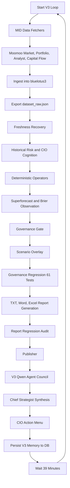
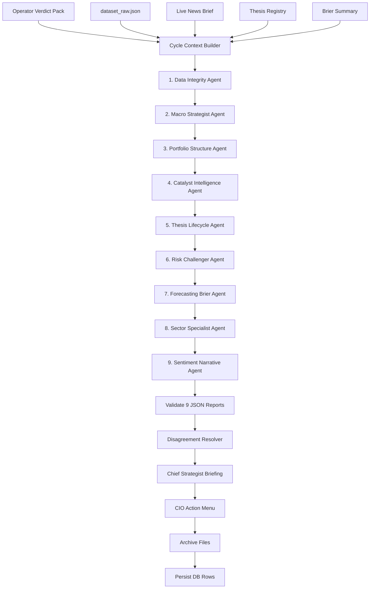
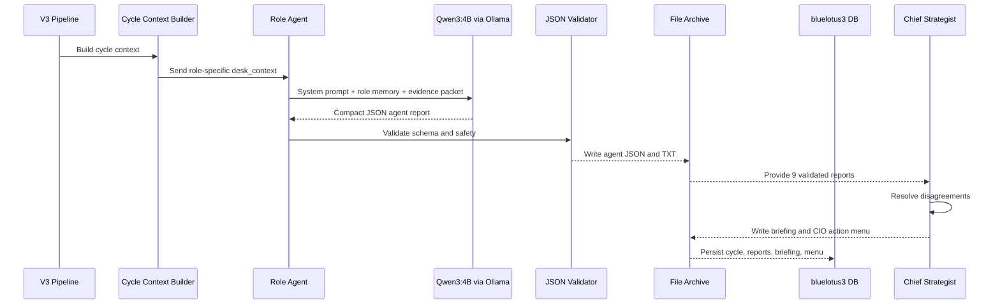
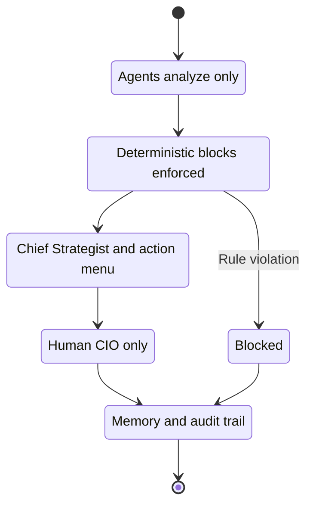
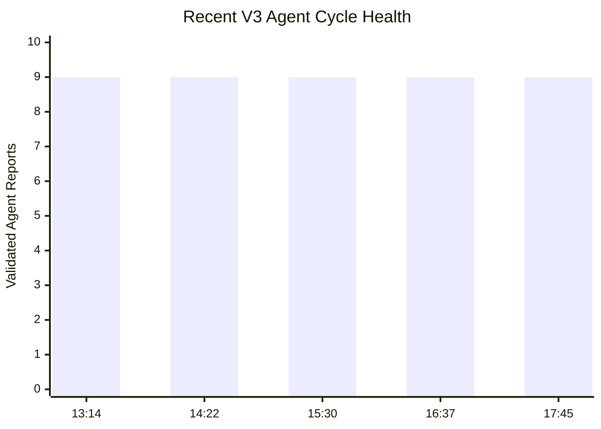
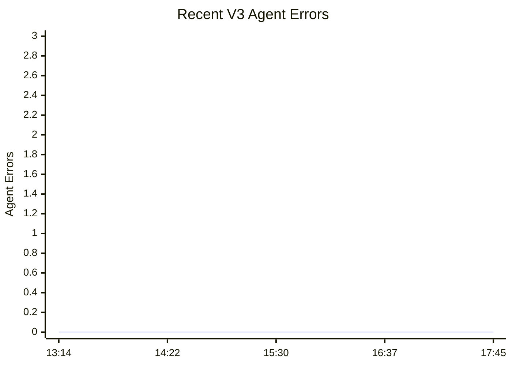

# BlueLotus V3 Upgrade Report

Date: 2026-06-15 SGT

Prepared for: Kian Soh, Dr. Claude Code, ChatGPT 5.5

Prepared by: Dr. Codex & Dr. Claude Windows Platform Team

## Executive Verdict

```text
BlueLotus V3 status: LIVE
Pipeline mode: 24/7 loop
Cycle cadence: full cycle runtime + 39 minute wait
Execution authority: CIO_ONLY_MANUAL
Order routing: disabled
Orders generated: 0
Latest verified agent cycles: 9 reports, 0 agent errors, 0 hard fails
Operational posture: GREEN / WATCH
```

BlueLotus V3 has moved from a deterministic report generator into an orchestration-driven institutional intelligence loop. The system now ingests data, exports dataset truth, runs deterministic operators, performs governance checks, generates reports, publishes locally, runs a Qwen-backed multi-agent council, synthesizes a Chief Strategist briefing, records CIO action menus, and persists memory into the V3 database.

## What Was Done Today

### 1. V3 Codebase Isolation

The BlueLotus2 codebase was replicated into:

```text
C:\bluelotus3
```

BlueLotus2 remains protected for the 90-day observation period. V3 is now the experimental architecture for multi-agent AI work.

### 2. V3 Pipeline Ownership

The V3 architecture now owns the full intelligence pipeline.

```text
run_v3_pipeline.bat
```

now launches:

```text
python -m orchestration.run_v3_intelligence_pipeline --loop
```

The old V2 batch file inside `C:\bluelotus3` is now only a compatibility shim. It forwards into the V3 runner.

### 3. Full 58-Step Intelligence Loop

The V3 pipeline now runs the full institutional intelligence chain:

```text
1. MID data fetchers
2. Moomoo market and portfolio extraction
3. Analyst targets
4. Capital flow
5. Fundamentals
6. Treasury yields
7. Cross-market confirmation
8. Ingest
9. Dataset export
10. Freshness recovery
11. Historical risk model
12. CIO cognition and journal
13. Deterministic operators
14. Superforecast engine
15. Governance gate
16. Scenario overlay
17. Governance regression tests
18. Research report generation
19. Report regression audit
20. Dashboard publisher
21. V3 Qwen multi-agent council
22. Chief Strategist synthesis
23. CIO action menu
24. V3 database persistence
```

### 4. V3 Database Separation

The V3 database target is:

```text
bluelotus3
```

The old deterministic intelligence schema was applied into the V3 database because legacy MID and governance modules still depend on those tables.

The V3-specific memory tables were also created and used:

```text
v3_cycle_runs
v3_operator_verdict_packs
v3_agent_reports
v3_chief_strategist_briefings
v3_disagreement_logs
v3_cio_action_menus
v3_thesis_states
v3_learning_snapshots
v3_system_health_log
```

### 5. Dataset Health Restored

Earlier, `dataset_raw.json` had null core fields:

```text
live_prices: null
regime: null
```

This was fixed. The dataset now exports usable institutional truth:

```text
meta: present
portfolio: present
live_prices: present
regime: present
```

### 6. Governance and Report Regression Restored

Verified outcomes:

```text
Governance regression: 61/61 passed
Report regression audit: 10/10 passed
CIO_ONLY_MANUAL: preserved
order_routing_enabled: false
orders_generated: 0
```

### 7. Freshness Recovery Fixed

The freshness recovery module failed because the market session label:

```text
WEEKEND SNAPSHOT / LAST REGULAR CLOSE
```

was longer than the old DB column width.

Fix:

```text
freshness_recovery_runs.market_session widened to varchar(128)
```

Freshness recovery now records cleanly.

### 8. ECE Evidence Sanitizer Fixed

Sector evidence mismatch previously allowed short unrelated headlines to remain in the `why` field.

Fix:

```text
SECTOR_EVIDENCE_MISMATCH now rewrites why to:
No direct theme-specific catalyst found; direction based on basket price action only.
```

This restored governance regression success.

### 9. Qwen3:4B Agent Council Activated

The V3 Qwen agent council now runs after deterministic reporting and publisher completion.

Current council structure:

```text
Data Integrity Agent
Macro Strategist Agent
Portfolio Structure Agent
Catalyst Intelligence Agent
Thesis Lifecycle Agent
Risk Challenger Agent
Forecasting Brier Agent
Sector Specialist Agent
Sentiment Narrative Agent
```

Each agent uses:

```text
model_used: qwen3:4b
provider: local Ollama
execution: linear, one agent at a time
manual_execution_required: true
llm_order_generation: false
```

### 10. Role-Specific Prompt Engineering Added

Initial Qwen agent outputs were too similar. The root cause was that every agent saw the same shared context and a shallow generic role prompt.

Fix:

```text
Each agent now receives:
- role memory
- desk mandate
- out-of-scope boundaries
- evidence priorities
- must-answer questions
- role-specific desk_context
```

The prompt was also shortened and filtered so Qwen3:4B is not overwhelmed by shared context.

After the fix, agent outputs became differentiated:

```text
Data Integrity: stale fear_greed and market-closed grace window
Portfolio Structure: AU 33.48%, Basic Materials 65.94%, AU/NEM blocked
Forecasting Brier: 385 active forecasts, no due forecasts resolved
Sentiment Narrative: clean vs dirty GOOGL/AAPL headline tape
Risk Challenger: hidden concentration and dirty-evidence risks
Macro Strategist: VIX, Fear/Greed, regime, BOJ event risk
Sector Specialist: sector rotation and contaminated evidence
Thesis Lifecycle: thesis states and review triggers
Catalyst Intelligence: event windows and CIO catalyst attention
```

## Current Live Monitoring Evidence

Latest database-verified cycles:

```text
v3_cycle_20260615_174427 | completed 17:45:41 SGT | reports 9 | errors 0 | hard_fail 0
v3_cycle_20260615_163621 | completed 16:37:33 SGT | reports 9 | errors 0 | hard_fail 0
v3_cycle_20260615_152855 | completed 15:30:05 SGT | reports 9 | errors 0 | hard_fail 0
v3_cycle_20260615_142110 | completed 14:22:21 SGT | reports 9 | errors 0 | hard_fail 0
v3_cycle_20260615_131341 | completed 13:14:52 SGT | reports 9 | errors 0 | hard_fail 0
```

Live process:

```text
run_v3_pipeline.bat: running
orchestration.run_v3_intelligence_pipeline --loop: running
```

## Workflow Graph: Full V3 Intelligence Pipeline



## Workflow Graph: Linear Multi-Agent AI Council



## Sequence Diagram: How Qwen3:4B Is Used



## State Graph: Execution Safety



## Mermaid Graph: Recent V3 Cycle Health





## Agent Council Role Map

| Agent | Primary Lens | Current Purpose |
|---|---|---|
| Data Integrity | Source and dataset trust | Detect stale, missing, null, or contaminated evidence |
| Macro Strategist | Cross-asset regime | Interpret VIX, rates, dollar, breadth, and macro permission |
| Portfolio Structure | Concentration and mandate | Enforce AU/NEM, cluster exposure, HHI, and cash constraints |
| Catalyst Intelligence | Time-sensitive events | Identify catalysts that can change thesis or risk |
| Thesis Lifecycle | Thesis state | Confirm, weaken, contradict, watch, or archive theses |
| Risk Challenger | Adversarial review | Attack the base case and expose hidden assumptions |
| Forecasting Brier | Calibration | Preserve forecast accountability and probability discipline |
| Sector Specialist | Sector rotation | Detect sector leadership, contamination, and price-action-only evidence |
| Sentiment Narrative | Narrative tape | Separate clean sentiment from dirty or irrelevant headlines |

## Safety Doctrine Preserved

```text
System advises.
CIO decides.
CIO executes manually.
System records.
```

Hard boundaries:

```text
No autonomous broker execution
No order routing
No generated orders
No Qwen override of deterministic governance
No hidden Brier reset
No mutation of BlueLotus2
```

## Known Watch Items

These are not current failures. They are monitoring items:

```text
P1: Brier historical continuity
P1: AU/NEM portfolio renderer override
P2: macro_regime label coherence
P2: source coverage explanation
P2: GitHub publishing token setup
P2: Qwen agent differentiation drift
```

## Roadmap Alignment

The work completed today belongs to:

```text
V3.0 - Live Intelligence Pipeline
V3.1 - Reporting Consistency & Governance Hardening
V3.6 - Model Governance Department foundation
```

The next architecture phases remain future work:

```text
V3.2 Historical Backfill
V3.3 Backtesting Department
V3.4 Paper Trading Department
V3.5 Brier Calibration after 90-day observation
V3.8 Agentic CIO Simulation Layer
V3.9 Optional LangGraph orchestration
```

## Monitoring Instructions

For each cycle, monitor:

```text
1. Did all 58 steps complete?
2. Did dataset_raw.json contain meta, portfolio, live_prices, regime?
3. Did governance regression remain 61/61?
4. Did report audit remain 10/10?
5. Did CIO_ONLY_MANUAL remain true?
6. Did orders_generated remain 0?
7. Did order_routing remain disabled?
8. Did V3 cycle persist to DB?
9. Did all 9 Qwen agents report?
10. Did agent_errors remain 0?
11. Did Qwen agents remain role-differentiated?
12. Did AU/NEM remain blocked under gold-miner concentration?
```

## Final Statement

BlueLotus V3 is now alive as a recurring institutional intelligence architecture.

It has:

```text
orchestration
freshness recovery
deterministic operators
governance regression
report regression
multi-agent Qwen council
role-specific prompt engineering
Chief Strategist synthesis
CIO action menu
database memory
execution safety
```

Final verdict:

```text
V3 is operational.
V3 agents are functioning.
V3 loop is under observation.
No autonomy expansion.
No execution routing.
Monitor before next upgrade.
```

